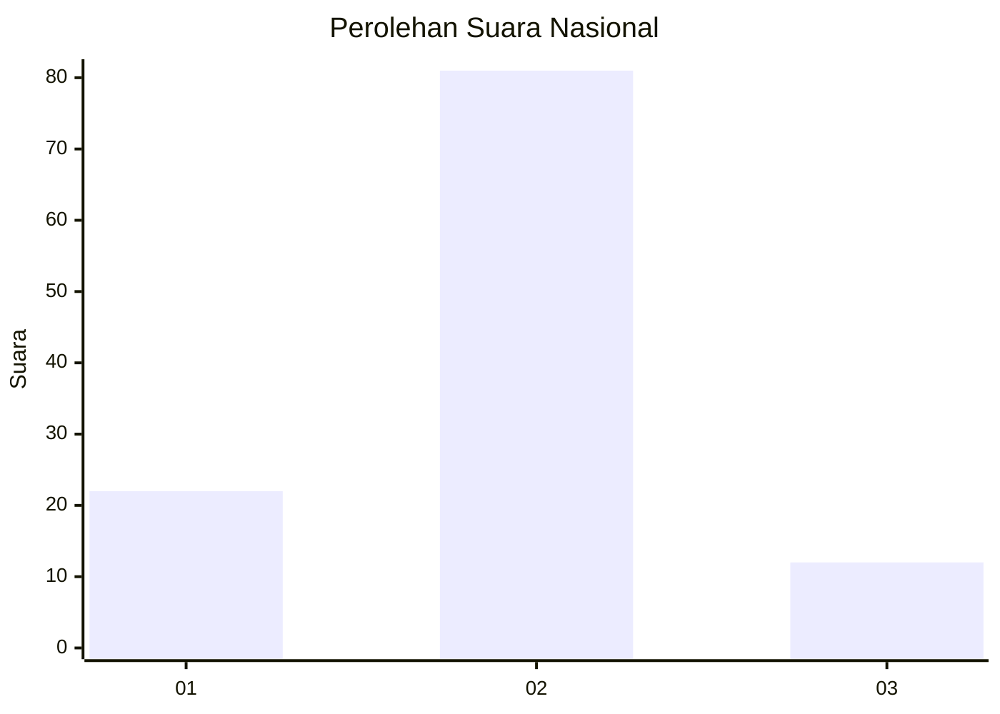
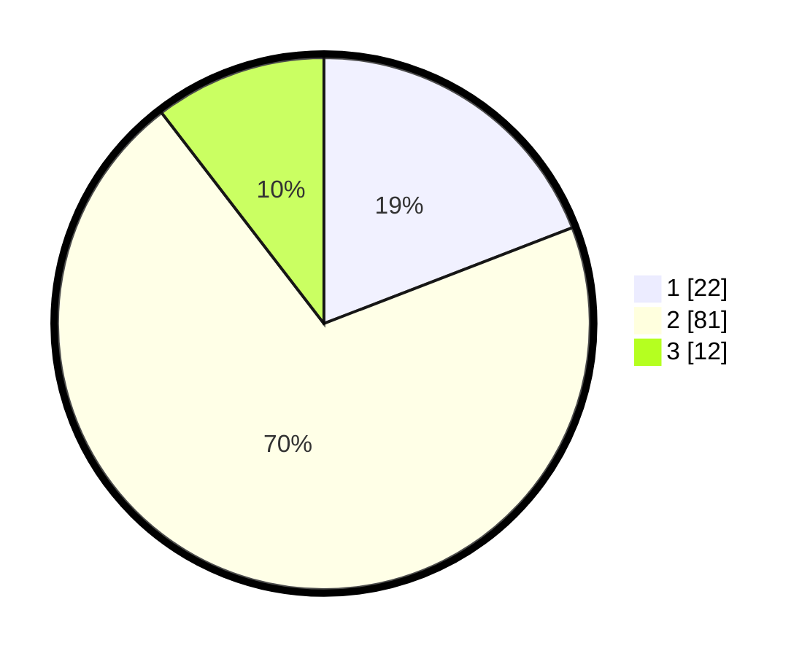

# Hasil

## Grafik

## Tabel

| No. | Nama Paslon    | Suara | Suara (raw) | Persentase |
|:--- |:-------------- | -----:| -----------:| ----------:|
| 1   | ANIES MUHAIMIN | 22    | [22][p-1]   | 19,13      |
| 2   | PRABOWO GIBRAN | 81    | [81][p-2]   | 70,43      |
| 3   | GANJAR MAHFUD  | 12    | [12][p-3]   | 10,43      |

[p-1]: https://github.com/gigit-pemilu/pemilu-2024/blob/main/pilpres/hitung-suara/sub/16-sumatera-selatan/sub/11-empat-lawang/sub/02-pendopo/sub/2026-tanjung-baru/sub/004-tps/sub/paslon-1.txt
[p-2]: https://github.com/gigit-pemilu/pemilu-2024/blob/main/pilpres/hitung-suara/sub/16-sumatera-selatan/sub/11-empat-lawang/sub/02-pendopo/sub/2026-tanjung-baru/sub/004-tps/sub/paslon-2.txt
[p-3]: https://github.com/gigit-pemilu/pemilu-2024/blob/main/pilpres/hitung-suara/sub/16-sumatera-selatan/sub/11-empat-lawang/sub/02-pendopo/sub/2026-tanjung-baru/sub/004-tps/sub/paslon-3.txt

## Foto C Plano

https://sirekap-obj-formc.kpu.go.id/8766/pemilu/ppwp/16/11/02/20/26/1611022026004-20240215-150711--50126db7-758b-480d-8cb8-0d34ed4c8f7d.jpg

https://sirekap-obj-formc.kpu.go.id/8766/pemilu/ppwp/16/11/02/20/26/1611022026004-20240215-150728--f3413295-57fa-4b51-9097-83b9f2daf629.jpg

https://sirekap-obj-formc.kpu.go.id/8766/pemilu/ppwp/16/11/02/20/26/1611022026004-20240215-150744--dd122e24-93cd-4474-8061-228148277f74.jpg

## Metadata

| Key        | Value               |
| ---------- | ------------------- |
| Time Stamp | 2024-02-16 23:00:00 |

