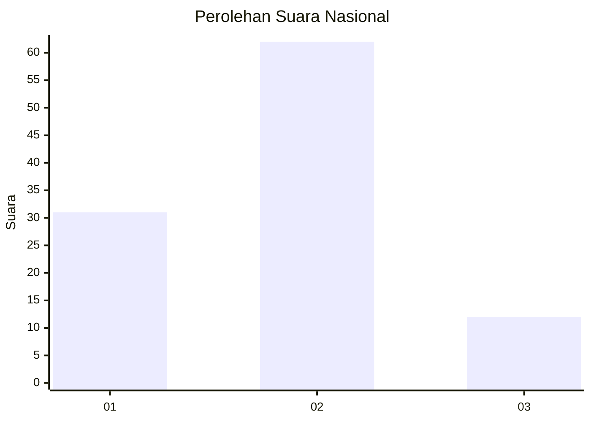
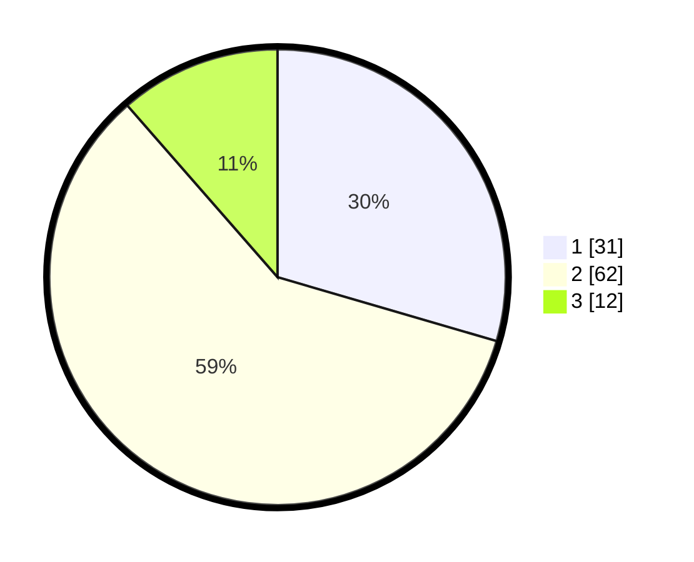

# Hasil

## Grafik

## Tabel

| No. | Nama Paslon    | Suara | Suara (raw) | Persentase |
|:--- |:-------------- | -----:| -----------:| ----------:|
| 1   | ANIES MUHAIMIN | 31    | [31][p-1]   | 29,52      |
| 2   | PRABOWO GIBRAN | 62    | [62][p-2]   | 59,05      |
| 3   | GANJAR MAHFUD  | 12    | [12][p-3]   | 11,43      |

[p-1]: https://github.com/gigit-pemilu/pemilu-2024/blob/main/pilpres/hitung-suara/sub/16-sumatera-selatan/sub/11-empat-lawang/sub/02-pendopo/sub/2026-tanjung-baru/sub/005-tps/sub/paslon-1.txt
[p-2]: https://github.com/gigit-pemilu/pemilu-2024/blob/main/pilpres/hitung-suara/sub/16-sumatera-selatan/sub/11-empat-lawang/sub/02-pendopo/sub/2026-tanjung-baru/sub/005-tps/sub/paslon-2.txt
[p-3]: https://github.com/gigit-pemilu/pemilu-2024/blob/main/pilpres/hitung-suara/sub/16-sumatera-selatan/sub/11-empat-lawang/sub/02-pendopo/sub/2026-tanjung-baru/sub/005-tps/sub/paslon-3.txt

## Foto C Plano

https://sirekap-obj-formc.kpu.go.id/d3a6/pemilu/ppwp/16/11/02/20/26/1611022026005-20240221-092943--0583b285-1bc1-4196-8fdc-329fbc681962.jpg

https://sirekap-obj-formc.kpu.go.id/d3a6/pemilu/ppwp/16/11/02/20/26/1611022026005-20240221-092948--ef9ff3fa-249c-48f5-a1e5-19295d336161.jpg

https://sirekap-obj-formc.kpu.go.id/d3a6/pemilu/ppwp/16/11/02/20/26/1611022026005-20240221-093002--1280dee5-3beb-47e5-a551-2a40383d6f3d.jpg

## Metadata

| Key        | Value               |
| ---------- | ------------------- |
| Time Stamp | 2024-02-22 14:00:00 |

