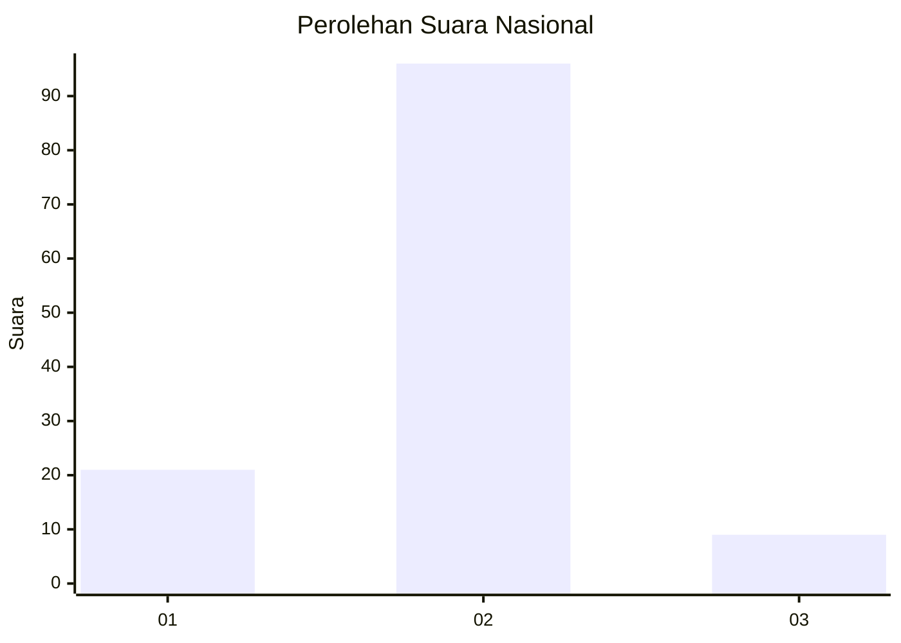
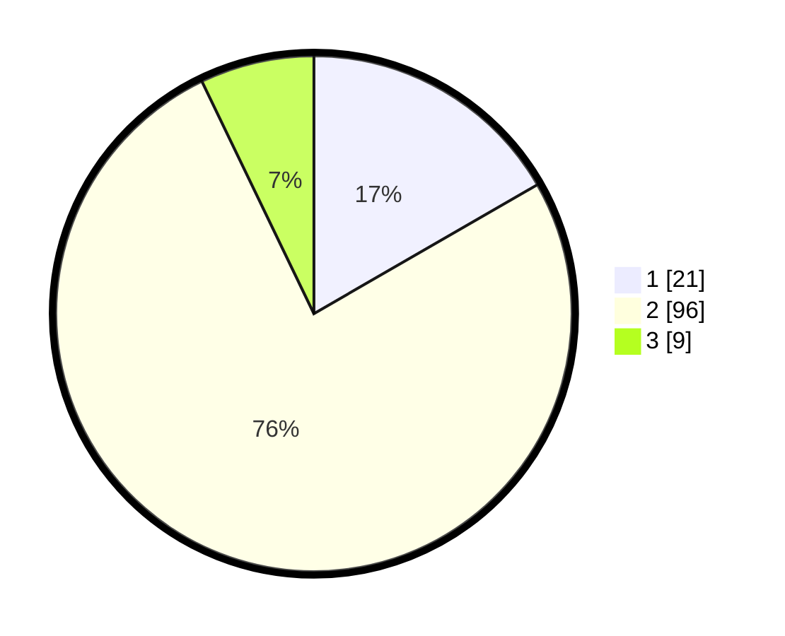

# Hasil

## Grafik

## Tabel

| No. | Nama Paslon    | Suara | Suara (raw) | Persentase |
|:--- |:-------------- | -----:| -----------:| ----------:|
| 1   | ANIES MUHAIMIN | 21    | [21][p-1]   | 16,67      |
| 2   | PRABOWO GIBRAN | 96    | [96][p-2]   | 76,19      |
| 3   | GANJAR MAHFUD  | 9     | [9][p-3]    | 7,14       |

[p-1]: https://github.com/gigit-pemilu/pemilu-2024/blob/main/pilpres/hitung-suara/sub/16-sumatera-selatan/sub/11-empat-lawang/sub/03-ulu-musi/sub/2001-air-kelinsar/sub/005-tps/sub/paslon-1.txt
[p-2]: https://github.com/gigit-pemilu/pemilu-2024/blob/main/pilpres/hitung-suara/sub/16-sumatera-selatan/sub/11-empat-lawang/sub/03-ulu-musi/sub/2001-air-kelinsar/sub/005-tps/sub/paslon-2.txt
[p-3]: https://github.com/gigit-pemilu/pemilu-2024/blob/main/pilpres/hitung-suara/sub/16-sumatera-selatan/sub/11-empat-lawang/sub/03-ulu-musi/sub/2001-air-kelinsar/sub/005-tps/sub/paslon-3.txt

## Foto C Plano

https://sirekap-obj-formc.kpu.go.id/ff48/pemilu/ppwp/16/11/03/20/01/1611032001005-20240215-080351--90561bae-91c6-4501-8b74-f8daa8a8dd02.jpg

https://sirekap-obj-formc.kpu.go.id/ff48/pemilu/ppwp/16/11/03/20/01/1611032001005-20240215-080720--4222d131-f232-41b9-aae6-8e4268b5ce0c.jpg

https://sirekap-obj-formc.kpu.go.id/ff48/pemilu/ppwp/16/11/03/20/01/1611032001005-20240215-081738--e0e9dfad-d149-412f-828c-c28f4e9334cd.jpg

## Metadata

| Key        | Value               |
| ---------- | ------------------- |
| Time Stamp | 2024-02-25 13:00:00 |

## DATA PEMILIH TETAP

Jumlah pemilih dalam DPT: **213**.
 * L: **120**.
 * P: **93**.

## DATA PENGGUNA HAK PILIH

Jumlah pengguna hak pilih dalam DPT: **210**.
 * L: **120**.
 * P: **90**.

Jumlah pengguna hak pilih dalam DPTb: **0**.
 * L: **0**.
 * P: **0**.

Jumlah pengguna hak pilih dalam DPK: **0**.
 * L: **0**.
 * P: **0**.

Jumlah pengguna hak pilih: **210**.
 * L: **120**.
 * P: **90**.

## JUMLAH SUARA SAH DAN TIDAK SAH

JUMLAH SELURUH SUARA SAH: **126**.

JUMLAH SUARA TIDAK SAH: **84**.

JUMLAH SELURUH SUARA SAH DAN SUARA TIDAK SAH: **210**.

