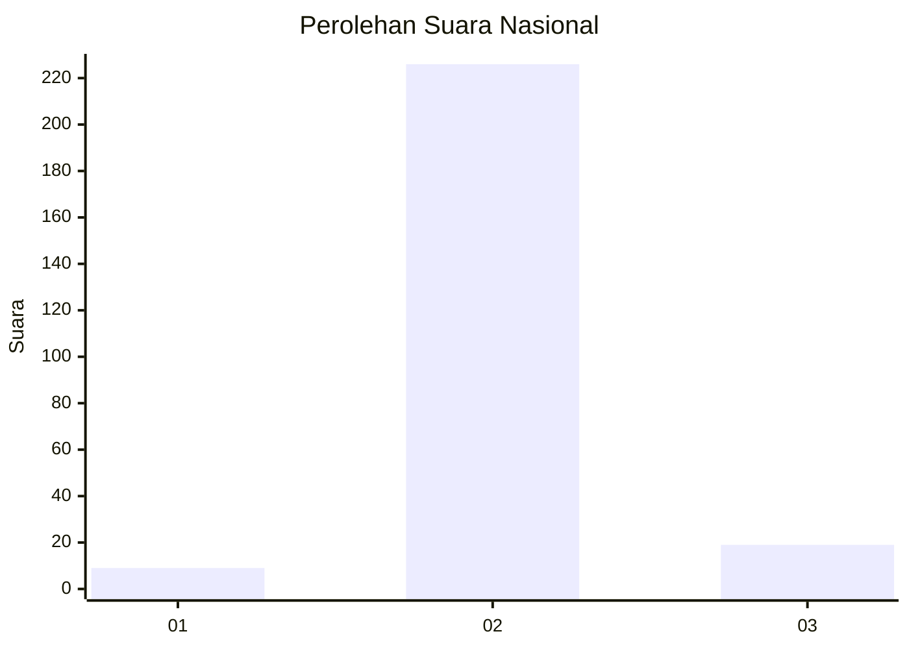
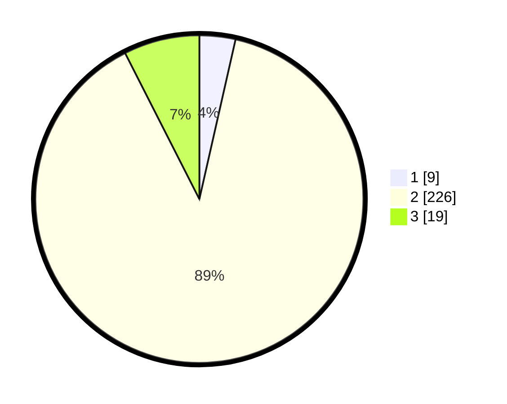

# Hasil

## Grafik

## Tabel

| No. | Nama Paslon    | Suara | Suara (raw) | Persentase |
|:--- |:-------------- | -----:| -----------:| ----------:|
| 1   | ANIES MUHAIMIN | 9     | [9][p-1]    | 3,54       |
| 2   | PRABOWO GIBRAN | 226   | [226][p-2]  | 88,98      |
| 3   | GANJAR MAHFUD  | 19    | [19][p-3]   | 7,48       |

[p-1]: https://github.com/gigit-pemilu/pemilu-2024/blob/main/pilpres/hitung-suara/sub/16-sumatera-selatan/sub/11-empat-lawang/sub/03-ulu-musi/sub/2002-talang-bengkulu/sub/002-tps/sub/paslon-1.txt
[p-2]: https://github.com/gigit-pemilu/pemilu-2024/blob/main/pilpres/hitung-suara/sub/16-sumatera-selatan/sub/11-empat-lawang/sub/03-ulu-musi/sub/2002-talang-bengkulu/sub/002-tps/sub/paslon-2.txt
[p-3]: https://github.com/gigit-pemilu/pemilu-2024/blob/main/pilpres/hitung-suara/sub/16-sumatera-selatan/sub/11-empat-lawang/sub/03-ulu-musi/sub/2002-talang-bengkulu/sub/002-tps/sub/paslon-3.txt

## Foto C Plano

https://sirekap-obj-formc.kpu.go.id/c617/pemilu/ppwp/16/11/03/20/02/1611032002002-20240215-055355--acc2ca38-ce36-47f0-9544-fb51c5fe2955.jpg

https://sirekap-obj-formc.kpu.go.id/c617/pemilu/ppwp/16/11/03/20/02/1611032002002-20240215-055631--12145a63-ba3d-4059-91a6-8e6ca2502e84.jpg

https://sirekap-obj-formc.kpu.go.id/c617/pemilu/ppwp/16/11/03/20/02/1611032002002-20240215-055831--28b15d64-a6ec-4f82-a812-0d544490d47b.jpg

## Metadata

| Key        | Value               |
| ---------- | ------------------- |
| Time Stamp | 2024-02-25 18:00:00 |

