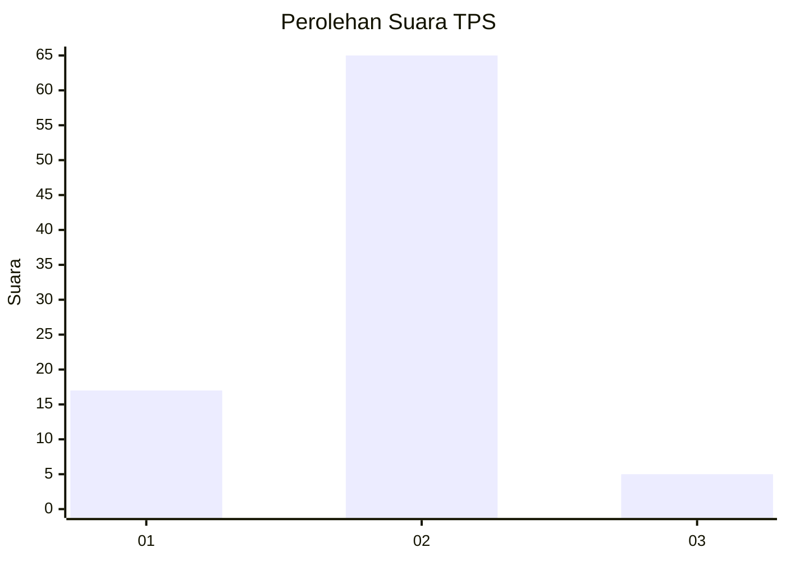
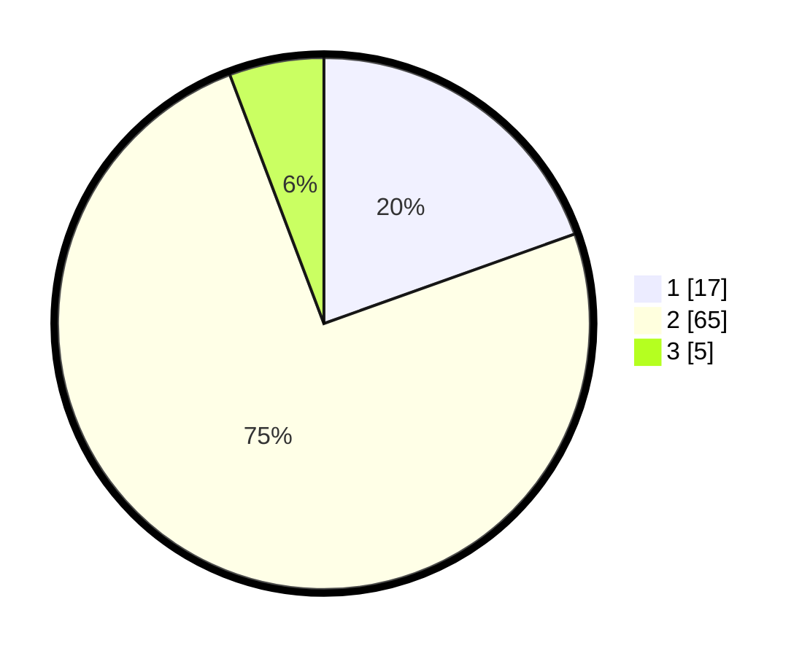

# Hasil

## Grafik

## Tabel

| No. | Nama Paslon    | Suara | Suara (raw) | Persentase |
|:--- |:-------------- | -----:| -----------:| ----------:|
| 1   | ANIES MUHAIMIN | 17    | [17][p-1]   | 19,54      |
| 2   | PRABOWO GIBRAN | 65    | [65][p-2]   | 74,71      |
| 3   | GANJAR MAHFUD  | 5     | [5][p-3]    | 5,75       |

[p-1]: https://github.com/gigit-pemilu/pemilu-2024-16-sumatera-selatan/blob/main/pilpres/hitung-suara/sub/16-sumatera-selatan/sub/11-empat-lawang/sub/03-ulu-musi/sub/2007-padang-tepong/sub/001-tps/sub/paslon-1.txt
[p-2]: https://github.com/gigit-pemilu/pemilu-2024-16-sumatera-selatan/blob/main/pilpres/hitung-suara/sub/16-sumatera-selatan/sub/11-empat-lawang/sub/03-ulu-musi/sub/2007-padang-tepong/sub/001-tps/sub/paslon-2.txt
[p-3]: https://github.com/gigit-pemilu/pemilu-2024-16-sumatera-selatan/blob/main/pilpres/hitung-suara/sub/16-sumatera-selatan/sub/11-empat-lawang/sub/03-ulu-musi/sub/2007-padang-tepong/sub/001-tps/sub/paslon-3.txt

## Foto C Plano

https://sirekap-obj-formc.kpu.go.id/a8da/pemilu/ppwp/16/11/03/20/07/1611032007001-20240215-101952--9e288ccb-d33b-414d-839c-474960b175d5.jpg

https://sirekap-obj-formc.kpu.go.id/a8da/pemilu/ppwp/16/11/03/20/07/1611032007001-20240215-103256--9d869a0d-6361-42d7-ae98-5b19ac33f4b1.jpg

https://sirekap-obj-formc.kpu.go.id/a8da/pemilu/ppwp/16/11/03/20/07/1611032007001-20240215-103848--04fea1cb-9a62-4b2a-b793-48840397d29f.jpg

## Metadata

| Key        | Value               |
| ---------- | ------------------- |
| Time Stamp | 2024-02-25 15:00:00 |

