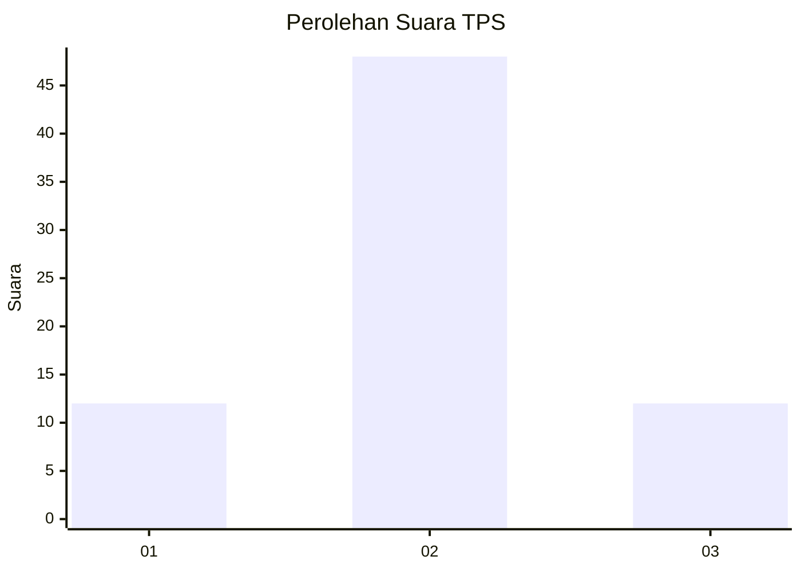
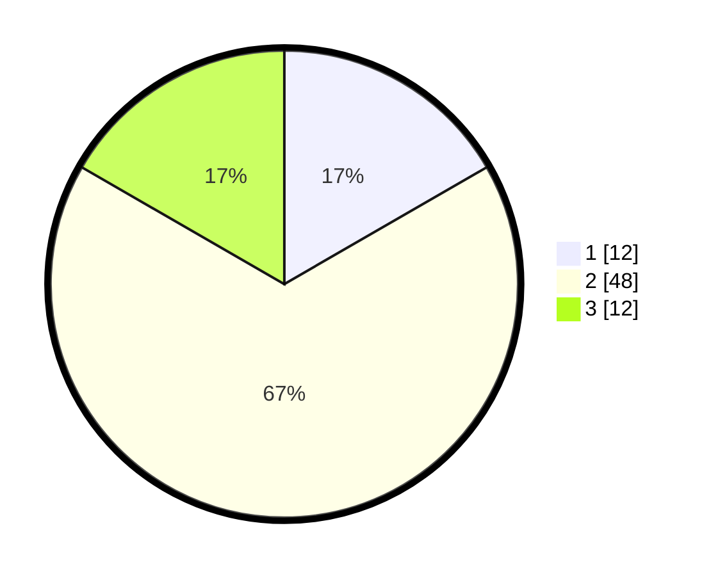

# Hasil

## Grafik

## Tabel

| No. | Nama Paslon    | Suara | Suara (raw) | Persentase |
|:--- |:-------------- | -----:| -----------:| ----------:|
| 1   | ANIES MUHAIMIN | 12    | [12][p-1]   | 16,67      |
| 2   | PRABOWO GIBRAN | 48    | [48][p-2]   | 66,67      |
| 3   | GANJAR MAHFUD  | 12    | [12][p-3]   | 16,67      |

[p-1]: https://github.com/gigit-pemilu/pemilu-2024-16-sumatera-selatan/blob/main/pilpres/hitung-suara/sub/16-sumatera-selatan/sub/11-empat-lawang/sub/03-ulu-musi/sub/2007-padang-tepong/sub/003-tps/sub/paslon-1.txt
[p-2]: https://github.com/gigit-pemilu/pemilu-2024-16-sumatera-selatan/blob/main/pilpres/hitung-suara/sub/16-sumatera-selatan/sub/11-empat-lawang/sub/03-ulu-musi/sub/2007-padang-tepong/sub/003-tps/sub/paslon-2.txt
[p-3]: https://github.com/gigit-pemilu/pemilu-2024-16-sumatera-selatan/blob/main/pilpres/hitung-suara/sub/16-sumatera-selatan/sub/11-empat-lawang/sub/03-ulu-musi/sub/2007-padang-tepong/sub/003-tps/sub/paslon-3.txt

## Foto C Plano

https://sirekap-obj-formc.kpu.go.id/fc91/pemilu/ppwp/16/11/03/20/07/1611032007003-20240214-222501--bd85c139-95bc-43e3-a6e6-4584c3aa8f91.jpg

https://sirekap-obj-formc.kpu.go.id/fc91/pemilu/ppwp/16/11/03/20/07/1611032007003-20240215-071756--4774522e-cd34-4a35-93fa-112b93aefba3.jpg

https://sirekap-obj-formc.kpu.go.id/fc91/pemilu/ppwp/16/11/03/20/07/1611032007003-20240215-004017--846460a3-eac5-4885-9515-db2333556a2d.jpg

## Metadata

| Key        | Value               |
| ---------- | ------------------- |
| Time Stamp | 2024-02-24 22:31:28 |

