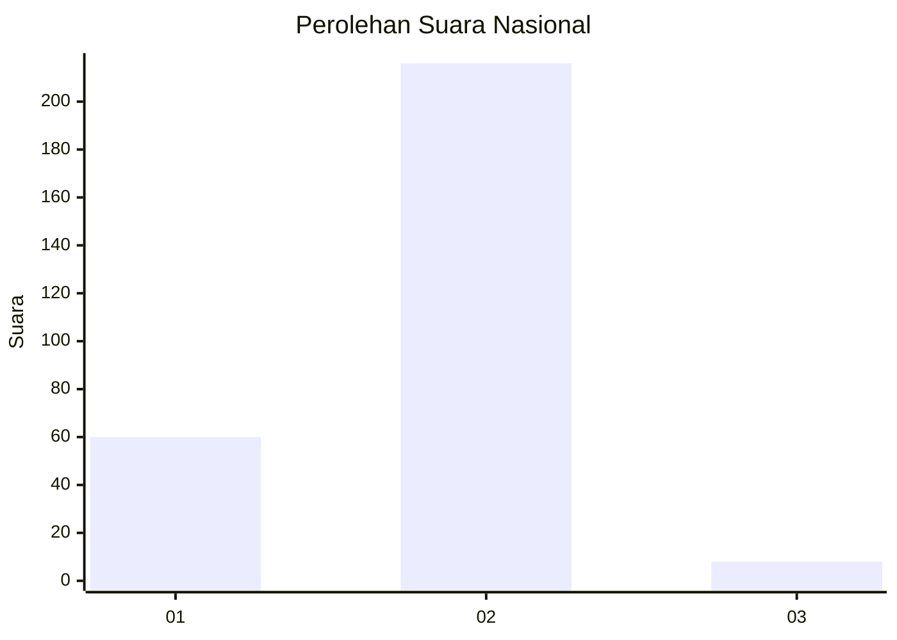
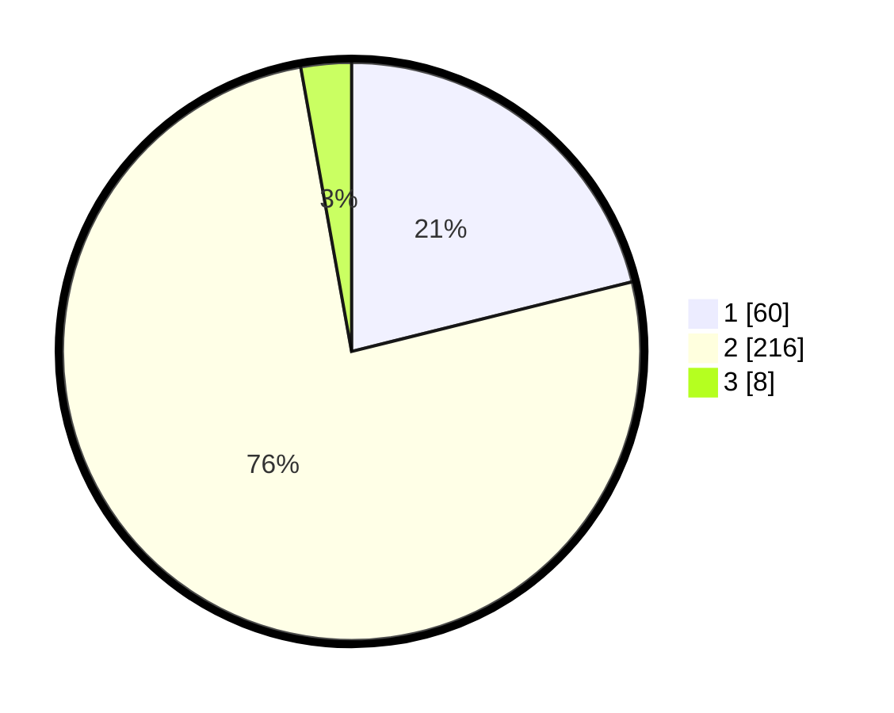

# Hasil

## Grafik

## Tabel

| No. | Nama Paslon    | Suara | Suara (raw) | Persentase |
|:--- |:-------------- | -----:| -----------:| ----------:|
| 1   | ANIES MUHAIMIN | 60    | [60][p-1]   | 21,13      |
| 2   | PRABOWO GIBRAN | 216   | [216][p-2]  | 76,06      |
| 3   | GANJAR MAHFUD  | 8     | [8][p-3]    | 2,82       |

[p-1]: https://github.com/gigit-pemilu/pemilu-2024/blob/main/pilpres/hitung-suara/sub/16-sumatera-selatan/sub/11-empat-lawang/sub/03-ulu-musi/sub/2007-padang-tepong/sub/005-tps/sub/paslon-1.txt
[p-2]: https://github.com/gigit-pemilu/pemilu-2024/blob/main/pilpres/hitung-suara/sub/16-sumatera-selatan/sub/11-empat-lawang/sub/03-ulu-musi/sub/2007-padang-tepong/sub/005-tps/sub/paslon-2.txt
[p-3]: https://github.com/gigit-pemilu/pemilu-2024/blob/main/pilpres/hitung-suara/sub/16-sumatera-selatan/sub/11-empat-lawang/sub/03-ulu-musi/sub/2007-padang-tepong/sub/005-tps/sub/paslon-3.txt

## Foto C Plano

https://sirekap-obj-formc.kpu.go.id/a490/pemilu/ppwp/16/11/03/20/07/1611032007005-20240214-202835--89ba9250-2ebc-40c3-ab4e-49bae1f3faea.jpg

https://sirekap-obj-formc.kpu.go.id/a490/pemilu/ppwp/16/11/03/20/07/1611032007005-20240214-194844--14598ccb-4eb2-4e61-86fa-8156c92bf1bf.jpg

## Metadata

| Key        | Value               |
| ---------- | ------------------- |
| Time Stamp | 2024-02-15 07:00:44 |

