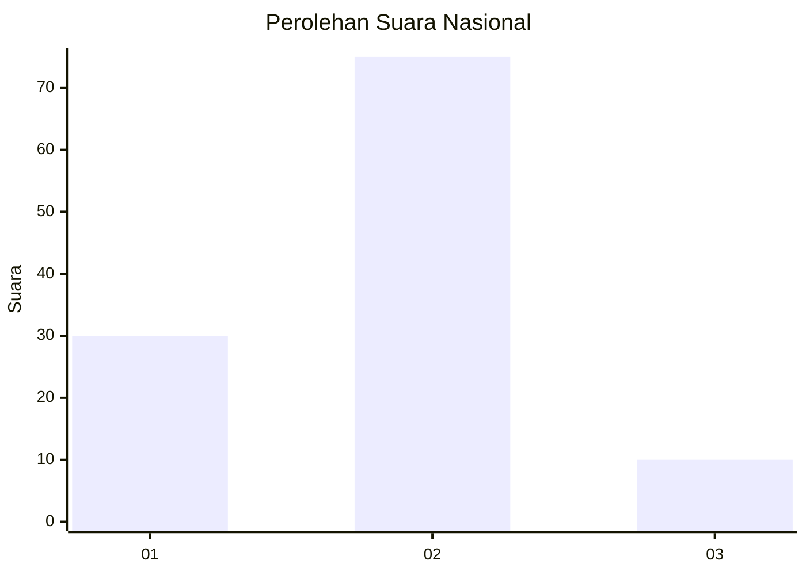
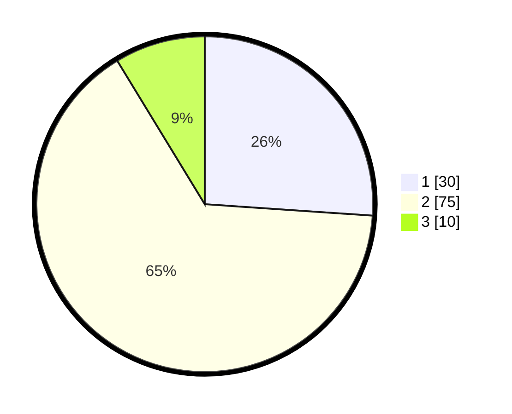

# Hasil

## Grafik

## Tabel

| No. | Nama Paslon    | Suara | Suara (raw) | Persentase |
|:--- |:-------------- | -----:| -----------:| ----------:|
| 1   | ANIES MUHAIMIN | 30    | [30][p-1]   | 26,09      |
| 2   | PRABOWO GIBRAN | 75    | [75][p-2]   | 65,22      |
| 3   | GANJAR MAHFUD  | 10    | [10][p-3]   | 8,70       |

[p-1]: https://github.com/gigit-pemilu/pemilu-2024/blob/main/pilpres/hitung-suara/sub/16-sumatera-selatan/sub/11-empat-lawang/sub/03-ulu-musi/sub/2009-lb-puding-baru/sub/002-tps/sub/paslon-1.txt
[p-2]: https://github.com/gigit-pemilu/pemilu-2024/blob/main/pilpres/hitung-suara/sub/16-sumatera-selatan/sub/11-empat-lawang/sub/03-ulu-musi/sub/2009-lb-puding-baru/sub/002-tps/sub/paslon-2.txt
[p-3]: https://github.com/gigit-pemilu/pemilu-2024/blob/main/pilpres/hitung-suara/sub/16-sumatera-selatan/sub/11-empat-lawang/sub/03-ulu-musi/sub/2009-lb-puding-baru/sub/002-tps/sub/paslon-3.txt

## Foto C Plano

https://sirekap-obj-formc.kpu.go.id/5567/pemilu/ppwp/16/11/03/20/09/1611032009002-20240215-000943--9377446a-b23e-4b4d-9836-8c6acb4c6f37.jpg

https://sirekap-obj-formc.kpu.go.id/5567/pemilu/ppwp/16/11/03/20/09/1611032009002-20240215-114227--841d3e80-f92d-4548-bbab-691487bab01c.jpg

https://sirekap-obj-formc.kpu.go.id/5567/pemilu/ppwp/16/11/03/20/09/1611032009002-20240215-114332--d911f525-2dfb-4bcf-a930-1680a7375b32.jpg

## Metadata

| Key        | Value               |
| ---------- | ------------------- |
| Time Stamp | 2024-02-25 16:00:00 |

