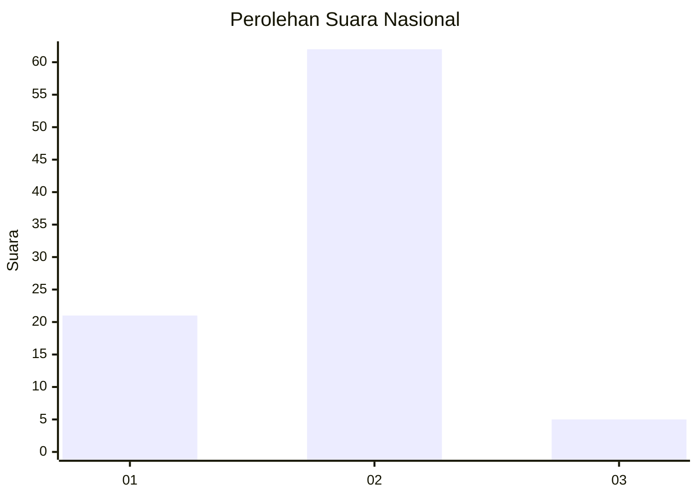
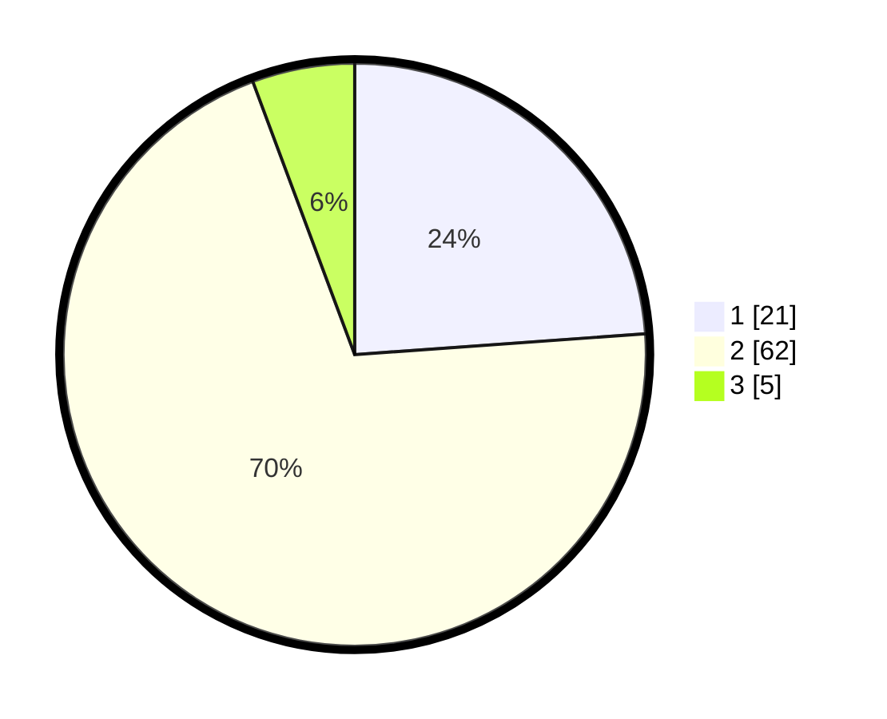

# Hasil

## Grafik

## Tabel

| No. | Nama Paslon    | Suara | Suara (raw) | Persentase |
|:--- |:-------------- | -----:| -----------:| ----------:|
| 1   | ANIES MUHAIMIN | 21    | [21][p-1]   | 23,86      |
| 2   | PRABOWO GIBRAN | 62    | [62][p-2]   | 70,45      |
| 3   | GANJAR MAHFUD  | 5     | [5][p-3]    | 5,68       |

[p-1]: https://github.com/gigit-pemilu/pemilu-2024/blob/main/pilpres/hitung-suara/sub/16-sumatera-selatan/sub/11-empat-lawang/sub/03-ulu-musi/sub/2010-pulau-kemang/sub/002-tps/sub/paslon-1.txt
[p-2]: https://github.com/gigit-pemilu/pemilu-2024/blob/main/pilpres/hitung-suara/sub/16-sumatera-selatan/sub/11-empat-lawang/sub/03-ulu-musi/sub/2010-pulau-kemang/sub/002-tps/sub/paslon-2.txt
[p-3]: https://github.com/gigit-pemilu/pemilu-2024/blob/main/pilpres/hitung-suara/sub/16-sumatera-selatan/sub/11-empat-lawang/sub/03-ulu-musi/sub/2010-pulau-kemang/sub/002-tps/sub/paslon-3.txt

## Foto C Plano

https://sirekap-obj-formc.kpu.go.id/c295/pemilu/ppwp/16/11/03/20/10/1611032010002-20240214-205318--900e3bc3-a710-47fd-a01d-af5f7a5346af.jpg

https://sirekap-obj-formc.kpu.go.id/c295/pemilu/ppwp/16/11/03/20/10/1611032010002-20240214-210535--287c573a-185b-4064-9221-9fe5d01714c0.jpg

https://sirekap-obj-formc.kpu.go.id/c295/pemilu/ppwp/16/11/03/20/10/1611032010002-20240214-205741--bed6afae-6cde-4c37-b414-88d0e323a37b.jpg

## Metadata

| Key        | Value               |
| ---------- | ------------------- |
| Time Stamp | 2024-02-24 22:31:28 |

