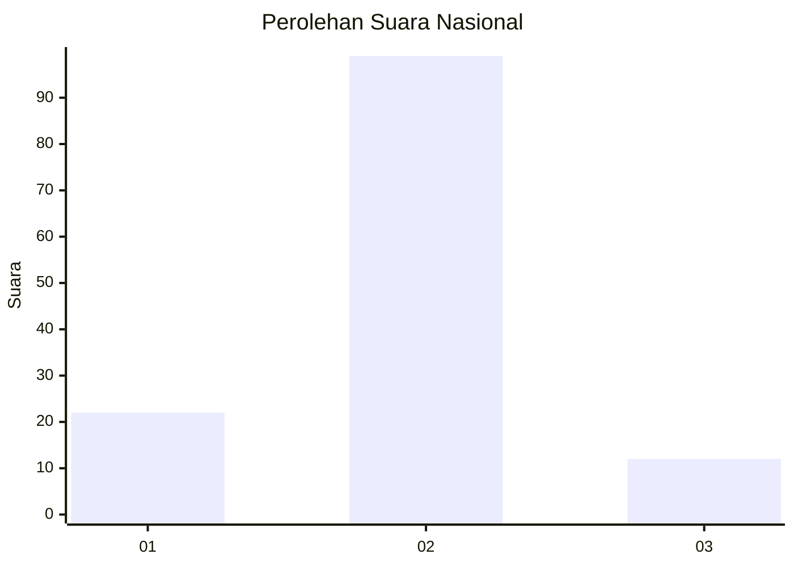
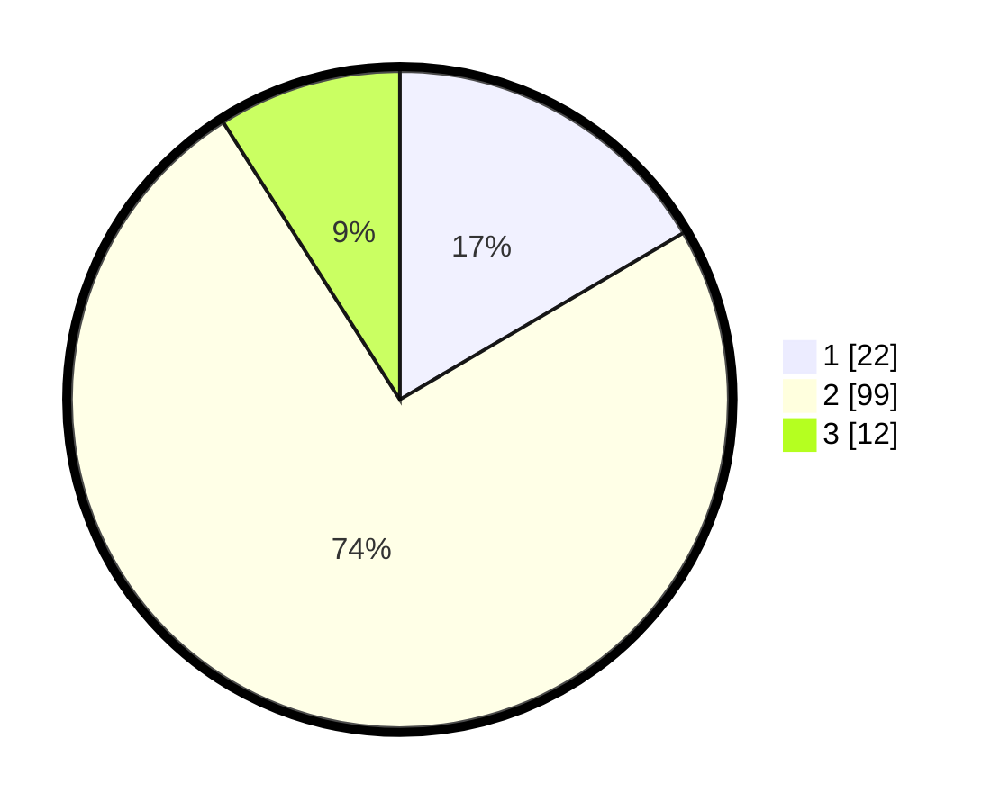

# Hasil

## Grafik

## Tabel

| No. | Nama Paslon    | Suara | Suara (raw) | Persentase |
|:--- |:-------------- | -----:| -----------:| ----------:|
| 1   | ANIES MUHAIMIN | 22    | [22][p-1]   | 16,54      |
| 2   | PRABOWO GIBRAN | 99    | [99][p-2]   | 74,44      |
| 3   | GANJAR MAHFUD  | 12    | [12][p-3]   | 9,02       |

[p-1]: https://github.com/gigit-pemilu/pemilu-2024/blob/main/pilpres/hitung-suara/sub/16-sumatera-selatan/sub/11-empat-lawang/sub/03-ulu-musi/sub/2024-tanjung-agung/sub/006-tps/sub/paslon-1.txt
[p-2]: https://github.com/gigit-pemilu/pemilu-2024/blob/main/pilpres/hitung-suara/sub/16-sumatera-selatan/sub/11-empat-lawang/sub/03-ulu-musi/sub/2024-tanjung-agung/sub/006-tps/sub/paslon-2.txt
[p-3]: https://github.com/gigit-pemilu/pemilu-2024/blob/main/pilpres/hitung-suara/sub/16-sumatera-selatan/sub/11-empat-lawang/sub/03-ulu-musi/sub/2024-tanjung-agung/sub/006-tps/sub/paslon-3.txt

## Foto C Plano

https://sirekap-obj-formc.kpu.go.id/1f11/pemilu/ppwp/16/11/03/20/24/1611032024006-20240215-005346--a71a97ec-c5ba-4df8-b83c-296647a14b0f.jpg

https://sirekap-obj-formc.kpu.go.id/1f11/pemilu/ppwp/16/11/03/20/24/1611032024006-20240216-155013--bffef071-437e-4792-9a66-ac56707f284d.jpg

https://sirekap-obj-formc.kpu.go.id/1f11/pemilu/ppwp/16/11/03/20/24/1611032024006-20240215-005935--acadbebe-f36e-4a9e-90bf-d275fe9c797c.jpg

## Metadata

| Key        | Value               |
| ---------- | ------------------- |
| Time Stamp | 2024-02-26 16:00:00 |

