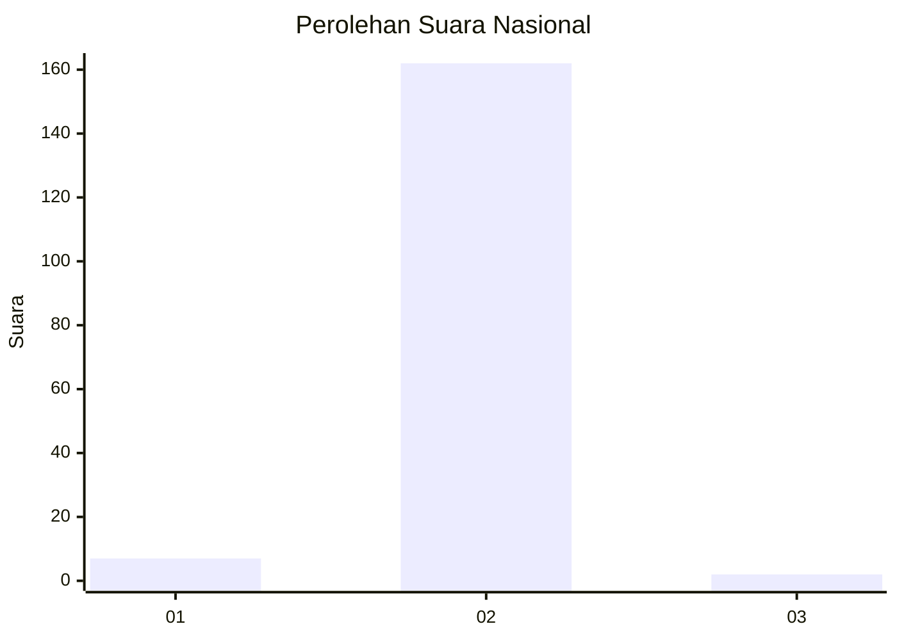
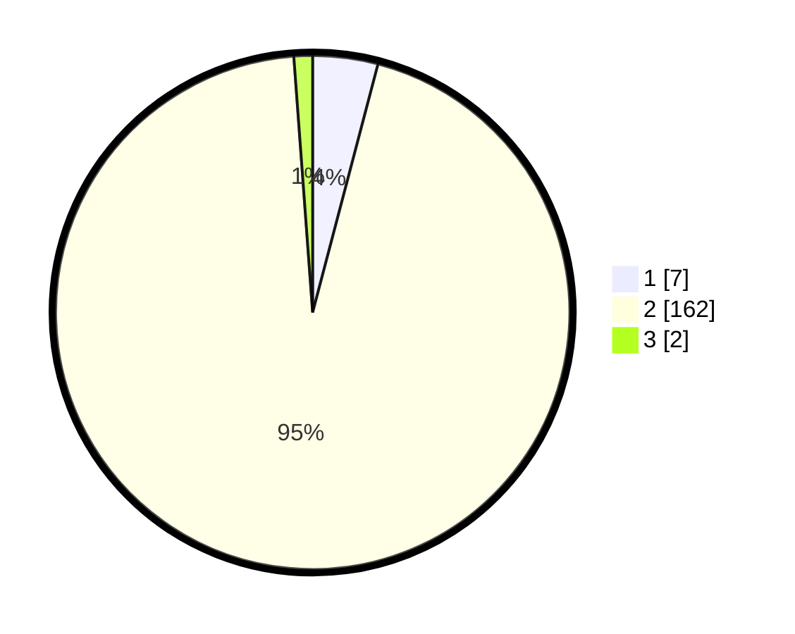

# Hasil

## Grafik

## Tabel

| No. | Nama Paslon    | Suara | Suara (raw) | Persentase |
|:--- |:-------------- | -----:| -----------:| ----------:|
| 1   | ANIES MUHAIMIN | 7     | [7][p-1]    | 4,09       |
| 2   | PRABOWO GIBRAN | 162   | [162][p-2]  | 94,74      |
| 3   | GANJAR MAHFUD  | 2     | [2][p-3]    | 1,17       |

[p-1]: https://github.com/gigit-pemilu/pemilu-2024/blob/main/pilpres/hitung-suara/sub/16-sumatera-selatan/sub/11-empat-lawang/sub/03-ulu-musi/sub/2025-galang/sub/003-tps/sub/paslon-1.txt
[p-2]: https://github.com/gigit-pemilu/pemilu-2024/blob/main/pilpres/hitung-suara/sub/16-sumatera-selatan/sub/11-empat-lawang/sub/03-ulu-musi/sub/2025-galang/sub/003-tps/sub/paslon-2.txt
[p-3]: https://github.com/gigit-pemilu/pemilu-2024/blob/main/pilpres/hitung-suara/sub/16-sumatera-selatan/sub/11-empat-lawang/sub/03-ulu-musi/sub/2025-galang/sub/003-tps/sub/paslon-3.txt

## Foto C Plano

https://sirekap-obj-formc.kpu.go.id/4af8/pemilu/ppwp/16/11/03/20/25/1611032025003-20240215-093826--21155b18-7382-4a6f-aecb-1cd6cad85cf4.jpg

https://sirekap-obj-formc.kpu.go.id/4af8/pemilu/ppwp/16/11/03/20/25/1611032025003-20240215-092748--b3961e82-b45c-4662-8c6c-e2ec68237dce.jpg

https://sirekap-obj-formc.kpu.go.id/4af8/pemilu/ppwp/16/11/03/20/25/1611032025003-20240215-092925--85cca439-1a4a-4701-a125-6b23442b3231.jpg

## Metadata

| Key        | Value               |
| ---------- | ------------------- |
| Time Stamp | 2024-02-25 22:00:00 |

