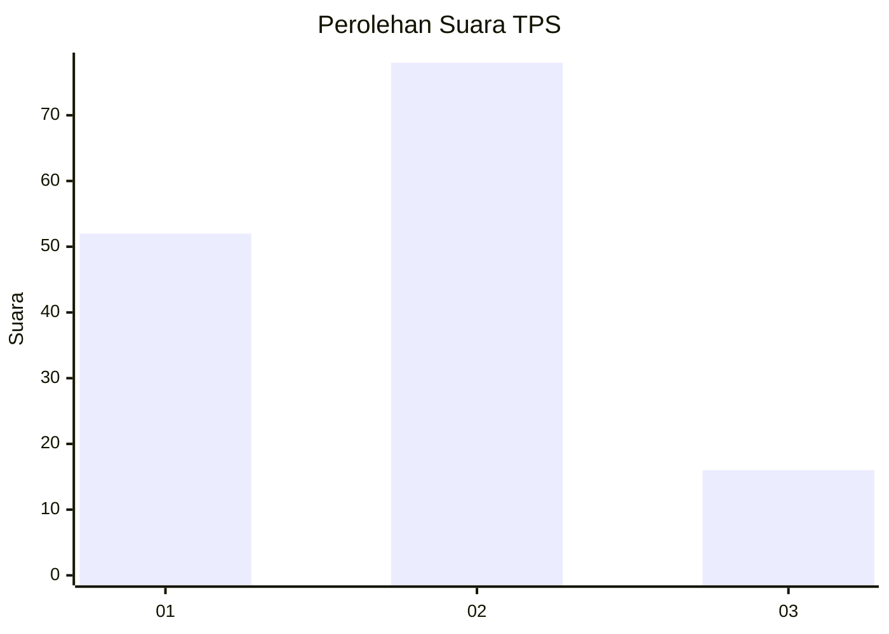
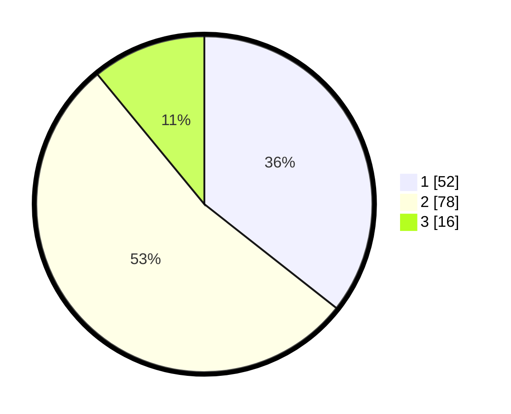

# Hasil

## Grafik

## Tabel

| No. | Nama Paslon    | Suara | Suara (raw) | Persentase |
|:--- |:-------------- | -----:| -----------:| ----------:|
| 1   | ANIES MUHAIMIN | 52    | [52][p-1]   | 35,62      |
| 2   | PRABOWO GIBRAN | 78    | [78][p-2]   | 53,42      |
| 3   | GANJAR MAHFUD  | 16    | [16][p-3]   | 10,96      |

[p-1]: https://github.com/gigit-pemilu/pemilu-2024-16-sumatera-selatan/blob/main/pilpres/hitung-suara/sub/16-sumatera-selatan/sub/11-empat-lawang/sub/04-tebing-tinggi/sub/1013-tanjungkupang/sub/002-tps/sub/paslon-1.txt
[p-2]: https://github.com/gigit-pemilu/pemilu-2024-16-sumatera-selatan/blob/main/pilpres/hitung-suara/sub/16-sumatera-selatan/sub/11-empat-lawang/sub/04-tebing-tinggi/sub/1013-tanjungkupang/sub/002-tps/sub/paslon-2.txt
[p-3]: https://github.com/gigit-pemilu/pemilu-2024-16-sumatera-selatan/blob/main/pilpres/hitung-suara/sub/16-sumatera-selatan/sub/11-empat-lawang/sub/04-tebing-tinggi/sub/1013-tanjungkupang/sub/002-tps/sub/paslon-3.txt

## Foto C Plano

https://sirekap-obj-formc.kpu.go.id/6ac4/pemilu/ppwp/16/11/04/10/13/1611041013002-20240215-011210--6a8b95b0-4f73-4450-b139-ba2db9f729bd.jpg

https://sirekap-obj-formc.kpu.go.id/6ac4/pemilu/ppwp/16/11/04/10/13/1611041013002-20240215-011234--697c4cf1-953e-43dc-a866-629a3f96c42e.jpg

https://sirekap-obj-formc.kpu.go.id/6ac4/pemilu/ppwp/16/11/04/10/13/1611041013002-20240215-011256--d01c1f55-4c38-4a1b-a613-07d4d4865aaf.jpg

## Metadata

| Key        | Value               |
| ---------- | ------------------- |
| Time Stamp | 2024-02-16 12:51:22 |

