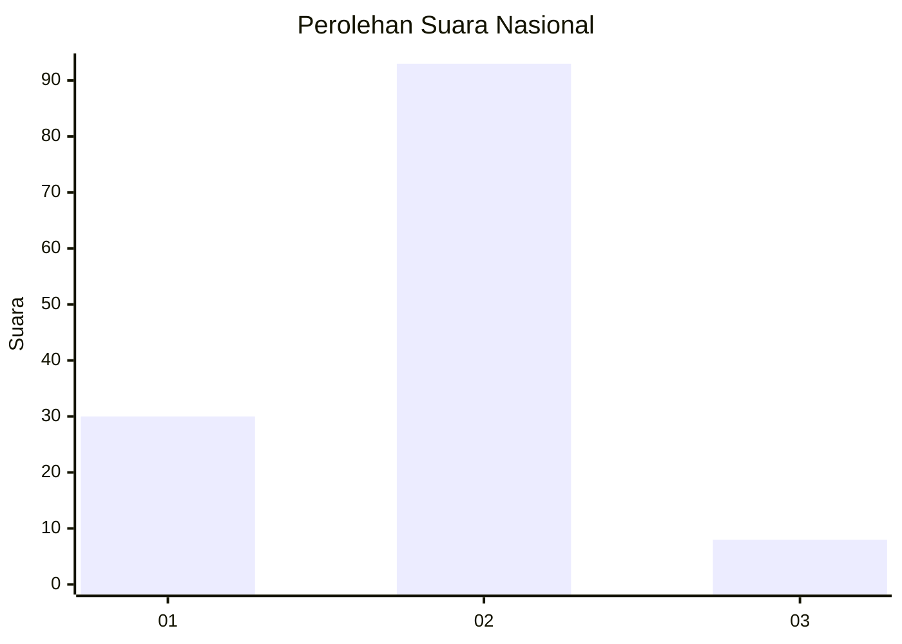
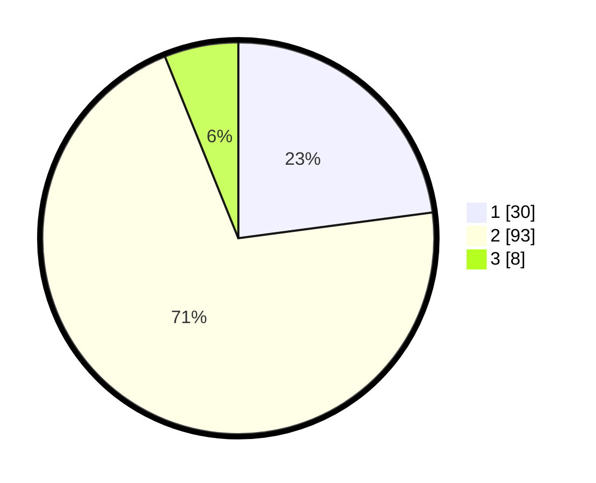

# Hasil

## Grafik

## Tabel

| No. | Nama Paslon    | Suara | Suara (raw) | Persentase |
|:--- |:-------------- | -----:| -----------:| ----------:|
| 1   | ANIES MUHAIMIN | 30    | [30][p-1]   | 22,90      |
| 2   | PRABOWO GIBRAN | 93    | [93][p-2]   | 70,99      |
| 3   | GANJAR MAHFUD  | 8     | [8][p-3]    | 6,11       |

[p-1]: https://github.com/gigit-pemilu/pemilu-2024/blob/main/pilpres/hitung-suara/sub/16-sumatera-selatan/sub/11-empat-lawang/sub/04-tebing-tinggi/sub/1013-tanjungkupang/sub/005-tps/sub/paslon-1.txt
[p-2]: https://github.com/gigit-pemilu/pemilu-2024/blob/main/pilpres/hitung-suara/sub/16-sumatera-selatan/sub/11-empat-lawang/sub/04-tebing-tinggi/sub/1013-tanjungkupang/sub/005-tps/sub/paslon-2.txt
[p-3]: https://github.com/gigit-pemilu/pemilu-2024/blob/main/pilpres/hitung-suara/sub/16-sumatera-selatan/sub/11-empat-lawang/sub/04-tebing-tinggi/sub/1013-tanjungkupang/sub/005-tps/sub/paslon-3.txt

## Foto C Plano

https://sirekap-obj-formc.kpu.go.id/27ea/pemilu/ppwp/16/11/04/10/13/1611041013005-20240215-001731--e4ab914d-11a3-4f26-9665-558acf767637.jpg

https://sirekap-obj-formc.kpu.go.id/27ea/pemilu/ppwp/16/11/04/10/13/1611041013005-20240215-001958--ccda947b-7ab2-467a-9e32-23c35541f5d7.jpg

https://sirekap-obj-formc.kpu.go.id/27ea/pemilu/ppwp/16/11/04/10/13/1611041013005-20240215-002249--fadf1c42-9f7f-448e-82a5-f8f47bcb136e.jpg

## Metadata

| Key        | Value               |
| ---------- | ------------------- |
| Time Stamp | 2024-02-16 16:25:10 |

