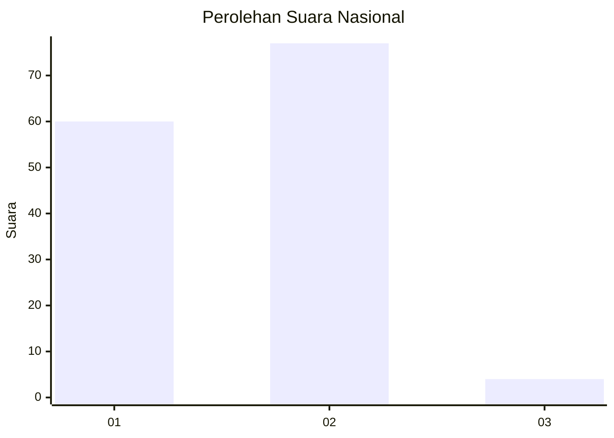
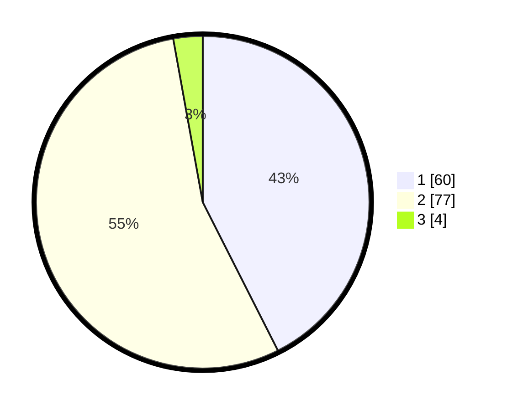

# Hasil

## Grafik

## Tabel

| No. | Nama Paslon    | Suara | Suara (raw) | Persentase |
|:--- |:-------------- | -----:| -----------:| ----------:|
| 1   | ANIES MUHAIMIN | 60    | [60][p-1]   | 42,55      |
| 2   | PRABOWO GIBRAN | 77    | [77][p-2]   | 54,61      |
| 3   | GANJAR MAHFUD  | 4     | [4][p-3]    | 2,84       |

[p-1]: https://github.com/gigit-pemilu/pemilu-2024/blob/main/pilpres/hitung-suara/sub/16-sumatera-selatan/sub/11-empat-lawang/sub/04-tebing-tinggi/sub/1013-tanjungkupang/sub/008-tps/sub/paslon-1.txt
[p-2]: https://github.com/gigit-pemilu/pemilu-2024/blob/main/pilpres/hitung-suara/sub/16-sumatera-selatan/sub/11-empat-lawang/sub/04-tebing-tinggi/sub/1013-tanjungkupang/sub/008-tps/sub/paslon-2.txt
[p-3]: https://github.com/gigit-pemilu/pemilu-2024/blob/main/pilpres/hitung-suara/sub/16-sumatera-selatan/sub/11-empat-lawang/sub/04-tebing-tinggi/sub/1013-tanjungkupang/sub/008-tps/sub/paslon-3.txt

## Foto C Plano

https://sirekap-obj-formc.kpu.go.id/2b4b/pemilu/ppwp/16/11/04/10/13/1611041013008-20240215-011718--66b2cc64-c19d-47d6-8a2e-eccd97f0002a.jpg

https://sirekap-obj-formc.kpu.go.id/2b4b/pemilu/ppwp/16/11/04/10/13/1611041013008-20240215-011550--1b7c9367-d6bc-42b2-ae16-dc3f7a7e4a31.jpg

https://sirekap-obj-formc.kpu.go.id/2b4b/pemilu/ppwp/16/11/04/10/13/1611041013008-20240215-011852--383b1bd3-0dd2-4904-b49e-bdab863ba5ca.jpg

## Metadata

| Key        | Value               |
| ---------- | ------------------- |
| Time Stamp | 2024-02-16 16:25:10 |

