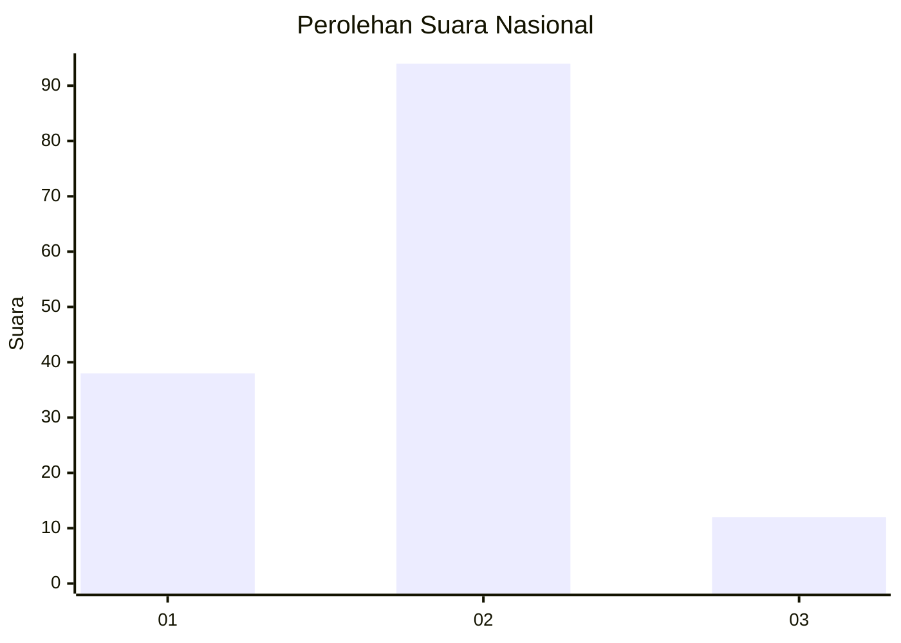
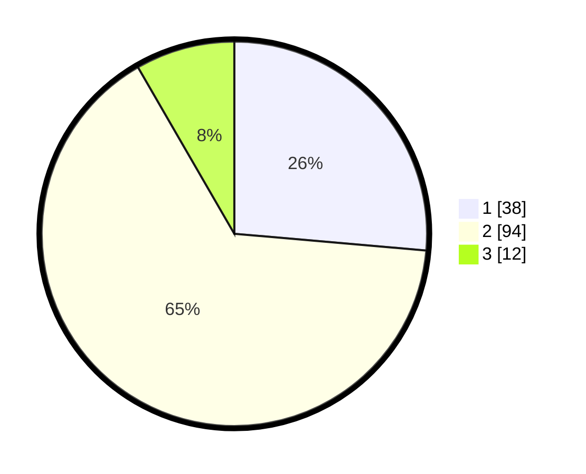

# Hasil

## Grafik

## Tabel

| No. | Nama Paslon    | Suara | Suara (raw) | Persentase |
|:--- |:-------------- | -----:| -----------:| ----------:|
| 1   | ANIES MUHAIMIN | 38    | [38][p-1]   | 26,39      |
| 2   | PRABOWO GIBRAN | 94    | [94][p-2]   | 65,28      |
| 3   | GANJAR MAHFUD  | 12    | [12][p-3]   | 8,33       |

[p-1]: https://github.com/gigit-pemilu/pemilu-2024/blob/main/pilpres/hitung-suara/sub/16-sumatera-selatan/sub/11-empat-lawang/sub/04-tebing-tinggi/sub/1013-tanjungkupang/sub/017-tps/sub/paslon-1.txt
[p-2]: https://github.com/gigit-pemilu/pemilu-2024/blob/main/pilpres/hitung-suara/sub/16-sumatera-selatan/sub/11-empat-lawang/sub/04-tebing-tinggi/sub/1013-tanjungkupang/sub/017-tps/sub/paslon-2.txt
[p-3]: https://github.com/gigit-pemilu/pemilu-2024/blob/main/pilpres/hitung-suara/sub/16-sumatera-selatan/sub/11-empat-lawang/sub/04-tebing-tinggi/sub/1013-tanjungkupang/sub/017-tps/sub/paslon-3.txt

## Foto C Plano

https://sirekap-obj-formc.kpu.go.id/fad7/pemilu/ppwp/16/11/04/10/13/1611041013017-20240215-044434--4f3912e0-b27e-4afb-abe5-b6d3e9911226.jpg

https://sirekap-obj-formc.kpu.go.id/fad7/pemilu/ppwp/16/11/04/10/13/1611041013017-20240215-015834--94324a85-eda8-4713-b105-bae2a4036f40.jpg

https://sirekap-obj-formc.kpu.go.id/fad7/pemilu/ppwp/16/11/04/10/13/1611041013017-20240215-015950--8427d340-41b2-4783-a4ab-f459ce511f34.jpg

## Metadata

| Key        | Value               |
| ---------- | ------------------- |
| Time Stamp | 2024-02-16 12:51:22 |

