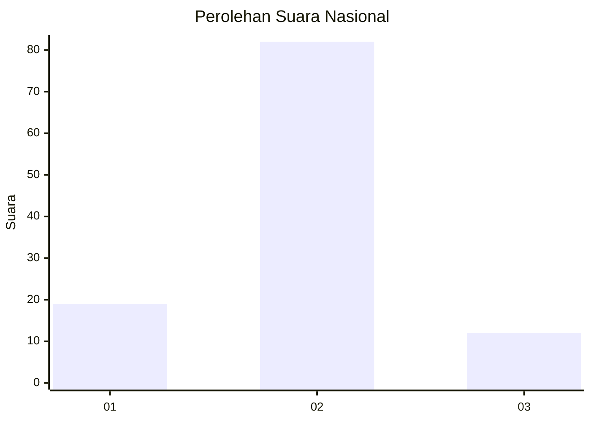
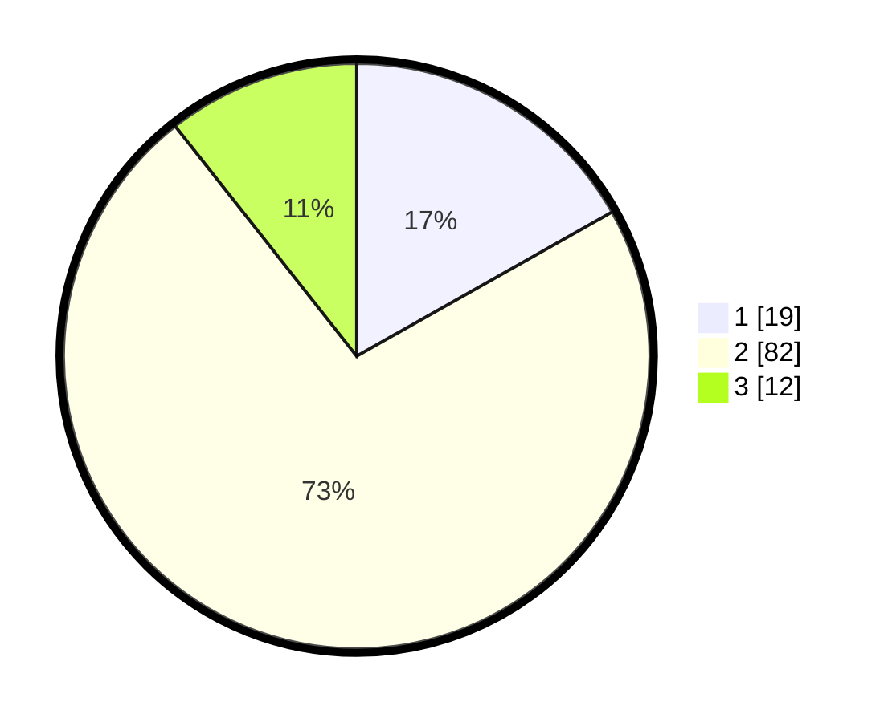

# Hasil

## Grafik

## Tabel

| No. | Nama Paslon    | Suara | Suara (raw) | Persentase |
|:--- |:-------------- | -----:| -----------:| ----------:|
| 1   | ANIES MUHAIMIN | 19    | [19][p-1]   | 16,81      |
| 2   | PRABOWO GIBRAN | 82    | [82][p-2]   | 72,57      |
| 3   | GANJAR MAHFUD  | 12    | [12][p-3]   | 10,62      |

[p-1]: https://github.com/gigit-pemilu/pemilu-2024/blob/main/pilpres/hitung-suara/sub/16-sumatera-selatan/sub/11-empat-lawang/sub/04-tebing-tinggi/sub/1014-tanjung-makmur/sub/002-tps/sub/paslon-1.txt
[p-2]: https://github.com/gigit-pemilu/pemilu-2024/blob/main/pilpres/hitung-suara/sub/16-sumatera-selatan/sub/11-empat-lawang/sub/04-tebing-tinggi/sub/1014-tanjung-makmur/sub/002-tps/sub/paslon-2.txt
[p-3]: https://github.com/gigit-pemilu/pemilu-2024/blob/main/pilpres/hitung-suara/sub/16-sumatera-selatan/sub/11-empat-lawang/sub/04-tebing-tinggi/sub/1014-tanjung-makmur/sub/002-tps/sub/paslon-3.txt

## Foto C Plano

https://sirekap-obj-formc.kpu.go.id/28b5/pemilu/ppwp/16/11/04/10/14/1611041014002-20240215-015157--6db01fa9-592a-480d-bb11-2553b14e9f37.jpg

https://sirekap-obj-formc.kpu.go.id/28b5/pemilu/ppwp/16/11/04/10/14/1611041014002-20240215-015808--00f59d23-abf0-4aa1-8ab3-4c6956d34f88.jpg

https://sirekap-obj-formc.kpu.go.id/28b5/pemilu/ppwp/16/11/04/10/14/1611041014002-20240215-000317--aee7c488-a4fe-4d5e-9770-f21aad33b0e7.jpg

## Metadata

| Key        | Value               |
| ---------- | ------------------- |
| Time Stamp | 2024-02-16 12:51:22 |

