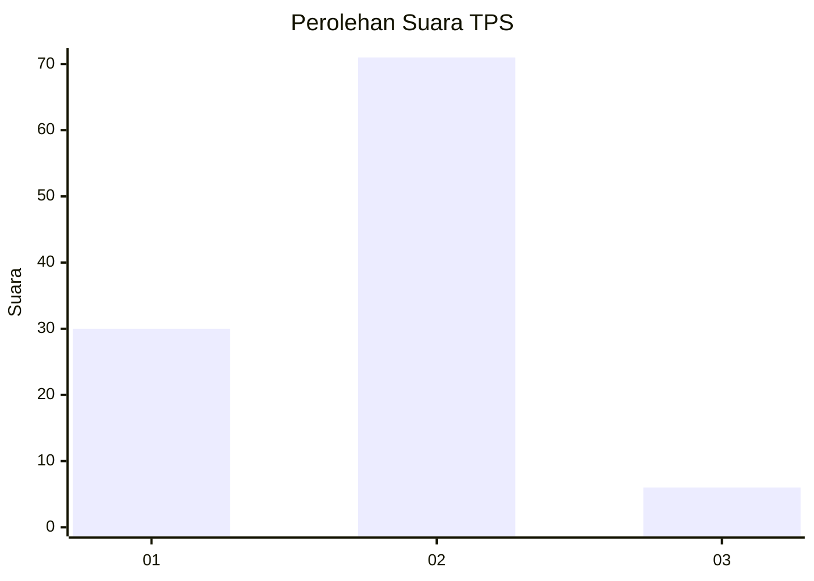
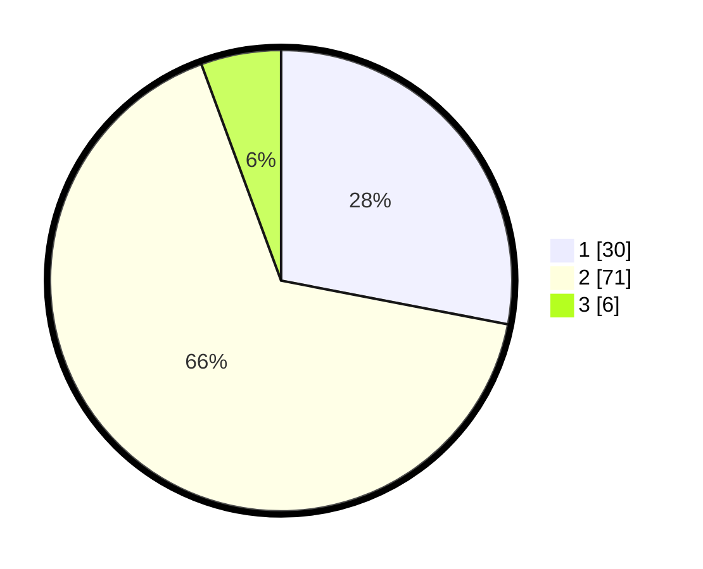

# Hasil

## Grafik

## Tabel

| No. | Nama Paslon    | Suara | Suara (raw) | Persentase |
|:--- |:-------------- | -----:| -----------:| ----------:|
| 1   | ANIES MUHAIMIN | 30    | [30][p-1]   | 28,04      |
| 2   | PRABOWO GIBRAN | 71    | [71][p-2]   | 66,36      |
| 3   | GANJAR MAHFUD  | 6     | [6][p-3]    | 5,61       |

[p-1]: https://github.com/gigit-pemilu/pemilu-2024-16-sumatera-selatan/blob/main/pilpres/hitung-suara/sub/16-sumatera-selatan/sub/11-empat-lawang/sub/04-tebing-tinggi/sub/1017-ps-tebing-tinggi/sub/003-tps/sub/paslon-1.txt
[p-2]: https://github.com/gigit-pemilu/pemilu-2024-16-sumatera-selatan/blob/main/pilpres/hitung-suara/sub/16-sumatera-selatan/sub/11-empat-lawang/sub/04-tebing-tinggi/sub/1017-ps-tebing-tinggi/sub/003-tps/sub/paslon-2.txt
[p-3]: https://github.com/gigit-pemilu/pemilu-2024-16-sumatera-selatan/blob/main/pilpres/hitung-suara/sub/16-sumatera-selatan/sub/11-empat-lawang/sub/04-tebing-tinggi/sub/1017-ps-tebing-tinggi/sub/003-tps/sub/paslon-3.txt

## Foto C Plano

https://sirekap-obj-formc.kpu.go.id/73fc/pemilu/ppwp/16/11/04/10/17/1611041017003-20240214-214847--1e7a0f5e-da19-4e5b-b39d-d4df66be2bd6.jpg

https://sirekap-obj-formc.kpu.go.id/73fc/pemilu/ppwp/16/11/04/10/17/1611041017003-20240216-101933--8339c683-e5ba-4ad6-a07c-11c821a1a825.jpg

https://sirekap-obj-formc.kpu.go.id/73fc/pemilu/ppwp/16/11/04/10/17/1611041017003-20240216-084958--2256d69b-4029-4c35-ace5-bd7064f72b2a.jpg

## Metadata

| Key        | Value               |
| ---------- | ------------------- |
| Time Stamp | 2024-02-16 12:51:22 |

