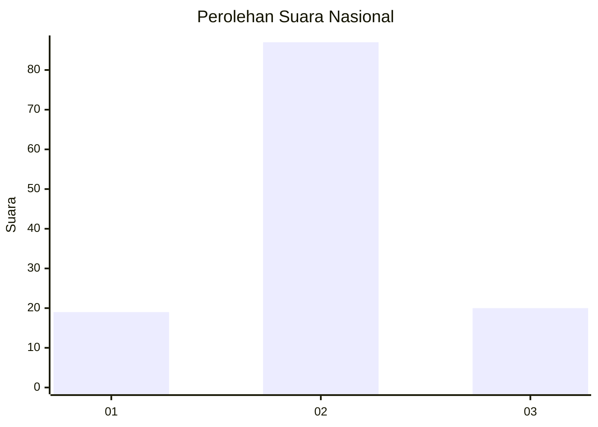
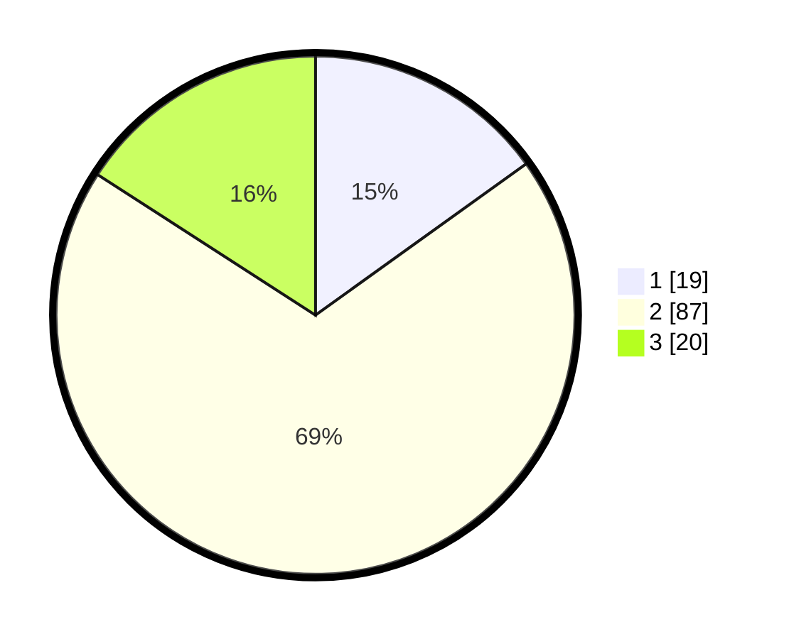

# Hasil

## Grafik

## Tabel

| No. | Nama Paslon    | Suara | Suara (raw) | Persentase |
|:--- |:-------------- | -----:| -----------:| ----------:|
| 1   | ANIES MUHAIMIN | 19    | [19][p-1]   | 15,08      |
| 2   | PRABOWO GIBRAN | 87    | [87][p-2]   | 69,05      |
| 3   | GANJAR MAHFUD  | 20    | [20][p-3]   | 15,87      |

[p-1]: https://github.com/gigit-pemilu/pemilu-2024/blob/main/pilpres/hitung-suara/sub/16-sumatera-selatan/sub/11-empat-lawang/sub/04-tebing-tinggi/sub/1017-ps-tebing-tinggi/sub/016-tps/sub/paslon-1.txt
[p-2]: https://github.com/gigit-pemilu/pemilu-2024/blob/main/pilpres/hitung-suara/sub/16-sumatera-selatan/sub/11-empat-lawang/sub/04-tebing-tinggi/sub/1017-ps-tebing-tinggi/sub/016-tps/sub/paslon-2.txt
[p-3]: https://github.com/gigit-pemilu/pemilu-2024/blob/main/pilpres/hitung-suara/sub/16-sumatera-selatan/sub/11-empat-lawang/sub/04-tebing-tinggi/sub/1017-ps-tebing-tinggi/sub/016-tps/sub/paslon-3.txt

## Foto C Plano

https://sirekap-obj-formc.kpu.go.id/8e64/pemilu/ppwp/16/11/04/10/17/1611041017016-20240215-102047--3ba614d9-8d9a-4b09-8672-5c2b6228c498.jpg

https://sirekap-obj-formc.kpu.go.id/8e64/pemilu/ppwp/16/11/04/10/17/1611041017016-20240214-235418--5676ebfc-b831-419e-b184-38452fd749b0.jpg

https://sirekap-obj-formc.kpu.go.id/8e64/pemilu/ppwp/16/11/04/10/17/1611041017016-20240214-235508--5384ced4-485e-4f06-b2b9-1f8750a069d1.jpg

## Metadata

| Key        | Value               |
| ---------- | ------------------- |
| Time Stamp | 2024-02-16 12:51:22 |

