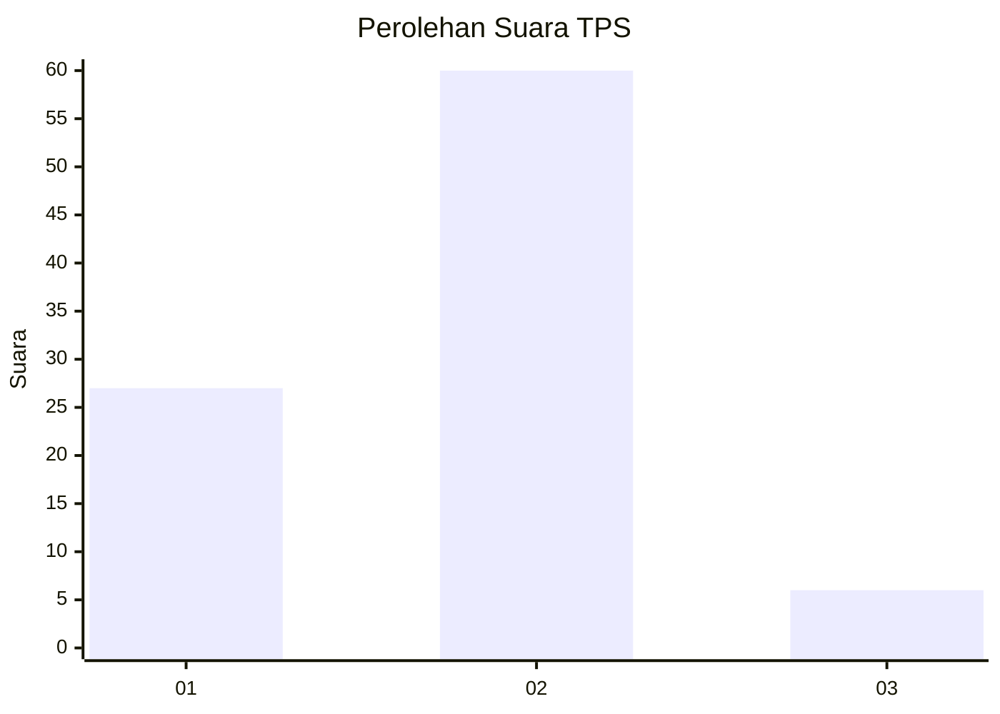
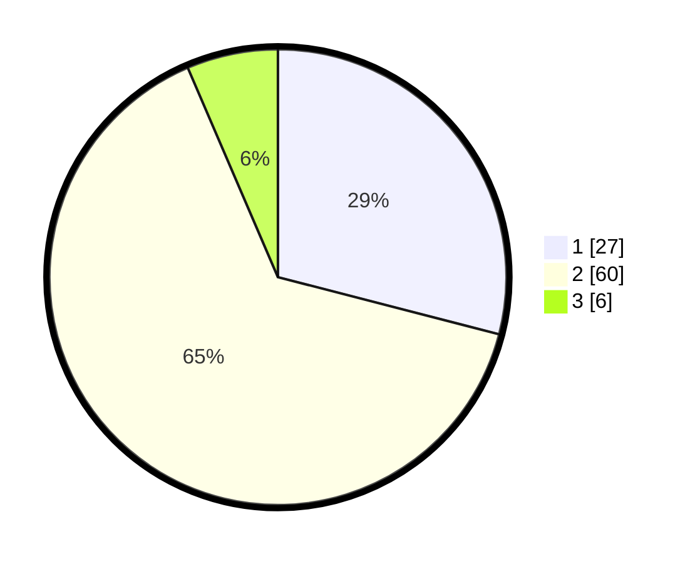

# Hasil

## Grafik

## Tabel

| No. | Nama Paslon    | Suara | Suara (raw) | Persentase |
|:--- |:-------------- | -----:| -----------:| ----------:|
| 1   | ANIES MUHAIMIN | 27    | [27][p-1]   | 29,03      |
| 2   | PRABOWO GIBRAN | 60    | [60][p-2]   | 64,52      |
| 3   | GANJAR MAHFUD  | 6     | [6][p-3]    | 6,45       |

[p-1]: https://github.com/gigit-pemilu/pemilu-2024-16-sumatera-selatan/blob/main/pilpres/hitung-suara/sub/16-sumatera-selatan/sub/11-empat-lawang/sub/04-tebing-tinggi/sub/1017-ps-tebing-tinggi/sub/025-tps/sub/paslon-1.txt
[p-2]: https://github.com/gigit-pemilu/pemilu-2024-16-sumatera-selatan/blob/main/pilpres/hitung-suara/sub/16-sumatera-selatan/sub/11-empat-lawang/sub/04-tebing-tinggi/sub/1017-ps-tebing-tinggi/sub/025-tps/sub/paslon-2.txt
[p-3]: https://github.com/gigit-pemilu/pemilu-2024-16-sumatera-selatan/blob/main/pilpres/hitung-suara/sub/16-sumatera-selatan/sub/11-empat-lawang/sub/04-tebing-tinggi/sub/1017-ps-tebing-tinggi/sub/025-tps/sub/paslon-3.txt

## Foto C Plano

https://sirekap-obj-formc.kpu.go.id/f807/pemilu/ppwp/16/11/04/10/17/1611041017025-20240215-063808--c09ff02e-ad7e-4857-9264-ba3b1f6ff643.jpg

https://sirekap-obj-formc.kpu.go.id/f807/pemilu/ppwp/16/11/04/10/17/1611041017025-20240215-064040--adfeee98-05e0-49be-8433-1409533adb6e.jpg

https://sirekap-obj-formc.kpu.go.id/f807/pemilu/ppwp/16/11/04/10/17/1611041017025-20240215-064235--6f208cc5-be78-4da0-959b-4653ad486ac3.jpg

## Metadata

| Key        | Value               |
| ---------- | ------------------- |
| Time Stamp | 2024-02-25 21:00:00 |

