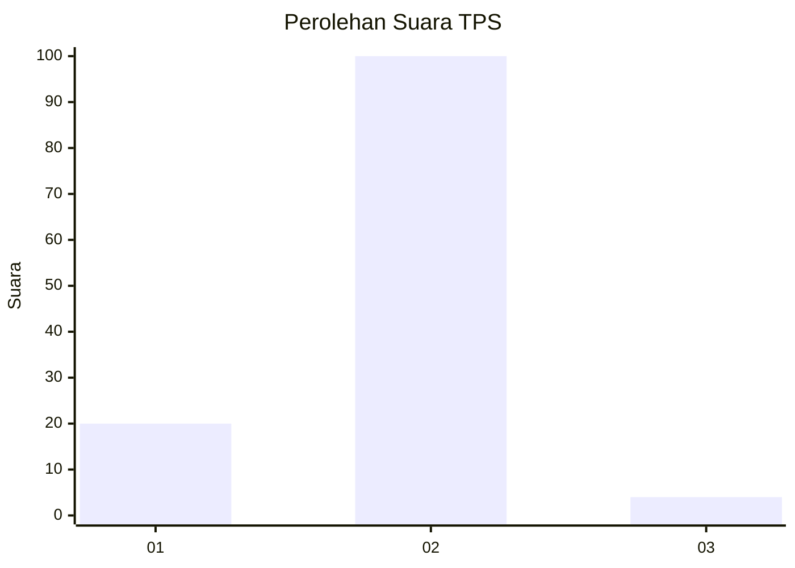
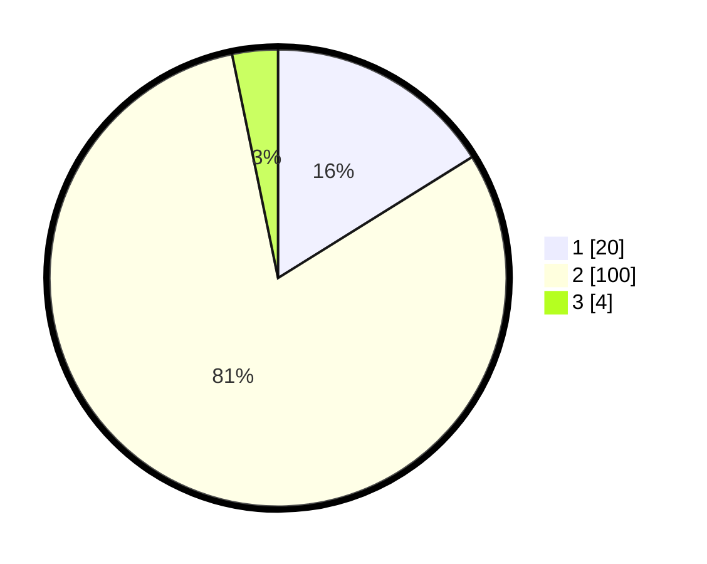

# Hasil

## Grafik

## Tabel

| No. | Nama Paslon    | Suara | Suara (raw) | Persentase |
|:--- |:-------------- | -----:| -----------:| ----------:|
| 1   | ANIES MUHAIMIN | 20    | [20][p-1]   | 16,13      |
| 2   | PRABOWO GIBRAN | 100   | [100][p-2]  | 80,65      |
| 3   | GANJAR MAHFUD  | 4     | [4][p-3]    | 3,23       |

[p-1]: https://github.com/gigit-pemilu/pemilu-2024-16-sumatera-selatan/blob/main/pilpres/hitung-suara/sub/16-sumatera-selatan/sub/11-empat-lawang/sub/04-tebing-tinggi/sub/2001-ujung-alih/sub/002-tps/sub/paslon-1.txt
[p-2]: https://github.com/gigit-pemilu/pemilu-2024-16-sumatera-selatan/blob/main/pilpres/hitung-suara/sub/16-sumatera-selatan/sub/11-empat-lawang/sub/04-tebing-tinggi/sub/2001-ujung-alih/sub/002-tps/sub/paslon-2.txt
[p-3]: https://github.com/gigit-pemilu/pemilu-2024-16-sumatera-selatan/blob/main/pilpres/hitung-suara/sub/16-sumatera-selatan/sub/11-empat-lawang/sub/04-tebing-tinggi/sub/2001-ujung-alih/sub/002-tps/sub/paslon-3.txt

## Foto C Plano

https://sirekap-obj-formc.kpu.go.id/4cef/pemilu/ppwp/16/11/04/20/01/1611042001002-20240218-124740--399d3944-5946-4a66-9a43-6abba657930b.jpg

https://sirekap-obj-formc.kpu.go.id/4cef/pemilu/ppwp/16/11/04/20/01/1611042001002-20240218-124920--1673e172-7df1-4c7b-be7b-901a0527e3eb.jpg

https://sirekap-obj-formc.kpu.go.id/4cef/pemilu/ppwp/16/11/04/20/01/1611042001002-20240215-032052--cab88940-503d-470e-a8d8-df7fd380d65f.jpg

## Metadata

| Key        | Value               |
| ---------- | ------------------- |
| Time Stamp | 2024-02-24 22:31:28 |

