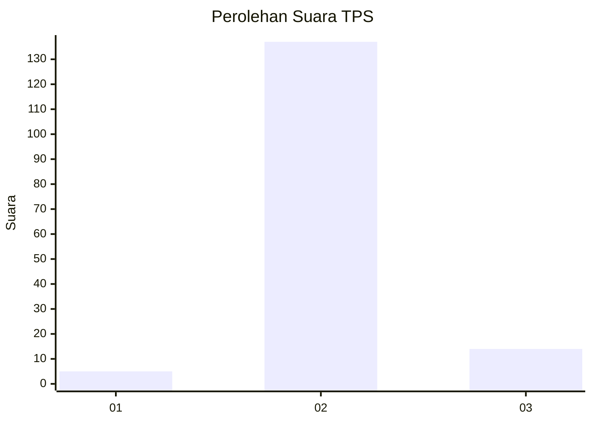
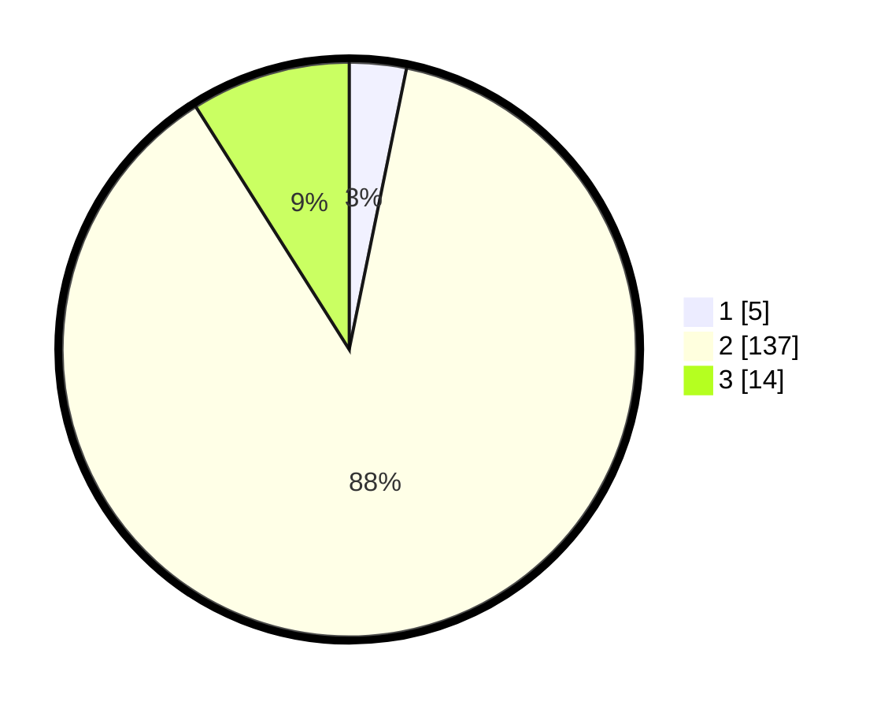

# Hasil

## Grafik

## Tabel

| No. | Nama Paslon    | Suara | Suara (raw) | Persentase |
|:--- |:-------------- | -----:| -----------:| ----------:|
| 1   | ANIES MUHAIMIN | 5     | [5][p-1]    | 3,21       |
| 2   | PRABOWO GIBRAN | 137   | [137][p-2]  | 87,82      |
| 3   | GANJAR MAHFUD  | 14    | [14][p-3]   | 8,97       |

[p-1]: https://github.com/gigit-pemilu/pemilu-2024-16-sumatera-selatan/blob/main/pilpres/hitung-suara/sub/16-sumatera-selatan/sub/11-empat-lawang/sub/04-tebing-tinggi/sub/2004-batu-pance/sub/004-tps/sub/paslon-1.txt
[p-2]: https://github.com/gigit-pemilu/pemilu-2024-16-sumatera-selatan/blob/main/pilpres/hitung-suara/sub/16-sumatera-selatan/sub/11-empat-lawang/sub/04-tebing-tinggi/sub/2004-batu-pance/sub/004-tps/sub/paslon-2.txt
[p-3]: https://github.com/gigit-pemilu/pemilu-2024-16-sumatera-selatan/blob/main/pilpres/hitung-suara/sub/16-sumatera-selatan/sub/11-empat-lawang/sub/04-tebing-tinggi/sub/2004-batu-pance/sub/004-tps/sub/paslon-3.txt

## Foto C Plano

https://sirekap-obj-formc.kpu.go.id/4d8a/pemilu/ppwp/16/11/04/20/04/1611042004004-20240215-011823--9a3f9214-5dc9-4f19-a3fb-d6f00efcd5a6.jpg

https://sirekap-obj-formc.kpu.go.id/4d8a/pemilu/ppwp/16/11/04/20/04/1611042004004-20240215-015726--deac8e16-aea2-4710-8c0f-4aea0d2ead53.jpg

https://sirekap-obj-formc.kpu.go.id/4d8a/pemilu/ppwp/16/11/04/20/04/1611042004004-20240215-011951--996a2d9b-a5d9-43c0-9752-dd979e410fc5.jpg

## Metadata

| Key        | Value               |
| ---------- | ------------------- |
| Time Stamp | 2024-02-16 13:30:32 |

