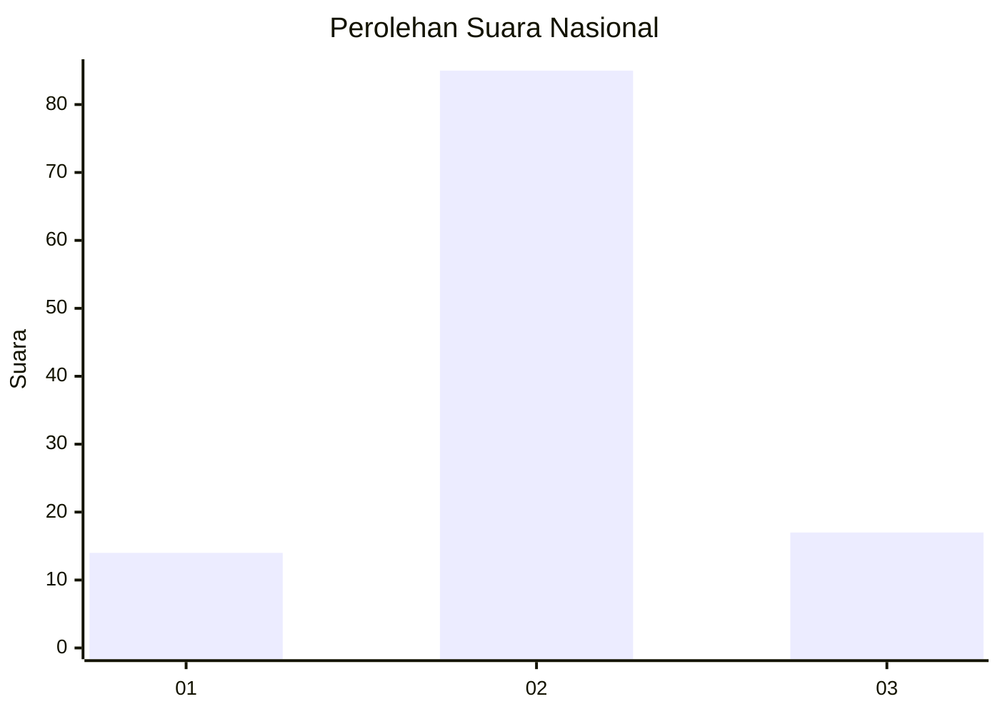
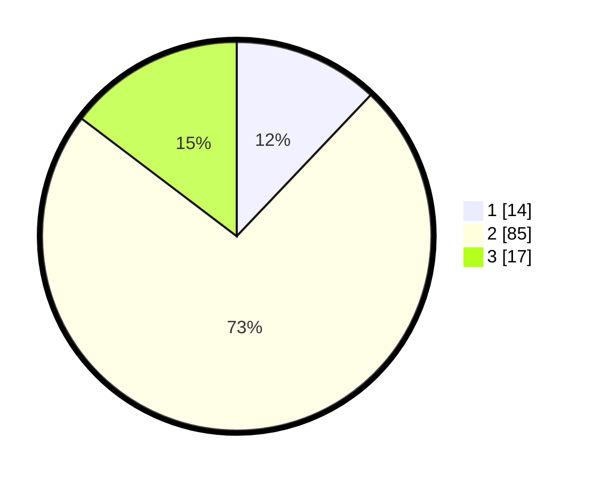

# Hasil

## Grafik

## Tabel

| No. | Nama Paslon    | Suara | Suara (raw) | Persentase |
|:--- |:-------------- | -----:| -----------:| ----------:|
| 1   | ANIES MUHAIMIN | 14    | [14][p-1]   | 12,07      |
| 2   | PRABOWO GIBRAN | 85    | [85][p-2]   | 73,28      |
| 3   | GANJAR MAHFUD  | 17    | [17][p-3]   | 14,66      |

[p-1]: https://github.com/gigit-pemilu/pemilu-2024/blob/main/pilpres/hitung-suara/sub/16-sumatera-selatan/sub/11-empat-lawang/sub/04-tebing-tinggi/sub/2008-rantau-tenang/sub/001-tps/sub/paslon-1.txt
[p-2]: https://github.com/gigit-pemilu/pemilu-2024/blob/main/pilpres/hitung-suara/sub/16-sumatera-selatan/sub/11-empat-lawang/sub/04-tebing-tinggi/sub/2008-rantau-tenang/sub/001-tps/sub/paslon-2.txt
[p-3]: https://github.com/gigit-pemilu/pemilu-2024/blob/main/pilpres/hitung-suara/sub/16-sumatera-selatan/sub/11-empat-lawang/sub/04-tebing-tinggi/sub/2008-rantau-tenang/sub/001-tps/sub/paslon-3.txt

## Foto C Plano

https://sirekap-obj-formc.kpu.go.id/95b2/pemilu/ppwp/16/11/04/20/08/1611042008001-20240216-181903--b08c1527-785e-4f21-b517-1dcb0b7ab5cd.jpg

https://sirekap-obj-formc.kpu.go.id/95b2/pemilu/ppwp/16/11/04/20/08/1611042008001-20240216-181904--9786185a-277c-4965-a38f-e3877334001e.jpg

https://sirekap-obj-formc.kpu.go.id/95b2/pemilu/ppwp/16/11/04/20/08/1611042008001-20240216-181904--e66e8990-675c-4ece-bcc0-44266a5c1deb.jpg

## Metadata

| Key        | Value               |
| ---------- | ------------------- |
| Time Stamp | 2024-02-24 22:31:28 |

## DATA PEMILIH TETAP

Jumlah pemilih dalam DPT: **0**.
 * L: **0**.
 * P: **0**.

## DATA PENGGUNA HAK PILIH

Jumlah pengguna hak pilih dalam DPT: **213**.
 * L: **100**.
 * P: **113**.

Jumlah pengguna hak pilih dalam DPTb: **110**.
 * L: **50**.
 * P: **60**.

Jumlah pengguna hak pilih dalam DPK: **110**.
 * L: **50**.
 * P: **60**.

Jumlah pengguna hak pilih: **213**.
 * L: **100**.
 * P: **113**.

## JUMLAH SUARA SAH DAN TIDAK SAH

JUMLAH SELURUH SUARA SAH: **0**.

JUMLAH SUARA TIDAK SAH: **0**.

JUMLAH SELURUH SUARA SAH DAN SUARA TIDAK SAH: **0**.

