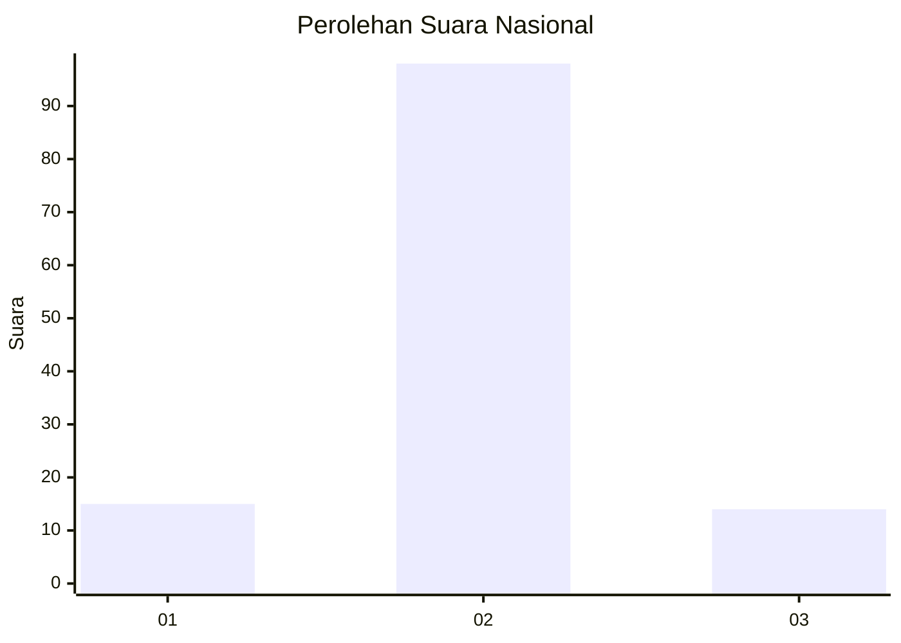
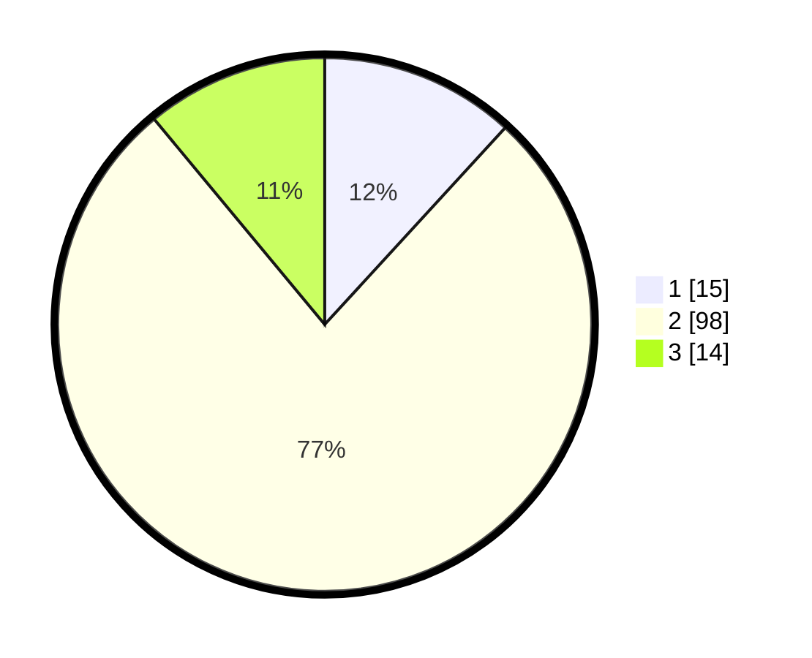

# Hasil

## Grafik

## Tabel

| No. | Nama Paslon    | Suara | Suara (raw) | Persentase |
|:--- |:-------------- | -----:| -----------:| ----------:|
| 1   | ANIES MUHAIMIN | 15    | [15][p-1]   | 11,81      |
| 2   | PRABOWO GIBRAN | 98    | [98][p-2]   | 77,17      |
| 3   | GANJAR MAHFUD  | 14    | [14][p-3]   | 11,02      |

[p-1]: https://github.com/gigit-pemilu/pemilu-2024/blob/main/pilpres/hitung-suara/sub/16-sumatera-selatan/sub/11-empat-lawang/sub/04-tebing-tinggi/sub/2012-lampar-baru/sub/001-tps/sub/paslon-1.txt
[p-2]: https://github.com/gigit-pemilu/pemilu-2024/blob/main/pilpres/hitung-suara/sub/16-sumatera-selatan/sub/11-empat-lawang/sub/04-tebing-tinggi/sub/2012-lampar-baru/sub/001-tps/sub/paslon-2.txt
[p-3]: https://github.com/gigit-pemilu/pemilu-2024/blob/main/pilpres/hitung-suara/sub/16-sumatera-selatan/sub/11-empat-lawang/sub/04-tebing-tinggi/sub/2012-lampar-baru/sub/001-tps/sub/paslon-3.txt

## Foto C Plano

https://sirekap-obj-formc.kpu.go.id/6e9c/pemilu/ppwp/16/11/04/20/12/1611042012001-20240214-232613--24578519-8a2a-46d3-870d-de920c1e7f6c.jpg

https://sirekap-obj-formc.kpu.go.id/6e9c/pemilu/ppwp/16/11/04/20/12/1611042012001-20240214-232639--cc49fa66-9de6-4484-ac0e-0d641c341bea.jpg

https://sirekap-obj-formc.kpu.go.id/6e9c/pemilu/ppwp/16/11/04/20/12/1611042012001-20240214-232649--9de6154b-e3cc-4e1d-a0b1-40cb9506eb39.jpg

## Metadata

| Key        | Value               |
| ---------- | ------------------- |
| Time Stamp | 2024-02-16 14:30:33 |

