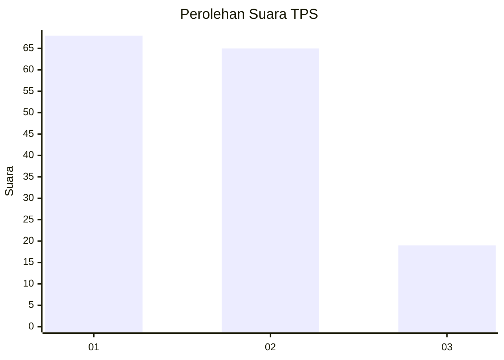
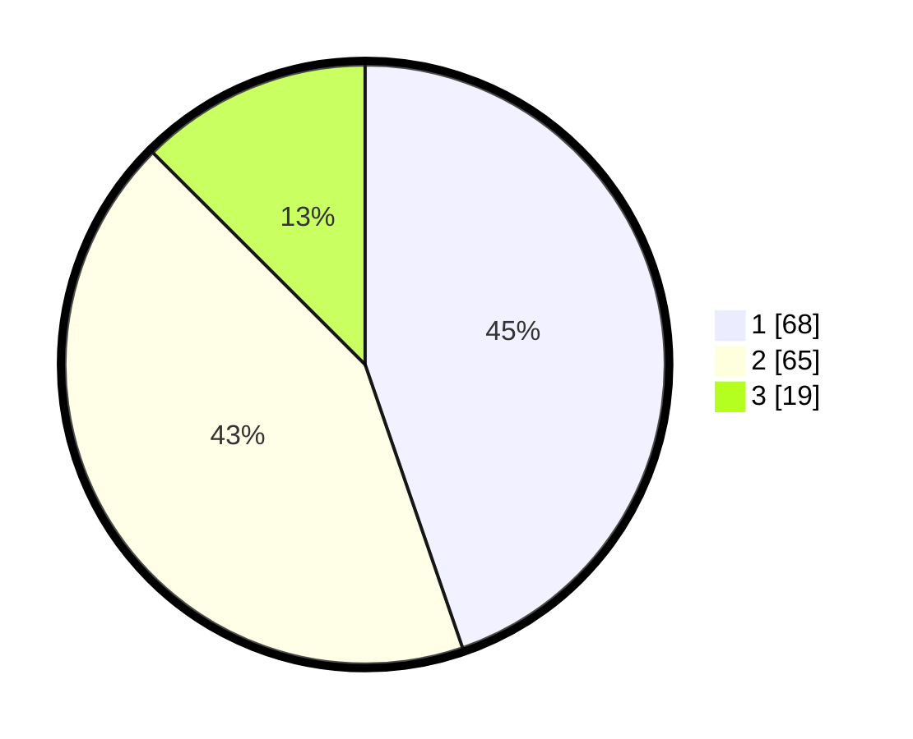

# Hasil

## Grafik

## Tabel

| No. | Nama Paslon    | Suara | Suara (raw) | Persentase |
|:--- |:-------------- | -----:| -----------:| ----------:|
| 1   | ANIES MUHAIMIN | 68    | [68][p-1]   | 44,74      |
| 2   | PRABOWO GIBRAN | 65    | [65][p-2]   | 42,76      |
| 3   | GANJAR MAHFUD  | 19    | [19][p-3]   | 12,50      |

[p-1]: https://github.com/gigit-pemilu/pemilu-2024-16-sumatera-selatan/blob/main/pilpres/hitung-suara/sub/16-sumatera-selatan/sub/11-empat-lawang/sub/04-tebing-tinggi/sub/2023-batu-raja-lama/sub/001-tps/sub/paslon-1.txt
[p-2]: https://github.com/gigit-pemilu/pemilu-2024-16-sumatera-selatan/blob/main/pilpres/hitung-suara/sub/16-sumatera-selatan/sub/11-empat-lawang/sub/04-tebing-tinggi/sub/2023-batu-raja-lama/sub/001-tps/sub/paslon-2.txt
[p-3]: https://github.com/gigit-pemilu/pemilu-2024-16-sumatera-selatan/blob/main/pilpres/hitung-suara/sub/16-sumatera-selatan/sub/11-empat-lawang/sub/04-tebing-tinggi/sub/2023-batu-raja-lama/sub/001-tps/sub/paslon-3.txt

## Foto C Plano

https://sirekap-obj-formc.kpu.go.id/662a/pemilu/ppwp/16/11/04/20/23/1611042023001-20240215-025052--ffb520fd-0ed6-4f17-ae58-0aebf7e38932.jpg

https://sirekap-obj-formc.kpu.go.id/662a/pemilu/ppwp/16/11/04/20/23/1611042023001-20240215-025233--356a1803-ae9e-4bf3-a762-9d39f61b89a6.jpg

https://sirekap-obj-formc.kpu.go.id/662a/pemilu/ppwp/16/11/04/20/23/1611042023001-20240215-052525--c2da0ed7-d068-41d6-9c74-83c8ddaa4720.jpg

## Metadata

| Key        | Value               |
| ---------- | ------------------- |
| Time Stamp | 2024-02-16 14:00:34 |

