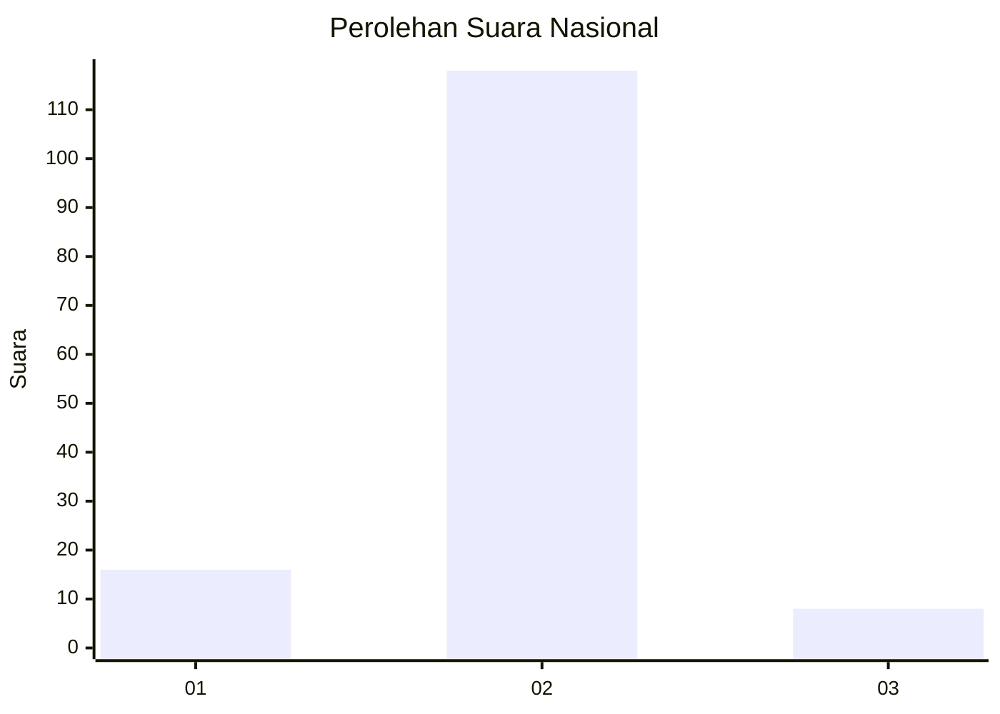
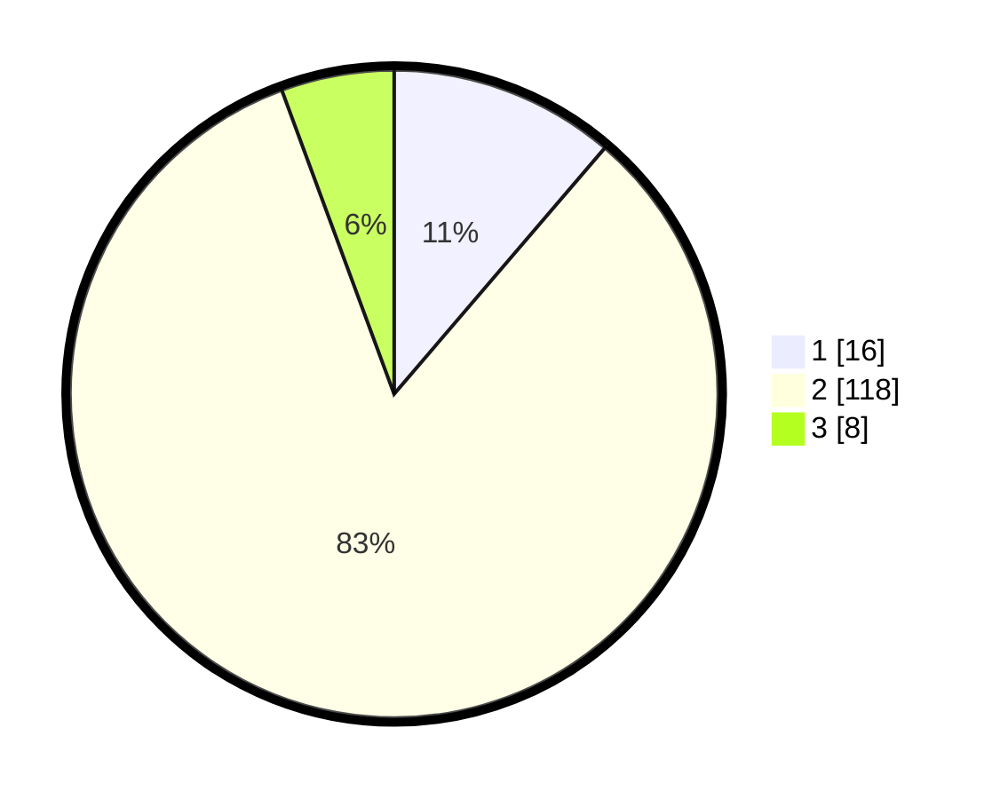

# Hasil

## Grafik

## Tabel

| No. | Nama Paslon    | Suara | Suara (raw) | Persentase |
|:--- |:-------------- | -----:| -----------:| ----------:|
| 1   | ANIES MUHAIMIN | 16    | [16][p-1]   | 11,27      |
| 2   | PRABOWO GIBRAN | 118   | [118][p-2]  | 83,10      |
| 3   | GANJAR MAHFUD  | 8     | [8][p-3]    | 5,63       |

[p-1]: https://github.com/gigit-pemilu/pemilu-2024/blob/main/pilpres/hitung-suara/sub/16-sumatera-selatan/sub/11-empat-lawang/sub/04-tebing-tinggi/sub/2024-sugi-waras/sub/001-tps/sub/paslon-1.txt
[p-2]: https://github.com/gigit-pemilu/pemilu-2024/blob/main/pilpres/hitung-suara/sub/16-sumatera-selatan/sub/11-empat-lawang/sub/04-tebing-tinggi/sub/2024-sugi-waras/sub/001-tps/sub/paslon-2.txt
[p-3]: https://github.com/gigit-pemilu/pemilu-2024/blob/main/pilpres/hitung-suara/sub/16-sumatera-selatan/sub/11-empat-lawang/sub/04-tebing-tinggi/sub/2024-sugi-waras/sub/001-tps/sub/paslon-3.txt

## Foto C Plano

https://sirekap-obj-formc.kpu.go.id/b7d4/pemilu/ppwp/16/11/04/20/24/1611042024001-20240215-080414--0edc0d77-909e-41f6-9775-caf932f8f7cf.jpg

https://sirekap-obj-formc.kpu.go.id/b7d4/pemilu/ppwp/16/11/04/20/24/1611042024001-20240215-080504--22b14322-ba4c-4bd4-97d5-5303b0533f7b.jpg

https://sirekap-obj-formc.kpu.go.id/b7d4/pemilu/ppwp/16/11/04/20/24/1611042024001-20240215-080617--a8f09a26-b044-4ab2-9194-3bab7c0bf120.jpg

## Metadata

| Key        | Value               |
| ---------- | ------------------- |
| Time Stamp | 2024-02-16 16:25:10 |

