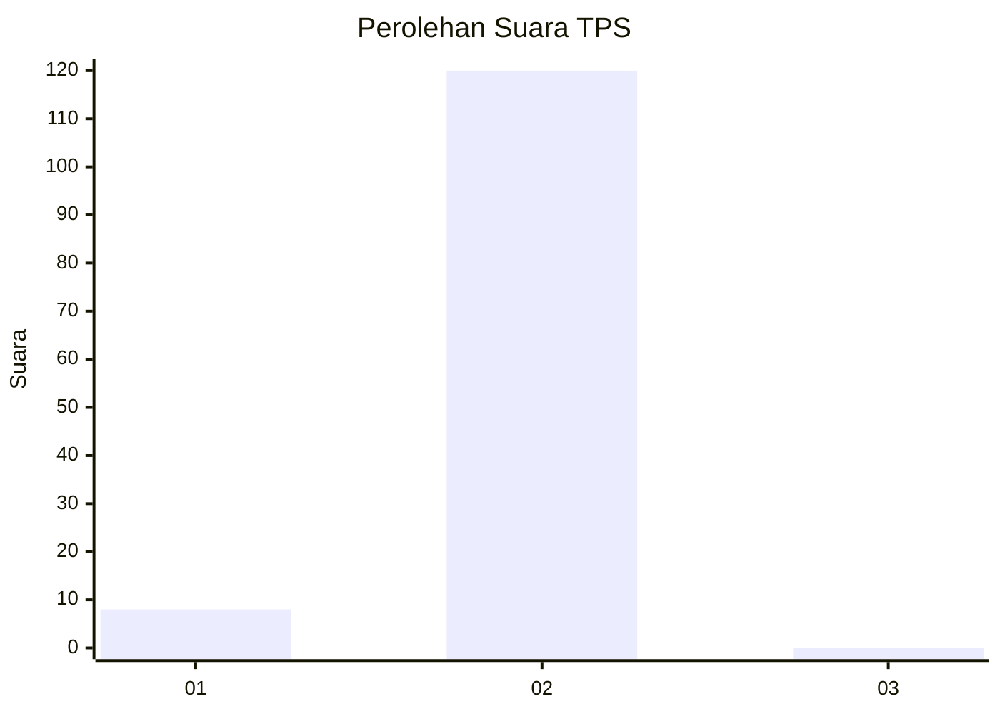
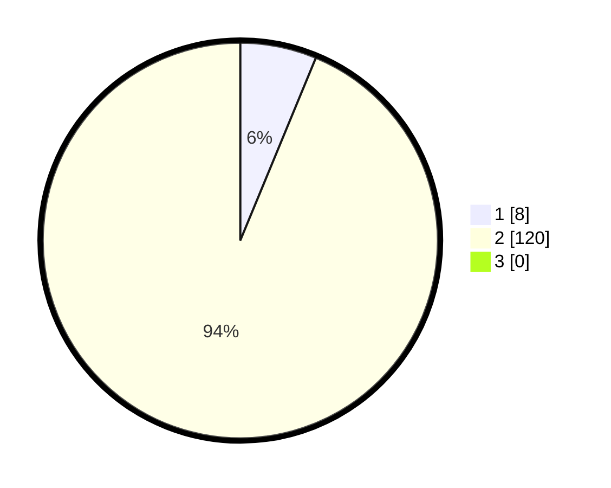

# Hasil

## Grafik

## Tabel

| No. | Nama Paslon    | Suara | Suara (raw) | Persentase |
|:--- |:-------------- | -----:| -----------:| ----------:|
| 1   | ANIES MUHAIMIN | 8     | [8][p-1]    | 6,25       |
| 2   | PRABOWO GIBRAN | 120   | [120][p-2]  | 93,75      |
| 3   | GANJAR MAHFUD  | 0     | [0][p-3]    | 0,00       |

[p-1]: https://github.com/gigit-pemilu/pemilu-2024-16-sumatera-selatan/blob/main/pilpres/hitung-suara/sub/16-sumatera-selatan/sub/11-empat-lawang/sub/04-tebing-tinggi/sub/2024-sugi-waras/sub/002-tps/sub/paslon-1.txt
[p-2]: https://github.com/gigit-pemilu/pemilu-2024-16-sumatera-selatan/blob/main/pilpres/hitung-suara/sub/16-sumatera-selatan/sub/11-empat-lawang/sub/04-tebing-tinggi/sub/2024-sugi-waras/sub/002-tps/sub/paslon-2.txt
[p-3]: https://github.com/gigit-pemilu/pemilu-2024-16-sumatera-selatan/blob/main/pilpres/hitung-suara/sub/16-sumatera-selatan/sub/11-empat-lawang/sub/04-tebing-tinggi/sub/2024-sugi-waras/sub/002-tps/sub/paslon-3.txt

## Foto C Plano

https://sirekap-obj-formc.kpu.go.id/114b/pemilu/ppwp/16/11/04/20/24/1611042024002-20240215-041809--6dc9a50b-caf2-4aa3-a7f0-ec3342aecd90.jpg

https://sirekap-obj-formc.kpu.go.id/114b/pemilu/ppwp/16/11/04/20/24/1611042024002-20240215-041521--5db31192-7aed-411b-b263-0d98500a190b.jpg

https://sirekap-obj-formc.kpu.go.id/114b/pemilu/ppwp/16/11/04/20/24/1611042024002-20240215-042128--3d279caa-a899-4db9-aef2-28ad71514701.jpg

## Metadata

| Key        | Value               |
| ---------- | ------------------- |
| Time Stamp | 2024-02-16 16:25:10 |

