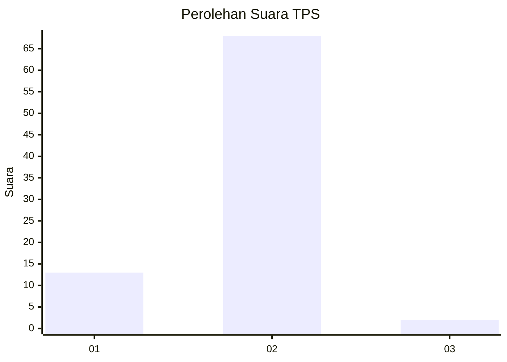
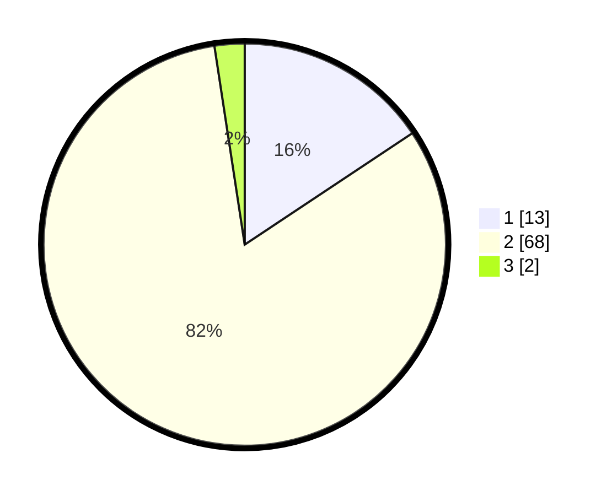

# Hasil

## Grafik

## Tabel

| No. | Nama Paslon    | Suara | Suara (raw) | Persentase |
|:--- |:-------------- | -----:| -----------:| ----------:|
| 1   | ANIES MUHAIMIN | 13    | [13][p-1]   | 15,66      |
| 2   | PRABOWO GIBRAN | 68    | [68][p-2]   | 81,93      |
| 3   | GANJAR MAHFUD  | 2     | [2][p-3]    | 2,41       |

[p-1]: https://github.com/gigit-pemilu/pemilu-2024-16-sumatera-selatan/blob/main/pilpres/hitung-suara/sub/16-sumatera-selatan/sub/11-empat-lawang/sub/04-tebing-tinggi/sub/2035-tanjung-kupang-baru/sub/002-tps/sub/paslon-1.txt
[p-2]: https://github.com/gigit-pemilu/pemilu-2024-16-sumatera-selatan/blob/main/pilpres/hitung-suara/sub/16-sumatera-selatan/sub/11-empat-lawang/sub/04-tebing-tinggi/sub/2035-tanjung-kupang-baru/sub/002-tps/sub/paslon-2.txt
[p-3]: https://github.com/gigit-pemilu/pemilu-2024-16-sumatera-selatan/blob/main/pilpres/hitung-suara/sub/16-sumatera-selatan/sub/11-empat-lawang/sub/04-tebing-tinggi/sub/2035-tanjung-kupang-baru/sub/002-tps/sub/paslon-3.txt

## Foto C Plano

https://sirekap-obj-formc.kpu.go.id/950a/pemilu/ppwp/16/11/04/20/35/1611042035002-20240214-230230--52f92136-ecd6-4879-b4aa-79804b44a6c0.jpg

https://sirekap-obj-formc.kpu.go.id/950a/pemilu/ppwp/16/11/04/20/35/1611042035002-20240214-230123--46d14ee9-d9cf-4fe6-b0df-e91fbe9da2cb.jpg

## Metadata

| Key        | Value               |
| ---------- | ------------------- |
| Time Stamp | 2024-02-24 22:31:28 |

