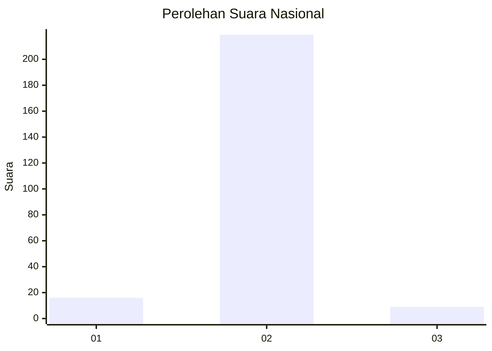
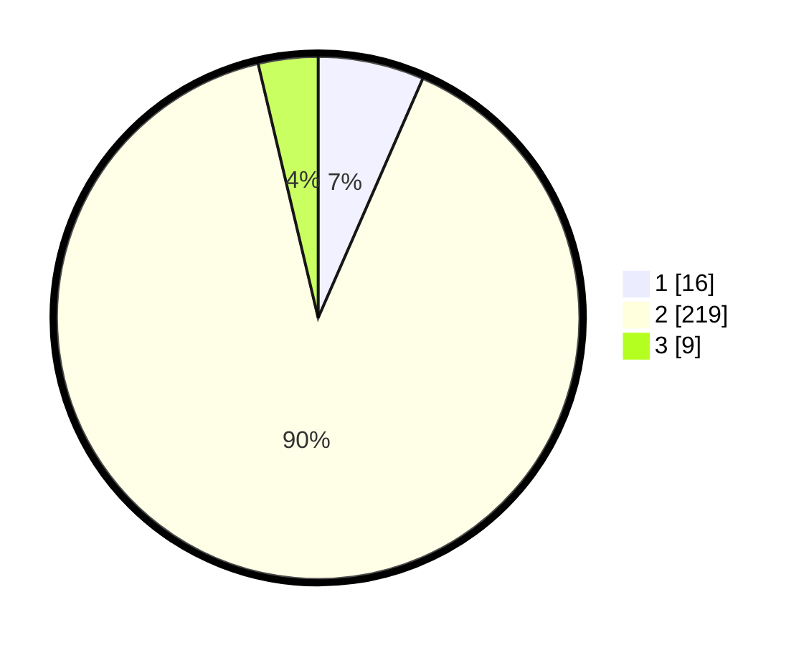

# Hasil

## Grafik

## Tabel

| No. | Nama Paslon    | Suara | Suara (raw) | Persentase |
|:--- |:-------------- | -----:| -----------:| ----------:|
| 1   | ANIES MUHAIMIN | 16    | [16][p-1]   | 6,56       |
| 2   | PRABOWO GIBRAN | 219   | [219][p-2]  | 89,75      |
| 3   | GANJAR MAHFUD  | 9     | [9][p-3]    | 3,69       |

[p-1]: https://github.com/gigit-pemilu/pemilu-2024/blob/main/pilpres/hitung-suara/sub/16-sumatera-selatan/sub/11-empat-lawang/sub/05-lintang-kanan/sub/2001-umo-jati/sub/001-tps/sub/paslon-1.txt
[p-2]: https://github.com/gigit-pemilu/pemilu-2024/blob/main/pilpres/hitung-suara/sub/16-sumatera-selatan/sub/11-empat-lawang/sub/05-lintang-kanan/sub/2001-umo-jati/sub/001-tps/sub/paslon-2.txt
[p-3]: https://github.com/gigit-pemilu/pemilu-2024/blob/main/pilpres/hitung-suara/sub/16-sumatera-selatan/sub/11-empat-lawang/sub/05-lintang-kanan/sub/2001-umo-jati/sub/001-tps/sub/paslon-3.txt

## Foto C Plano

https://sirekap-obj-formc.kpu.go.id/3570/pemilu/ppwp/16/11/05/20/01/1611052001001-20240219-231352--438137e8-e9ee-453c-ac77-ad03c876c865.jpg

https://sirekap-obj-formc.kpu.go.id/3570/pemilu/ppwp/16/11/05/20/01/1611052001001-20240219-231604--b79dc3ee-2e95-42ff-9dc9-2242dee6a287.jpg

https://sirekap-obj-formc.kpu.go.id/3570/pemilu/ppwp/16/11/05/20/01/1611052001001-20240219-232237--c0f88a62-70b0-4338-b196-09c5322dc722.jpg

## Metadata

| Key        | Value               |
| ---------- | ------------------- |
| Time Stamp | 2024-02-24 22:31:28 |

