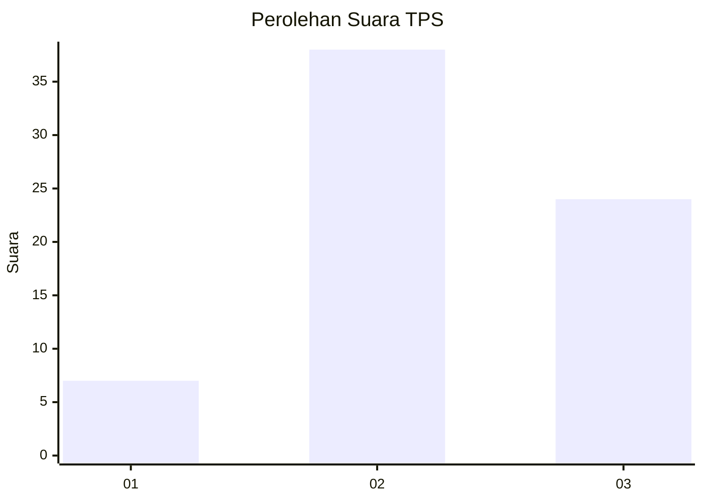
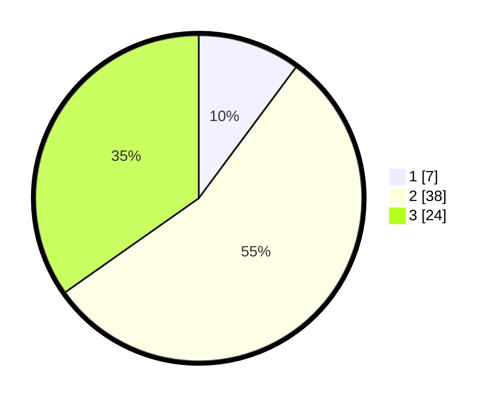

# Hasil

## Grafik

## Tabel

| No. | Nama Paslon    | Suara | Suara (raw) | Persentase |
|:--- |:-------------- | -----:| -----------:| ----------:|
| 1   | ANIES MUHAIMIN | 7     | [7][p-1]    | 10,14      |
| 2   | PRABOWO GIBRAN | 38    | [38][p-2]   | 55,07      |
| 3   | GANJAR MAHFUD  | 24    | [24][p-3]   | 34,78      |

[p-1]: https://github.com/gigit-pemilu/pemilu-2024-16-sumatera-selatan/blob/main/pilpres/hitung-suara/sub/16-sumatera-selatan/sub/11-empat-lawang/sub/05-lintang-kanan/sub/2001-umo-jati/sub/002-tps/sub/paslon-1.txt
[p-2]: https://github.com/gigit-pemilu/pemilu-2024-16-sumatera-selatan/blob/main/pilpres/hitung-suara/sub/16-sumatera-selatan/sub/11-empat-lawang/sub/05-lintang-kanan/sub/2001-umo-jati/sub/002-tps/sub/paslon-2.txt
[p-3]: https://github.com/gigit-pemilu/pemilu-2024-16-sumatera-selatan/blob/main/pilpres/hitung-suara/sub/16-sumatera-selatan/sub/11-empat-lawang/sub/05-lintang-kanan/sub/2001-umo-jati/sub/002-tps/sub/paslon-3.txt

## Foto C Plano

https://sirekap-obj-formc.kpu.go.id/757f/pemilu/ppwp/16/11/05/20/01/1611052001002-20240223-020208--3f76a649-83d3-4cc6-bd05-fb3b4317e333.jpg

https://sirekap-obj-formc.kpu.go.id/757f/pemilu/ppwp/16/11/05/20/01/1611052001002-20240223-020311--32f60021-9ad8-4269-ae48-a3d68a1b9cef.jpg

https://sirekap-obj-formc.kpu.go.id/757f/pemilu/ppwp/16/11/05/20/01/1611052001002-20240223-020352--72285f93-89e3-458d-988f-d6529217d1f9.jpg

## Metadata

| Key        | Value               |
| ---------- | ------------------- |
| Time Stamp | 2024-02-24 22:31:28 |

