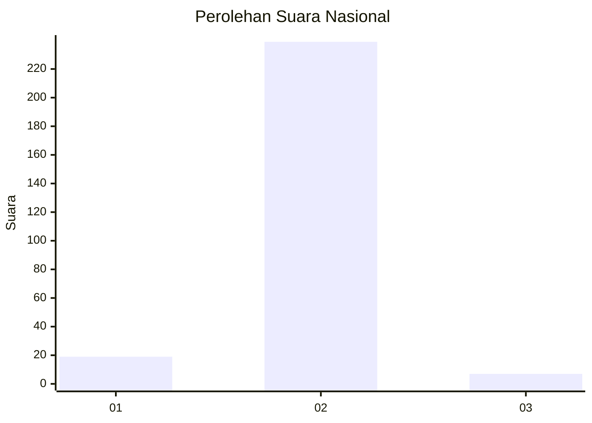
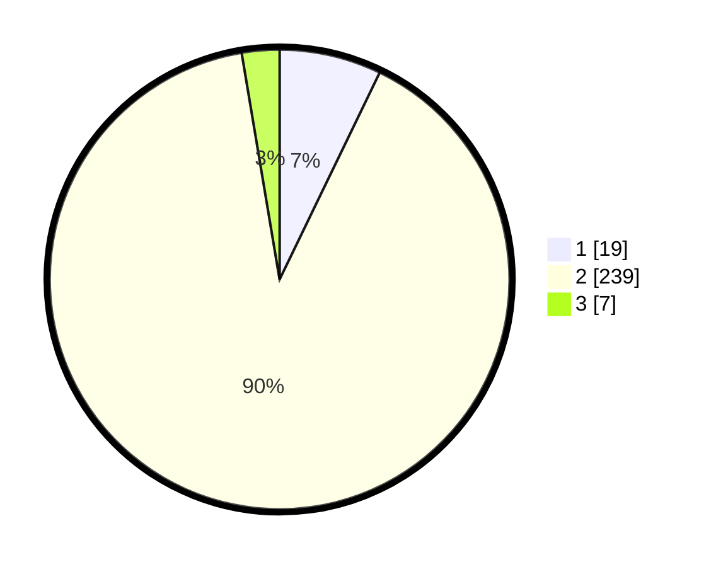

# Hasil

## Grafik

## Tabel

| No. | Nama Paslon    | Suara | Suara (raw) | Persentase |
|:--- |:-------------- | -----:| -----------:| ----------:|
| 1   | ANIES MUHAIMIN | 19    | [19][p-1]   | 7,17       |
| 2   | PRABOWO GIBRAN | 239   | [239][p-2]  | 90,19      |
| 3   | GANJAR MAHFUD  | 7     | [7][p-3]    | 2,64       |

[p-1]: https://github.com/gigit-pemilu/pemilu-2024/blob/main/pilpres/hitung-suara/sub/16-sumatera-selatan/sub/11-empat-lawang/sub/05-lintang-kanan/sub/2001-umo-jati/sub/003-tps/sub/paslon-1.txt
[p-2]: https://github.com/gigit-pemilu/pemilu-2024/blob/main/pilpres/hitung-suara/sub/16-sumatera-selatan/sub/11-empat-lawang/sub/05-lintang-kanan/sub/2001-umo-jati/sub/003-tps/sub/paslon-2.txt
[p-3]: https://github.com/gigit-pemilu/pemilu-2024/blob/main/pilpres/hitung-suara/sub/16-sumatera-selatan/sub/11-empat-lawang/sub/05-lintang-kanan/sub/2001-umo-jati/sub/003-tps/sub/paslon-3.txt

## Foto C Plano

https://sirekap-obj-formc.kpu.go.id/19a6/pemilu/ppwp/16/11/05/20/01/1611052001003-20240220-015956--c68452fe-d041-4344-bc55-a17155bb2b60.jpg

https://sirekap-obj-formc.kpu.go.id/19a6/pemilu/ppwp/16/11/05/20/01/1611052001003-20240219-235240--5fcd5856-6bc2-4c99-ad9a-30ecc7e0e4c9.jpg

https://sirekap-obj-formc.kpu.go.id/19a6/pemilu/ppwp/16/11/05/20/01/1611052001003-20240219-235351--ef352694-5fe9-4bba-a91a-6473f6c3dfc2.jpg

## Metadata

| Key        | Value               |
| ---------- | ------------------- |
| Time Stamp | 2024-02-24 22:31:28 |

