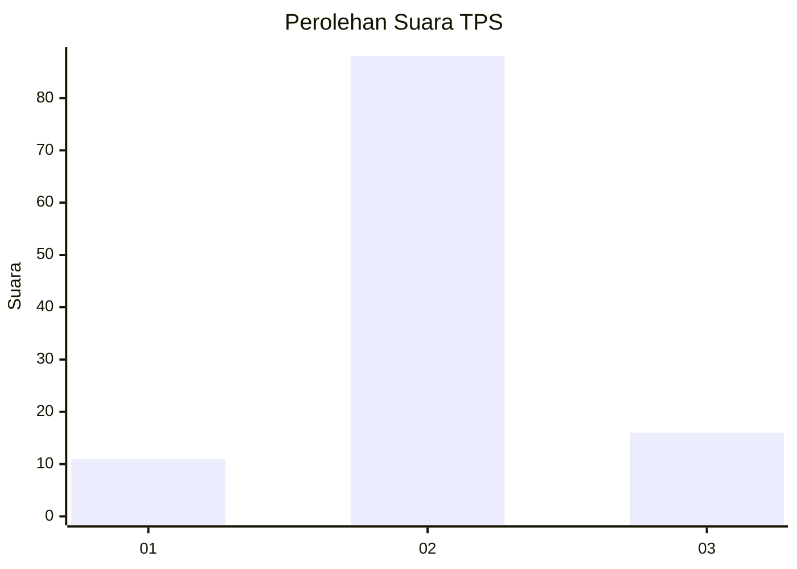
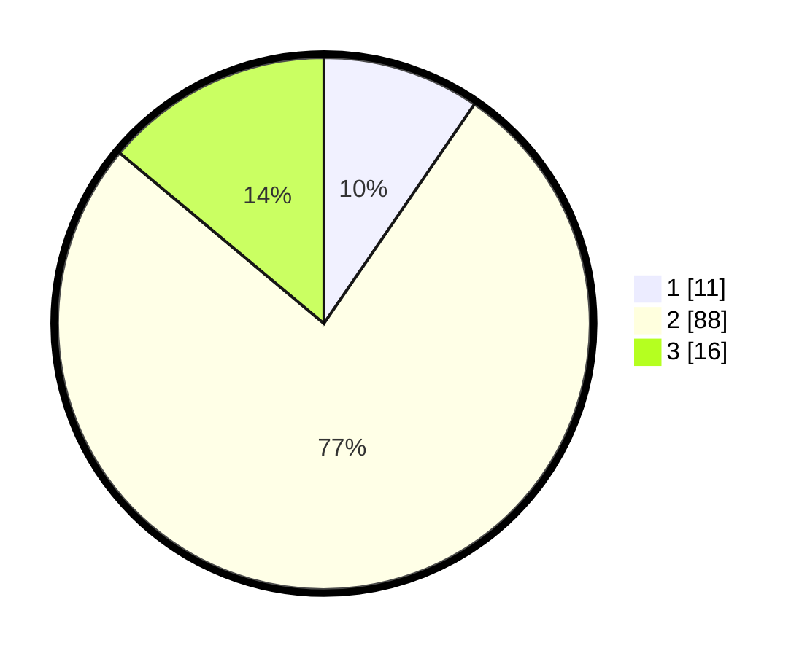

# Hasil

## Grafik

## Tabel

| No. | Nama Paslon    | Suara | Suara (raw) | Persentase |
|:--- |:-------------- | -----:| -----------:| ----------:|
| 1   | ANIES MUHAIMIN | 11    | [11][p-1]   | 9,57       |
| 2   | PRABOWO GIBRAN | 88    | [88][p-2]   | 76,52      |
| 3   | GANJAR MAHFUD  | 16    | [16][p-3]   | 13,91      |

[p-1]: https://github.com/gigit-pemilu/pemilu-2024-16-sumatera-selatan/blob/main/pilpres/hitung-suara/sub/16-sumatera-selatan/sub/11-empat-lawang/sub/05-lintang-kanan/sub/2002-tanjung-jati/sub/001-tps/sub/paslon-1.txt
[p-2]: https://github.com/gigit-pemilu/pemilu-2024-16-sumatera-selatan/blob/main/pilpres/hitung-suara/sub/16-sumatera-selatan/sub/11-empat-lawang/sub/05-lintang-kanan/sub/2002-tanjung-jati/sub/001-tps/sub/paslon-2.txt
[p-3]: https://github.com/gigit-pemilu/pemilu-2024-16-sumatera-selatan/blob/main/pilpres/hitung-suara/sub/16-sumatera-selatan/sub/11-empat-lawang/sub/05-lintang-kanan/sub/2002-tanjung-jati/sub/001-tps/sub/paslon-3.txt

## Foto C Plano

https://sirekap-obj-formc.kpu.go.id/077b/pemilu/ppwp/16/11/05/20/02/1611052002001-20240223-000622--e4579e50-46ca-40e6-94ad-75d2b4e1d303.jpg

https://sirekap-obj-formc.kpu.go.id/077b/pemilu/ppwp/16/11/05/20/02/1611052002001-20240223-000717--20e11b8b-915b-451f-8dec-0b844a596aea.jpg

https://sirekap-obj-formc.kpu.go.id/077b/pemilu/ppwp/16/11/05/20/02/1611052002001-20240223-000820--fdf56670-32bc-4f27-848f-6b17bf99c01e.jpg

## Metadata

| Key        | Value               |
| ---------- | ------------------- |
| Time Stamp | 2024-02-24 22:31:28 |

