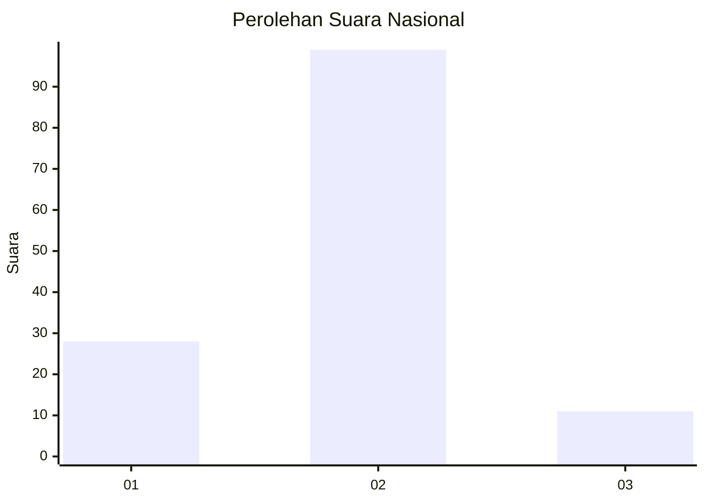
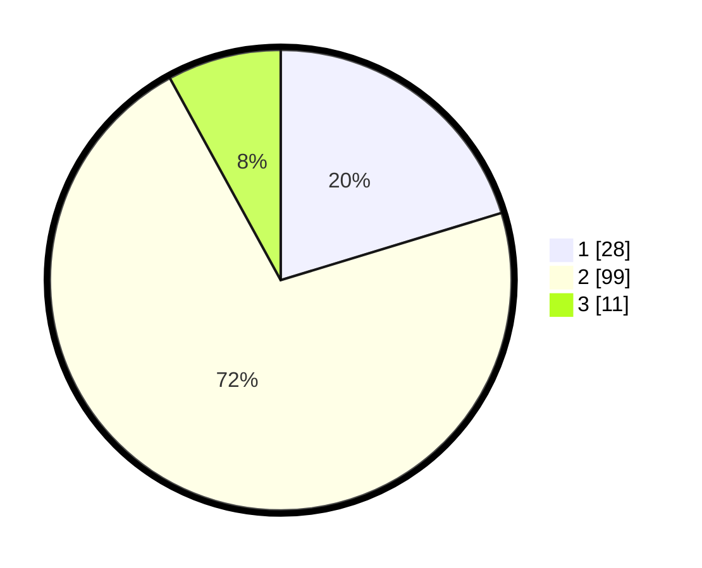

# Hasil

## Grafik

## Tabel

| No. | Nama Paslon    | Suara | Suara (raw) | Persentase |
|:--- |:-------------- | -----:| -----------:| ----------:|
| 1   | ANIES MUHAIMIN | 28    | [28][p-1]   | 20,29      |
| 2   | PRABOWO GIBRAN | 99    | [99][p-2]   | 71,74      |
| 3   | GANJAR MAHFUD  | 11    | [11][p-3]   | 7,97       |

[p-1]: https://github.com/gigit-pemilu/pemilu-2024/blob/main/pilpres/hitung-suara/sub/16-sumatera-selatan/sub/11-empat-lawang/sub/05-lintang-kanan/sub/2004-nibung/sub/002-tps/sub/paslon-1.txt
[p-2]: https://github.com/gigit-pemilu/pemilu-2024/blob/main/pilpres/hitung-suara/sub/16-sumatera-selatan/sub/11-empat-lawang/sub/05-lintang-kanan/sub/2004-nibung/sub/002-tps/sub/paslon-2.txt
[p-3]: https://github.com/gigit-pemilu/pemilu-2024/blob/main/pilpres/hitung-suara/sub/16-sumatera-selatan/sub/11-empat-lawang/sub/05-lintang-kanan/sub/2004-nibung/sub/002-tps/sub/paslon-3.txt

## Foto C Plano

https://sirekap-obj-formc.kpu.go.id/e910/pemilu/ppwp/16/11/05/20/04/1611052004002-20240222-204806--a66e3ec8-f547-4ec2-bc1b-daf5d2c7a04f.jpg

https://sirekap-obj-formc.kpu.go.id/e910/pemilu/ppwp/16/11/05/20/04/1611052004002-20240222-205236--f2a5548a-1712-43ad-a814-e137132a0191.jpg

https://sirekap-obj-formc.kpu.go.id/e910/pemilu/ppwp/16/11/05/20/04/1611052004002-20240222-205417--3790e68c-ea94-428e-8664-4abc5d36fae8.jpg

## Metadata

| Key        | Value               |
| ---------- | ------------------- |
| Time Stamp | 2024-02-25 21:00:00 |

