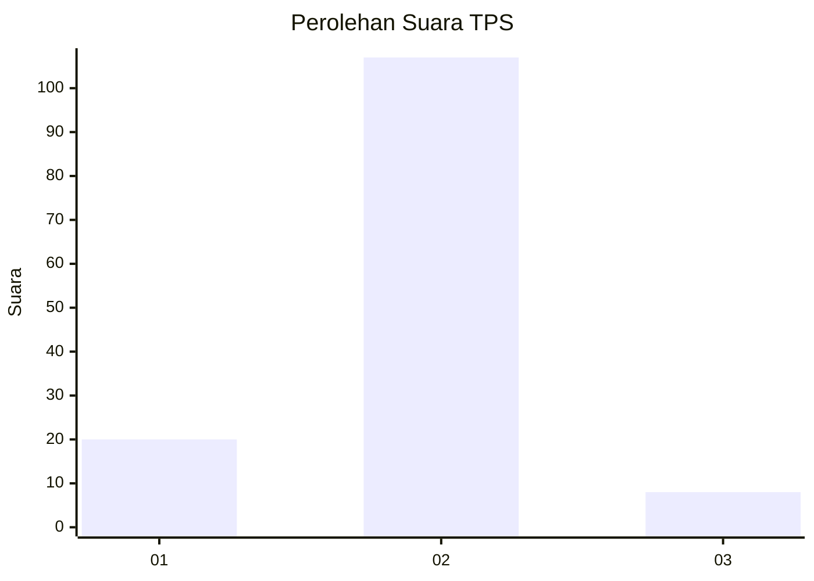
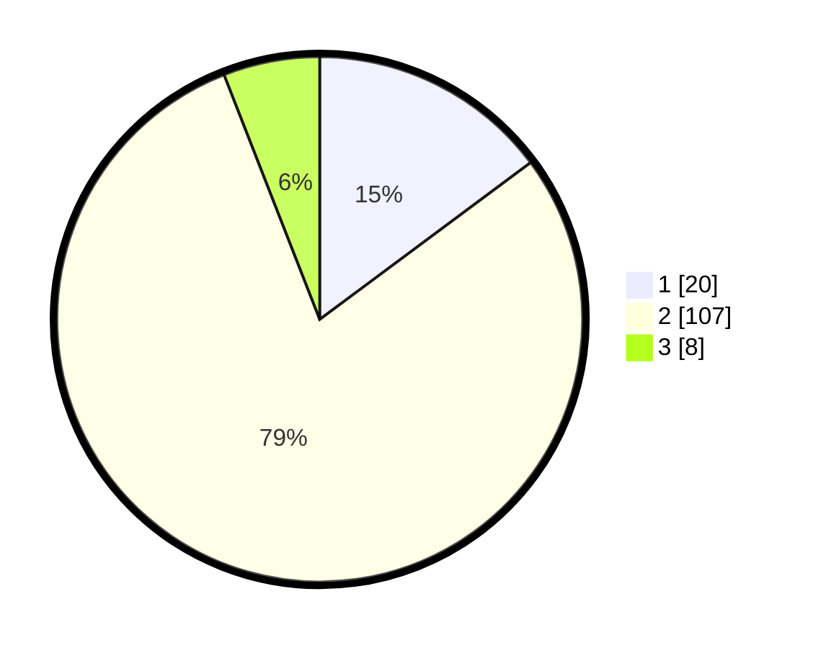

# Hasil

## Grafik

## Tabel

| No. | Nama Paslon    | Suara | Suara (raw) | Persentase |
|:--- |:-------------- | -----:| -----------:| ----------:|
| 1   | ANIES MUHAIMIN | 20    | [20][p-1]   | 14,81      |
| 2   | PRABOWO GIBRAN | 107   | [107][p-2]  | 79,26      |
| 3   | GANJAR MAHFUD  | 8     | [8][p-3]    | 5,93       |

[p-1]: https://github.com/gigit-pemilu/pemilu-2024-16-sumatera-selatan/blob/main/pilpres/hitung-suara/sub/16-sumatera-selatan/sub/11-empat-lawang/sub/05-lintang-kanan/sub/2004-nibung/sub/003-tps/sub/paslon-1.txt
[p-2]: https://github.com/gigit-pemilu/pemilu-2024-16-sumatera-selatan/blob/main/pilpres/hitung-suara/sub/16-sumatera-selatan/sub/11-empat-lawang/sub/05-lintang-kanan/sub/2004-nibung/sub/003-tps/sub/paslon-2.txt
[p-3]: https://github.com/gigit-pemilu/pemilu-2024-16-sumatera-selatan/blob/main/pilpres/hitung-suara/sub/16-sumatera-selatan/sub/11-empat-lawang/sub/05-lintang-kanan/sub/2004-nibung/sub/003-tps/sub/paslon-3.txt

## Foto C Plano

https://sirekap-obj-formc.kpu.go.id/c398/pemilu/ppwp/16/11/05/20/04/1611052004003-20240222-210725--d02dfaad-0479-44db-96d5-8ef1a23b8908.jpg

https://sirekap-obj-formc.kpu.go.id/c398/pemilu/ppwp/16/11/05/20/04/1611052004003-20240222-210849--ad1ceebb-4e60-48ec-8a25-6bba62d29f3d.jpg

https://sirekap-obj-formc.kpu.go.id/c398/pemilu/ppwp/16/11/05/20/04/1611052004003-20240222-210940--b03d4002-0057-40af-9344-3054446668b1.jpg

## Metadata

| Key        | Value               |
| ---------- | ------------------- |
| Time Stamp | 2024-02-25 16:00:00 |

