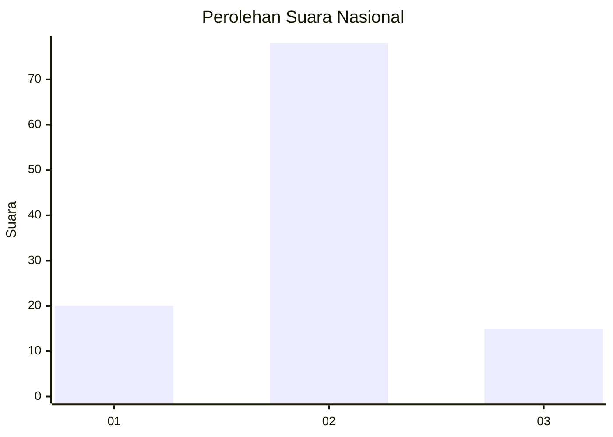
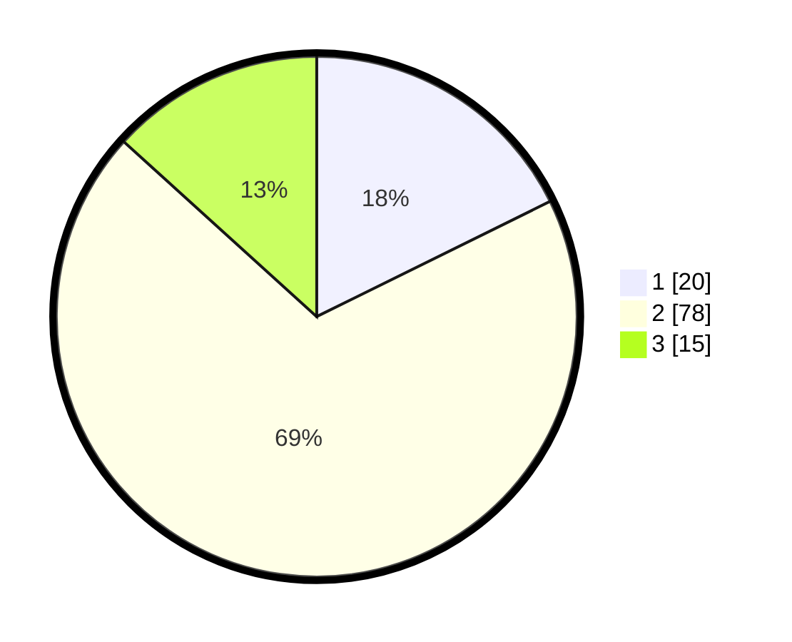

# Hasil

## Grafik

## Tabel

| No. | Nama Paslon    | Suara | Suara (raw) | Persentase |
|:--- |:-------------- | -----:| -----------:| ----------:|
| 1   | ANIES MUHAIMIN | 20    | [20][p-1]   | 17,70      |
| 2   | PRABOWO GIBRAN | 78    | [78][p-2]   | 69,03      |
| 3   | GANJAR MAHFUD  | 15    | [15][p-3]   | 13,27      |

[p-1]: https://github.com/gigit-pemilu/pemilu-2024/blob/main/pilpres/hitung-suara/sub/16-sumatera-selatan/sub/11-empat-lawang/sub/05-lintang-kanan/sub/2004-nibung/sub/004-tps/sub/paslon-1.txt
[p-2]: https://github.com/gigit-pemilu/pemilu-2024/blob/main/pilpres/hitung-suara/sub/16-sumatera-selatan/sub/11-empat-lawang/sub/05-lintang-kanan/sub/2004-nibung/sub/004-tps/sub/paslon-2.txt
[p-3]: https://github.com/gigit-pemilu/pemilu-2024/blob/main/pilpres/hitung-suara/sub/16-sumatera-selatan/sub/11-empat-lawang/sub/05-lintang-kanan/sub/2004-nibung/sub/004-tps/sub/paslon-3.txt

## Foto C Plano

https://sirekap-obj-formc.kpu.go.id/473a/pemilu/ppwp/16/11/05/20/04/1611052004004-20240222-212723--59dd1dbe-3073-451d-a421-1948af21ddd4.jpg

https://sirekap-obj-formc.kpu.go.id/473a/pemilu/ppwp/16/11/05/20/04/1611052004004-20240222-212759--9aad648d-c093-4104-a710-71d3ab4a6e30.jpg

https://sirekap-obj-formc.kpu.go.id/473a/pemilu/ppwp/16/11/05/20/04/1611052004004-20240222-212828--a6b91c7a-2112-43b0-baa9-2c136ed4dfd0.jpg

## Metadata

| Key        | Value               |
| ---------- | ------------------- |
| Time Stamp | 2024-02-25 11:00:00 |

