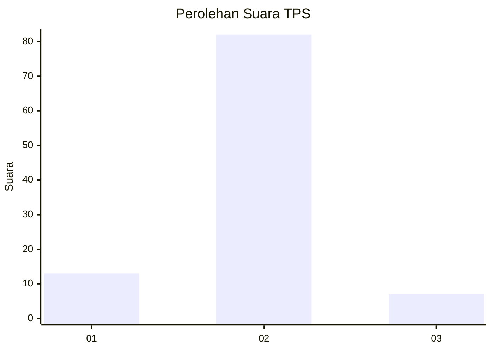
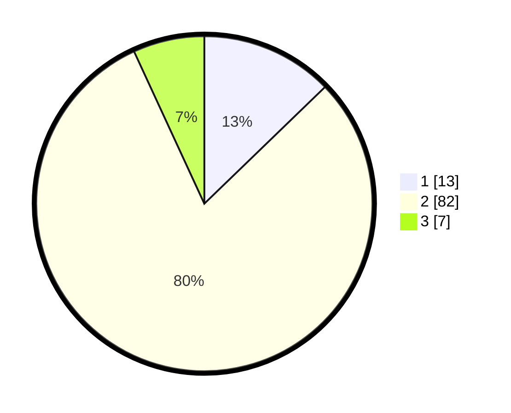

# Hasil

## Grafik

## Tabel

| No. | Nama Paslon    | Suara | Suara (raw) | Persentase |
|:--- |:-------------- | -----:| -----------:| ----------:|
| 1   | ANIES MUHAIMIN | 13    | [13][p-1]   | 12,75      |
| 2   | PRABOWO GIBRAN | 82    | [82][p-2]   | 80,39      |
| 3   | GANJAR MAHFUD  | 7     | [7][p-3]    | 6,86       |

[p-1]: https://github.com/gigit-pemilu/pemilu-2024-16-sumatera-selatan/blob/main/pilpres/hitung-suara/sub/16-sumatera-selatan/sub/11-empat-lawang/sub/05-lintang-kanan/sub/2004-nibung/sub/005-tps/sub/paslon-1.txt
[p-2]: https://github.com/gigit-pemilu/pemilu-2024-16-sumatera-selatan/blob/main/pilpres/hitung-suara/sub/16-sumatera-selatan/sub/11-empat-lawang/sub/05-lintang-kanan/sub/2004-nibung/sub/005-tps/sub/paslon-2.txt
[p-3]: https://github.com/gigit-pemilu/pemilu-2024-16-sumatera-selatan/blob/main/pilpres/hitung-suara/sub/16-sumatera-selatan/sub/11-empat-lawang/sub/05-lintang-kanan/sub/2004-nibung/sub/005-tps/sub/paslon-3.txt

## Foto C Plano

https://sirekap-obj-formc.kpu.go.id/3a2f/pemilu/ppwp/16/11/05/20/04/1611052004005-20240222-202338--9f3a28bd-15a7-4bbb-a599-3584581bb2b7.jpg

https://sirekap-obj-formc.kpu.go.id/3a2f/pemilu/ppwp/16/11/05/20/04/1611052004005-20240222-202456--c2061bea-5ea6-4b8e-8c36-108db9697bc6.jpg

https://sirekap-obj-formc.kpu.go.id/3a2f/pemilu/ppwp/16/11/05/20/04/1611052004005-20240222-202715--f903abfd-cd5f-4d24-a11a-2fd434c332b1.jpg

## Metadata

| Key        | Value               |
| ---------- | ------------------- |
| Time Stamp | 2024-02-24 22:31:28 |

