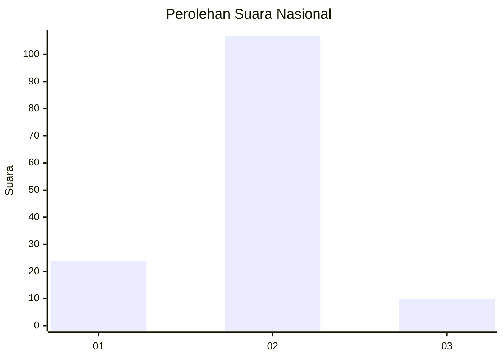
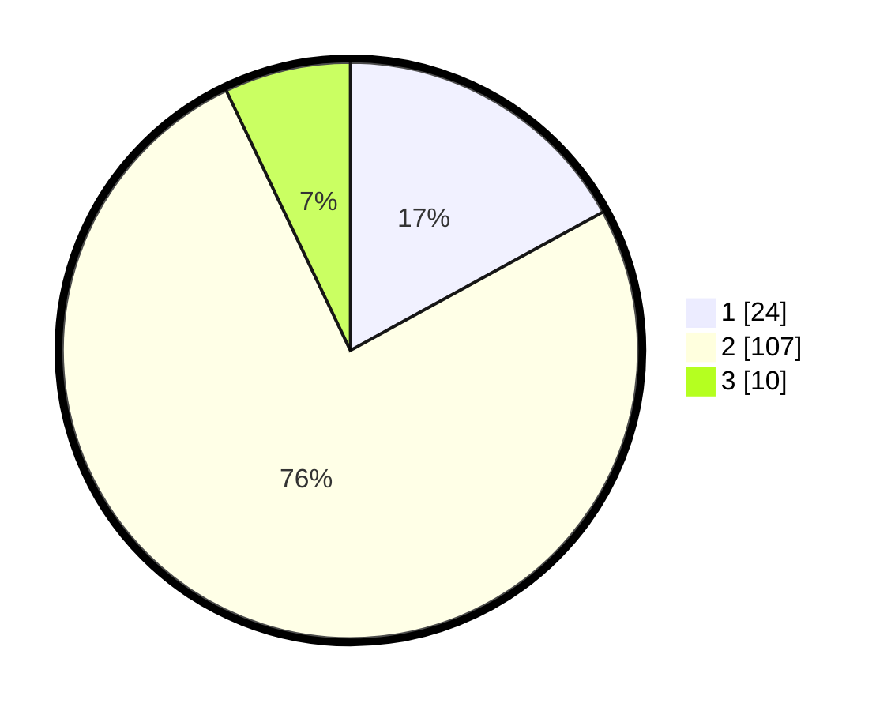

# Hasil

## Grafik

## Tabel

| No. | Nama Paslon    | Suara | Suara (raw) | Persentase |
|:--- |:-------------- | -----:| -----------:| ----------:|
| 1   | ANIES MUHAIMIN | 24    | [24][p-1]   | 17,02      |
| 2   | PRABOWO GIBRAN | 107   | [107][p-2]  | 75,89      |
| 3   | GANJAR MAHFUD  | 10    | [10][p-3]   | 7,09       |

[p-1]: https://github.com/gigit-pemilu/pemilu-2024/blob/main/pilpres/hitung-suara/sub/16-sumatera-selatan/sub/11-empat-lawang/sub/05-lintang-kanan/sub/2004-nibung/sub/006-tps/sub/paslon-1.txt
[p-2]: https://github.com/gigit-pemilu/pemilu-2024/blob/main/pilpres/hitung-suara/sub/16-sumatera-selatan/sub/11-empat-lawang/sub/05-lintang-kanan/sub/2004-nibung/sub/006-tps/sub/paslon-2.txt
[p-3]: https://github.com/gigit-pemilu/pemilu-2024/blob/main/pilpres/hitung-suara/sub/16-sumatera-selatan/sub/11-empat-lawang/sub/05-lintang-kanan/sub/2004-nibung/sub/006-tps/sub/paslon-3.txt

## Foto C Plano

https://sirekap-obj-formc.kpu.go.id/1a18/pemilu/ppwp/16/11/05/20/04/1611052004006-20240222-212109--1051e840-d19b-45b4-86d0-137ae3fb292f.jpg

https://sirekap-obj-formc.kpu.go.id/1a18/pemilu/ppwp/16/11/05/20/04/1611052004006-20240222-212246--2e664cbd-8e95-45c9-b5d2-c3cbcabaafb4.jpg

https://sirekap-obj-formc.kpu.go.id/1a18/pemilu/ppwp/16/11/05/20/04/1611052004006-20240222-212419--7bae34d0-245f-4ff2-a45c-da7e63ca696d.jpg

## Metadata

| Key        | Value               |
| ---------- | ------------------- |
| Time Stamp | 2024-02-25 16:00:00 |

