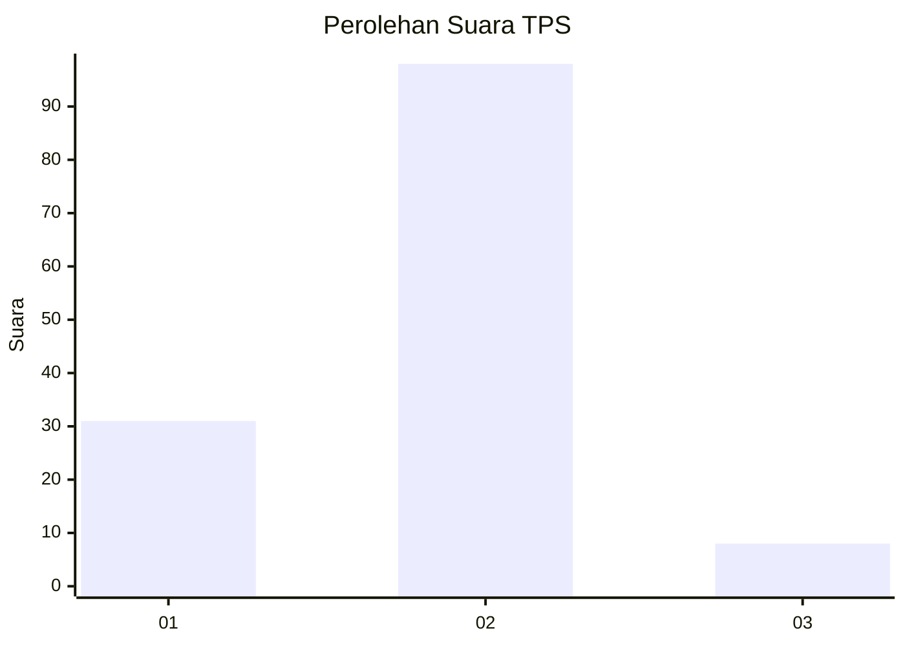
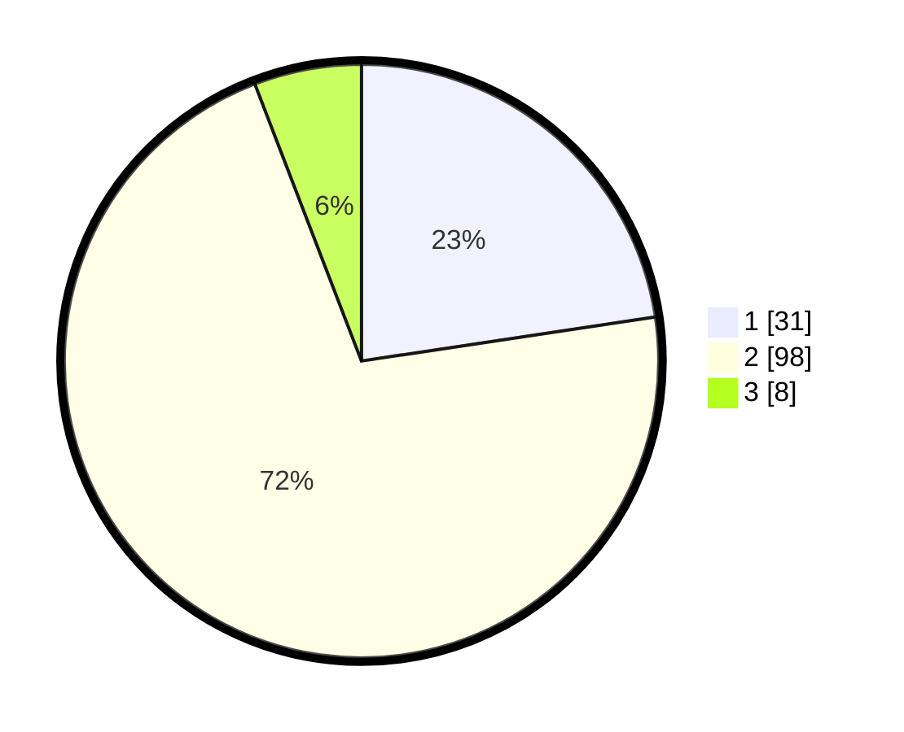

# Hasil

## Grafik

## Tabel

| No. | Nama Paslon    | Suara | Suara (raw) | Persentase |
|:--- |:-------------- | -----:| -----------:| ----------:|
| 1   | ANIES MUHAIMIN | 31    | [31][p-1]   | 22,63      |
| 2   | PRABOWO GIBRAN | 98    | [98][p-2]   | 71,53      |
| 3   | GANJAR MAHFUD  | 8     | [8][p-3]    | 5,84       |

[p-1]: https://github.com/gigit-pemilu/pemilu-2024-16-sumatera-selatan/blob/main/pilpres/hitung-suara/sub/16-sumatera-selatan/sub/11-empat-lawang/sub/05-lintang-kanan/sub/2004-nibung/sub/007-tps/sub/paslon-1.txt
[p-2]: https://github.com/gigit-pemilu/pemilu-2024-16-sumatera-selatan/blob/main/pilpres/hitung-suara/sub/16-sumatera-selatan/sub/11-empat-lawang/sub/05-lintang-kanan/sub/2004-nibung/sub/007-tps/sub/paslon-2.txt
[p-3]: https://github.com/gigit-pemilu/pemilu-2024-16-sumatera-selatan/blob/main/pilpres/hitung-suara/sub/16-sumatera-selatan/sub/11-empat-lawang/sub/05-lintang-kanan/sub/2004-nibung/sub/007-tps/sub/paslon-3.txt

## Foto C Plano

https://sirekap-obj-formc.kpu.go.id/78dd/pemilu/ppwp/16/11/05/20/04/1611052004007-20240222-211230--0b6dfc17-ebb2-469d-bbb1-3b7d2dbd8cb3.jpg

https://sirekap-obj-formc.kpu.go.id/78dd/pemilu/ppwp/16/11/05/20/04/1611052004007-20240222-211341--89775c9e-fcae-4a03-a677-cc6a5b00bc9d.jpg

https://sirekap-obj-formc.kpu.go.id/78dd/pemilu/ppwp/16/11/05/20/04/1611052004007-20240222-211556--4eee40f5-c51f-40e1-a657-b3f6abb9dc01.jpg

## Metadata

| Key        | Value               |
| ---------- | ------------------- |
| Time Stamp | 2024-02-25 12:00:00 |

