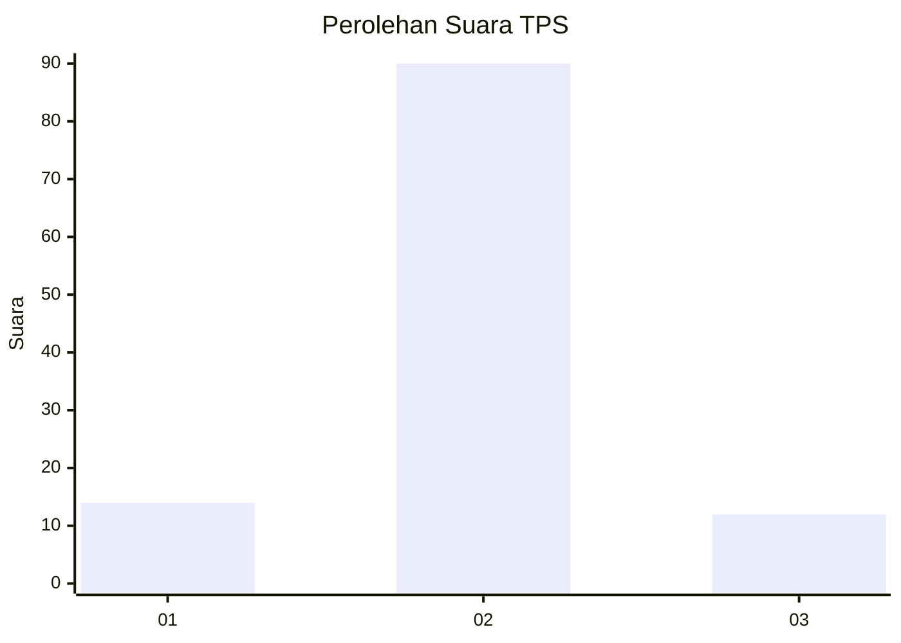
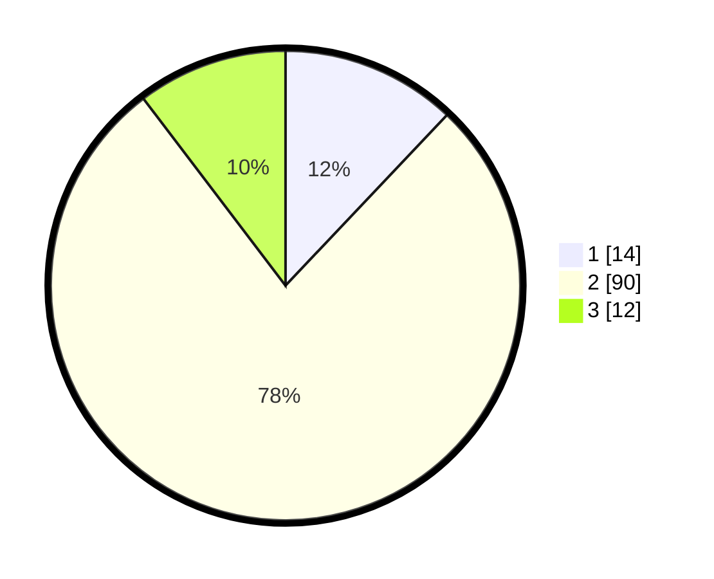

# Hasil

## Grafik

## Tabel

| No. | Nama Paslon    | Suara | Suara (raw) | Persentase |
|:--- |:-------------- | -----:| -----------:| ----------:|
| 1   | ANIES MUHAIMIN | 14    | [14][p-1]   | 12,07      |
| 2   | PRABOWO GIBRAN | 90    | [90][p-2]   | 77,59      |
| 3   | GANJAR MAHFUD  | 12    | [12][p-3]   | 10,34      |

[p-1]: https://github.com/gigit-pemilu/pemilu-2024-16-sumatera-selatan/blob/main/pilpres/hitung-suara/sub/16-sumatera-selatan/sub/11-empat-lawang/sub/05-lintang-kanan/sub/2004-nibung/sub/009-tps/sub/paslon-1.txt
[p-2]: https://github.com/gigit-pemilu/pemilu-2024-16-sumatera-selatan/blob/main/pilpres/hitung-suara/sub/16-sumatera-selatan/sub/11-empat-lawang/sub/05-lintang-kanan/sub/2004-nibung/sub/009-tps/sub/paslon-2.txt
[p-3]: https://github.com/gigit-pemilu/pemilu-2024-16-sumatera-selatan/blob/main/pilpres/hitung-suara/sub/16-sumatera-selatan/sub/11-empat-lawang/sub/05-lintang-kanan/sub/2004-nibung/sub/009-tps/sub/paslon-3.txt

## Foto C Plano

https://sirekap-obj-formc.kpu.go.id/e3d9/pemilu/ppwp/16/11/05/20/04/1611052004009-20240222-203747--7efad5ab-0e82-4e29-84b3-9d3f0b70121b.jpg

https://sirekap-obj-formc.kpu.go.id/e3d9/pemilu/ppwp/16/11/05/20/04/1611052004009-20240222-204018--50797c47-932e-4951-a199-1e6aa8145056.jpg

https://sirekap-obj-formc.kpu.go.id/e3d9/pemilu/ppwp/16/11/05/20/04/1611052004009-20240222-204136--c9991fea-e65a-4d91-81bc-244dc58cdbd7.jpg

## Metadata

| Key        | Value               |
| ---------- | ------------------- |
| Time Stamp | 2024-02-25 16:00:00 |

