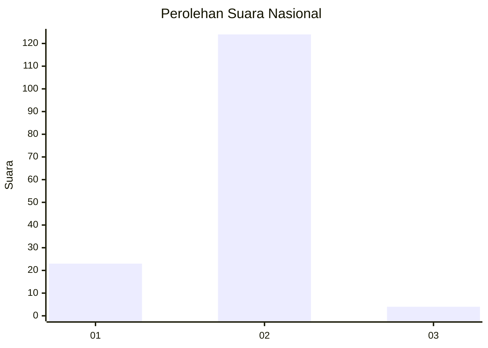
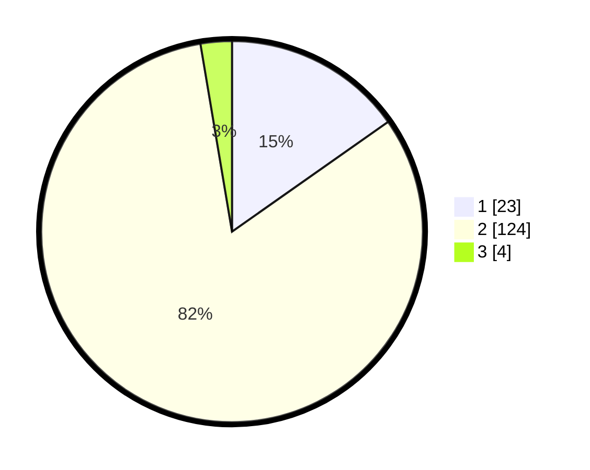

# Hasil

## Grafik

## Tabel

| No. | Nama Paslon    | Suara | Suara (raw) | Persentase |
|:--- |:-------------- | -----:| -----------:| ----------:|
| 1   | ANIES MUHAIMIN | 23    | [23][p-1]   | 15,23      |
| 2   | PRABOWO GIBRAN | 124   | [124][p-2]  | 82,12      |
| 3   | GANJAR MAHFUD  | 4     | [4][p-3]    | 2,65       |

[p-1]: https://github.com/gigit-pemilu/pemilu-2024/blob/main/pilpres/hitung-suara/sub/16-sumatera-selatan/sub/11-empat-lawang/sub/05-lintang-kanan/sub/2005-batu-ampar/sub/004-tps/sub/paslon-1.txt
[p-2]: https://github.com/gigit-pemilu/pemilu-2024/blob/main/pilpres/hitung-suara/sub/16-sumatera-selatan/sub/11-empat-lawang/sub/05-lintang-kanan/sub/2005-batu-ampar/sub/004-tps/sub/paslon-2.txt
[p-3]: https://github.com/gigit-pemilu/pemilu-2024/blob/main/pilpres/hitung-suara/sub/16-sumatera-selatan/sub/11-empat-lawang/sub/05-lintang-kanan/sub/2005-batu-ampar/sub/004-tps/sub/paslon-3.txt

## Foto C Plano

https://sirekap-obj-formc.kpu.go.id/8841/pemilu/ppwp/16/11/05/20/05/1611052005004-20240219-171419--985cd2f2-3990-4adb-9538-d5fd35eed289.jpg

https://sirekap-obj-formc.kpu.go.id/8841/pemilu/ppwp/16/11/05/20/05/1611052005004-20240219-171503--454d0a2c-d84f-40b5-88f4-1f03f31b4a04.jpg

https://sirekap-obj-formc.kpu.go.id/8841/pemilu/ppwp/16/11/05/20/05/1611052005004-20240219-171650--472f794f-e135-4704-8405-f8c209c682c1.jpg

## Metadata

| Key        | Value               |
| ---------- | ------------------- |
| Time Stamp | 2024-02-24 22:31:28 |

