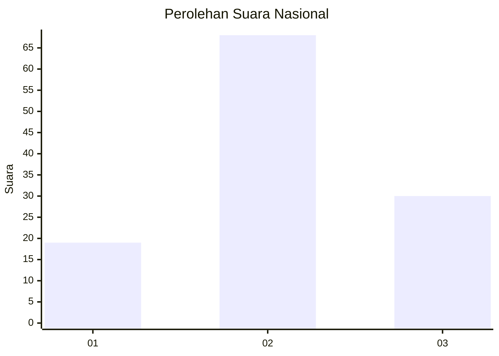
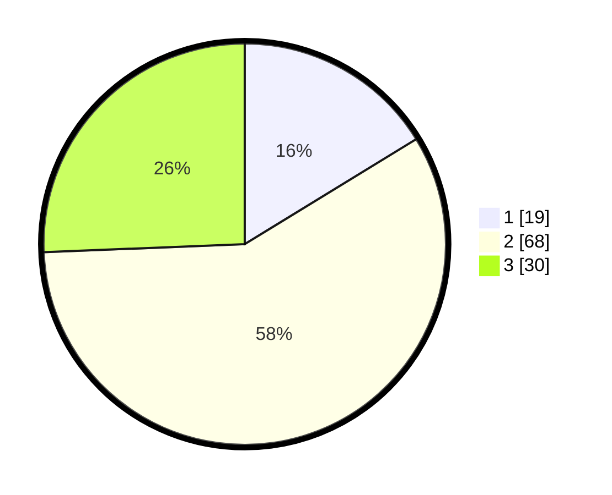

# Hasil

## Grafik

## Tabel

| No. | Nama Paslon    | Suara | Suara (raw) | Persentase |
|:--- |:-------------- | -----:| -----------:| ----------:|
| 1   | ANIES MUHAIMIN | 19    | [19][p-1]   | 16,24      |
| 2   | PRABOWO GIBRAN | 68    | [68][p-2]   | 58,12      |
| 3   | GANJAR MAHFUD  | 30    | [30][p-3]   | 25,64      |

[p-1]: https://github.com/gigit-pemilu/pemilu-2024/blob/main/pilpres/hitung-suara/sub/16-sumatera-selatan/sub/11-empat-lawang/sub/05-lintang-kanan/sub/2006-karang-tanding/sub/004-tps/sub/paslon-1.txt
[p-2]: https://github.com/gigit-pemilu/pemilu-2024/blob/main/pilpres/hitung-suara/sub/16-sumatera-selatan/sub/11-empat-lawang/sub/05-lintang-kanan/sub/2006-karang-tanding/sub/004-tps/sub/paslon-2.txt
[p-3]: https://github.com/gigit-pemilu/pemilu-2024/blob/main/pilpres/hitung-suara/sub/16-sumatera-selatan/sub/11-empat-lawang/sub/05-lintang-kanan/sub/2006-karang-tanding/sub/004-tps/sub/paslon-3.txt

## Foto C Plano

https://sirekap-obj-formc.kpu.go.id/a331/pemilu/ppwp/16/11/05/20/06/1611052006004-20240223-002926--3643ca01-cffe-4fc1-b4d8-9a60b37c990f.jpg

https://sirekap-obj-formc.kpu.go.id/a331/pemilu/ppwp/16/11/05/20/06/1611052006004-20240223-003003--81075e9f-8222-4382-bf12-cbc7b3978e7f.jpg

https://sirekap-obj-formc.kpu.go.id/a331/pemilu/ppwp/16/11/05/20/06/1611052006004-20240223-003045--b2b257d6-da48-4fa8-aa5a-cc0fbc873247.jpg

## Metadata

| Key        | Value               |
| ---------- | ------------------- |
| Time Stamp | 2024-02-25 12:00:00 |

