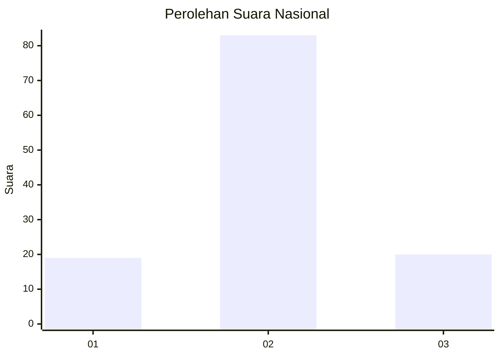
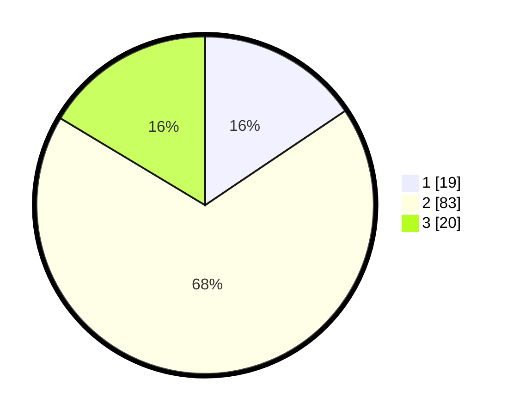

# Hasil

## Grafik

## Tabel

| No. | Nama Paslon    | Suara | Suara (raw) | Persentase |
|:--- |:-------------- | -----:| -----------:| ----------:|
| 1   | ANIES MUHAIMIN | 19    | [19][p-1]   | 15,57      |
| 2   | PRABOWO GIBRAN | 83    | [83][p-2]   | 68,03      |
| 3   | GANJAR MAHFUD  | 20    | [20][p-3]   | 16,39      |

[p-1]: https://github.com/gigit-pemilu/pemilu-2024/blob/main/pilpres/hitung-suara/sub/16-sumatera-selatan/sub/11-empat-lawang/sub/05-lintang-kanan/sub/2007-lubuk-cik/sub/002-tps/sub/paslon-1.txt
[p-2]: https://github.com/gigit-pemilu/pemilu-2024/blob/main/pilpres/hitung-suara/sub/16-sumatera-selatan/sub/11-empat-lawang/sub/05-lintang-kanan/sub/2007-lubuk-cik/sub/002-tps/sub/paslon-2.txt
[p-3]: https://github.com/gigit-pemilu/pemilu-2024/blob/main/pilpres/hitung-suara/sub/16-sumatera-selatan/sub/11-empat-lawang/sub/05-lintang-kanan/sub/2007-lubuk-cik/sub/002-tps/sub/paslon-3.txt

## Foto C Plano

https://sirekap-obj-formc.kpu.go.id/ed3c/pemilu/ppwp/16/11/05/20/07/1611052007002-20240223-021513--7b812270-2f63-44b8-98cf-a65ac0af34a9.jpg

https://sirekap-obj-formc.kpu.go.id/ed3c/pemilu/ppwp/16/11/05/20/07/1611052007002-20240223-021622--fffdc3fe-1d7a-4d94-95fb-1f4cb4c83557.jpg

https://sirekap-obj-formc.kpu.go.id/ed3c/pemilu/ppwp/16/11/05/20/07/1611052007002-20240223-021729--41d41639-b265-4fe1-a284-2823c545867f.jpg

## Metadata

| Key        | Value               |
| ---------- | ------------------- |
| Time Stamp | 2024-02-25 17:00:00 |

