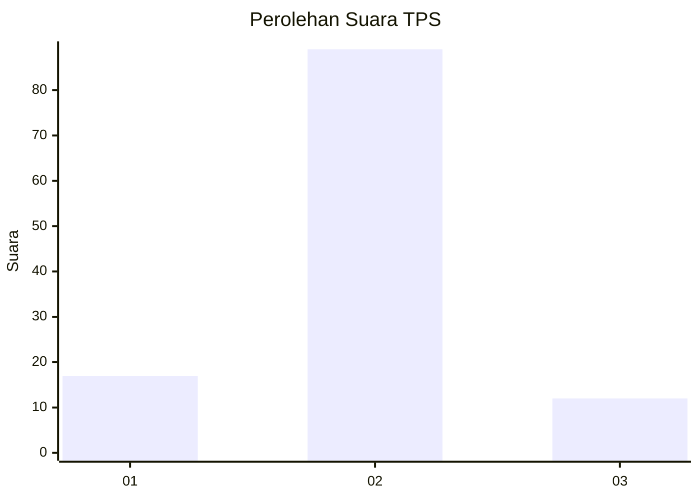
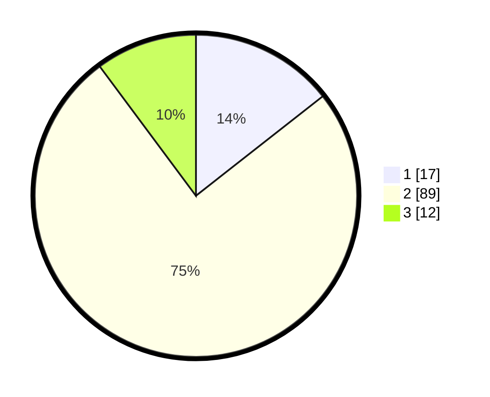

# Hasil

## Grafik

## Tabel

| No. | Nama Paslon    | Suara | Suara (raw) | Persentase |
|:--- |:-------------- | -----:| -----------:| ----------:|
| 1   | ANIES MUHAIMIN | 17    | [17][p-1]   | 14,41      |
| 2   | PRABOWO GIBRAN | 89    | [89][p-2]   | 75,42      |
| 3   | GANJAR MAHFUD  | 12    | [12][p-3]   | 10,17      |

[p-1]: https://github.com/gigit-pemilu/pemilu-2024-16-sumatera-selatan/blob/main/pilpres/hitung-suara/sub/16-sumatera-selatan/sub/11-empat-lawang/sub/05-lintang-kanan/sub/2007-lubuk-cik/sub/004-tps/sub/paslon-1.txt
[p-2]: https://github.com/gigit-pemilu/pemilu-2024-16-sumatera-selatan/blob/main/pilpres/hitung-suara/sub/16-sumatera-selatan/sub/11-empat-lawang/sub/05-lintang-kanan/sub/2007-lubuk-cik/sub/004-tps/sub/paslon-2.txt
[p-3]: https://github.com/gigit-pemilu/pemilu-2024-16-sumatera-selatan/blob/main/pilpres/hitung-suara/sub/16-sumatera-selatan/sub/11-empat-lawang/sub/05-lintang-kanan/sub/2007-lubuk-cik/sub/004-tps/sub/paslon-3.txt

## Foto C Plano

https://sirekap-obj-formc.kpu.go.id/f7e2/pemilu/ppwp/16/11/05/20/07/1611052007004-20240223-021927--5522d740-d26b-4d76-a215-f679d87dfdb0.jpg

https://sirekap-obj-formc.kpu.go.id/f7e2/pemilu/ppwp/16/11/05/20/07/1611052007004-20240223-022022--0caf3add-32c2-468a-9768-479c7036de3b.jpg

https://sirekap-obj-formc.kpu.go.id/f7e2/pemilu/ppwp/16/11/05/20/07/1611052007004-20240223-022104--4a5db59c-46ba-4359-8174-af5e7cef86be.jpg

## Metadata

| Key        | Value               |
| ---------- | ------------------- |
| Time Stamp | 2024-02-24 22:31:28 |

