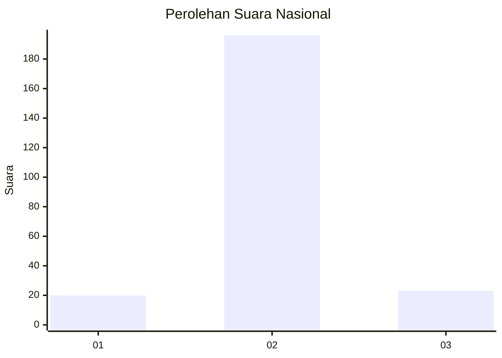
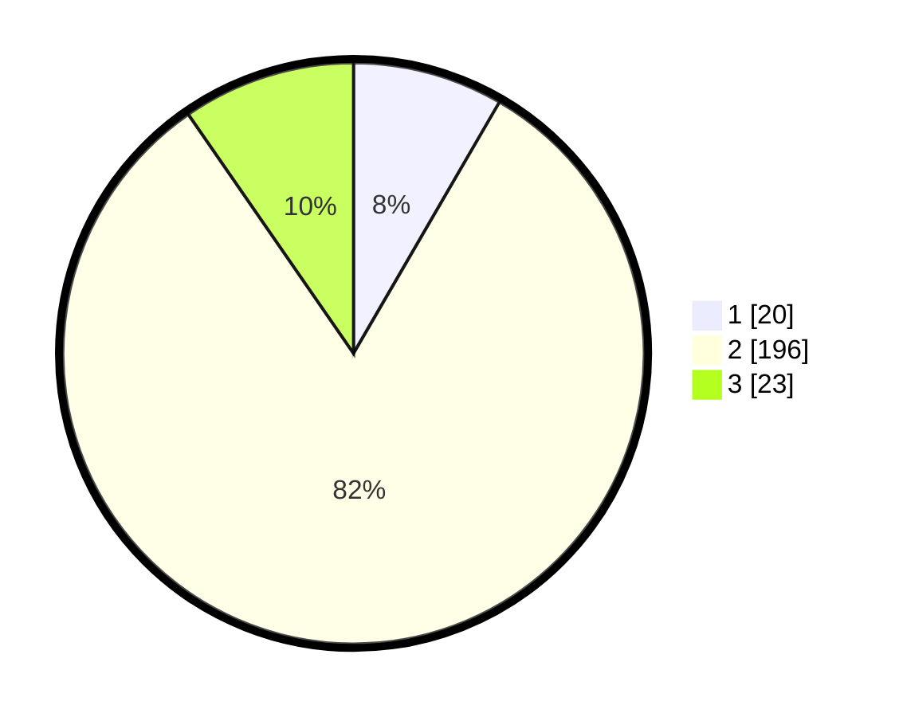

# Hasil

## Grafik

## Tabel

| No. | Nama Paslon    | Suara | Suara (raw) | Persentase |
|:--- |:-------------- | -----:| -----------:| ----------:|
| 1   | ANIES MUHAIMIN | 20    | [20][p-1]   | 8,37       |
| 2   | PRABOWO GIBRAN | 196   | [196][p-2]  | 82,01      |
| 3   | GANJAR MAHFUD  | 23    | [23][p-3]   | 9,62       |

[p-1]: https://github.com/gigit-pemilu/pemilu-2024/blob/main/pilpres/hitung-suara/sub/16-sumatera-selatan/sub/11-empat-lawang/sub/05-lintang-kanan/sub/2008-rantau-kasai/sub/003-tps/sub/paslon-1.txt
[p-2]: https://github.com/gigit-pemilu/pemilu-2024/blob/main/pilpres/hitung-suara/sub/16-sumatera-selatan/sub/11-empat-lawang/sub/05-lintang-kanan/sub/2008-rantau-kasai/sub/003-tps/sub/paslon-2.txt
[p-3]: https://github.com/gigit-pemilu/pemilu-2024/blob/main/pilpres/hitung-suara/sub/16-sumatera-selatan/sub/11-empat-lawang/sub/05-lintang-kanan/sub/2008-rantau-kasai/sub/003-tps/sub/paslon-3.txt

## Foto C Plano

https://sirekap-obj-formc.kpu.go.id/5ece/pemilu/ppwp/16/11/05/20/08/1611052008003-20240219-135005--6b7c0d77-1d70-418d-ba40-25aa45aa796e.jpg

https://sirekap-obj-formc.kpu.go.id/5ece/pemilu/ppwp/16/11/05/20/08/1611052008003-20240219-135043--a732ca2e-d9fa-4afb-af75-2a88aa3c5770.jpg

https://sirekap-obj-formc.kpu.go.id/5ece/pemilu/ppwp/16/11/05/20/08/1611052008003-20240219-135121--41a23263-eb8b-4fd1-b8cd-8744bec2478d.jpg

## Metadata

| Key        | Value               |
| ---------- | ------------------- |
| Time Stamp | 2024-02-24 23:00:00 |

