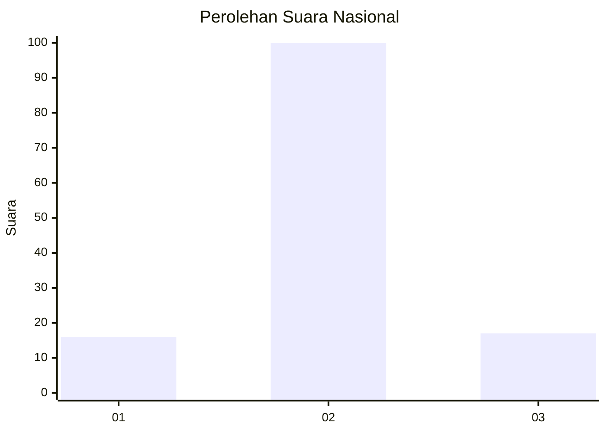
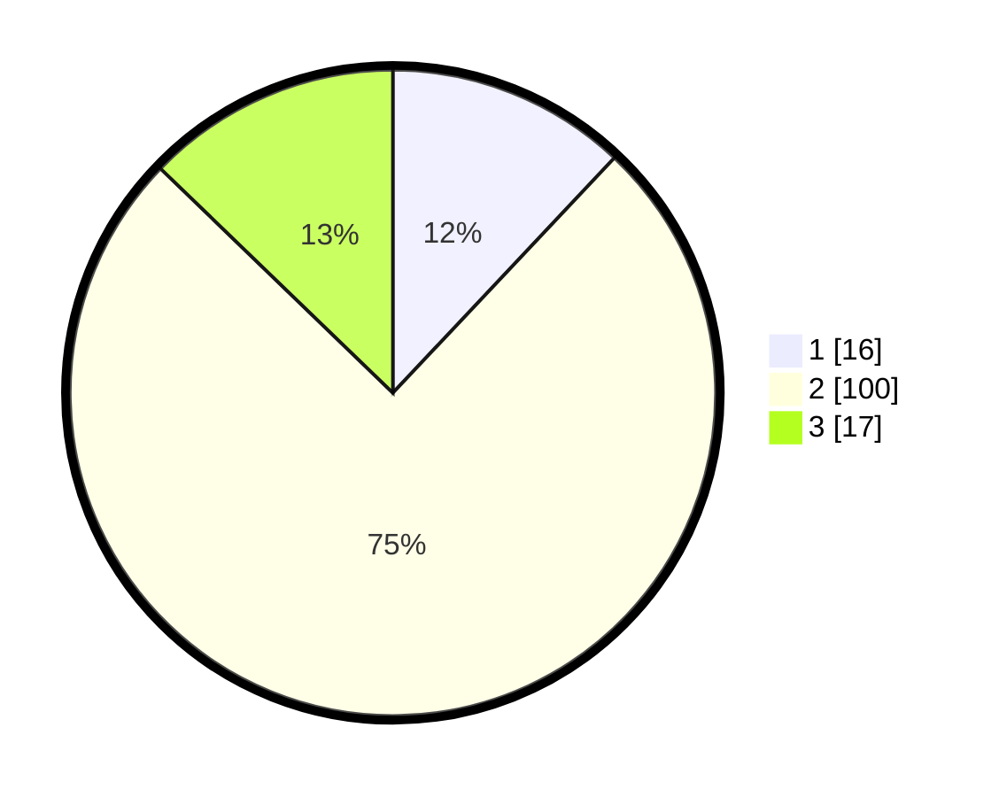

# Hasil

## Grafik

## Tabel

| No. | Nama Paslon    | Suara | Suara (raw) | Persentase |
|:--- |:-------------- | -----:| -----------:| ----------:|
| 1   | ANIES MUHAIMIN | 16    | [16][p-1]   | 12,03      |
| 2   | PRABOWO GIBRAN | 100   | [100][p-2]  | 75,19      |
| 3   | GANJAR MAHFUD  | 17    | [17][p-3]   | 12,78      |

[p-1]: https://github.com/gigit-pemilu/pemilu-2024/blob/main/pilpres/hitung-suara/sub/16-sumatera-selatan/sub/11-empat-lawang/sub/05-lintang-kanan/sub/2010-rantau-alih/sub/001-tps/sub/paslon-1.txt
[p-2]: https://github.com/gigit-pemilu/pemilu-2024/blob/main/pilpres/hitung-suara/sub/16-sumatera-selatan/sub/11-empat-lawang/sub/05-lintang-kanan/sub/2010-rantau-alih/sub/001-tps/sub/paslon-2.txt
[p-3]: https://github.com/gigit-pemilu/pemilu-2024/blob/main/pilpres/hitung-suara/sub/16-sumatera-selatan/sub/11-empat-lawang/sub/05-lintang-kanan/sub/2010-rantau-alih/sub/001-tps/sub/paslon-3.txt

## Foto C Plano

https://sirekap-obj-formc.kpu.go.id/98c6/pemilu/ppwp/16/11/05/20/10/1611052010001-20240220-025752--28b6a1da-2a91-4c47-8668-8d44a8556cdf.jpg

https://sirekap-obj-formc.kpu.go.id/98c6/pemilu/ppwp/16/11/05/20/10/1611052010001-20240220-025855--ce520d36-75fd-4465-a838-806b04310a12.jpg

https://sirekap-obj-formc.kpu.go.id/98c6/pemilu/ppwp/16/11/05/20/10/1611052010001-20240220-025953--6e2dce9a-9f4c-419e-a315-0b31c8885dab.jpg

## Metadata

| Key        | Value               |
| ---------- | ------------------- |
| Time Stamp | 2024-02-25 15:00:00 |

