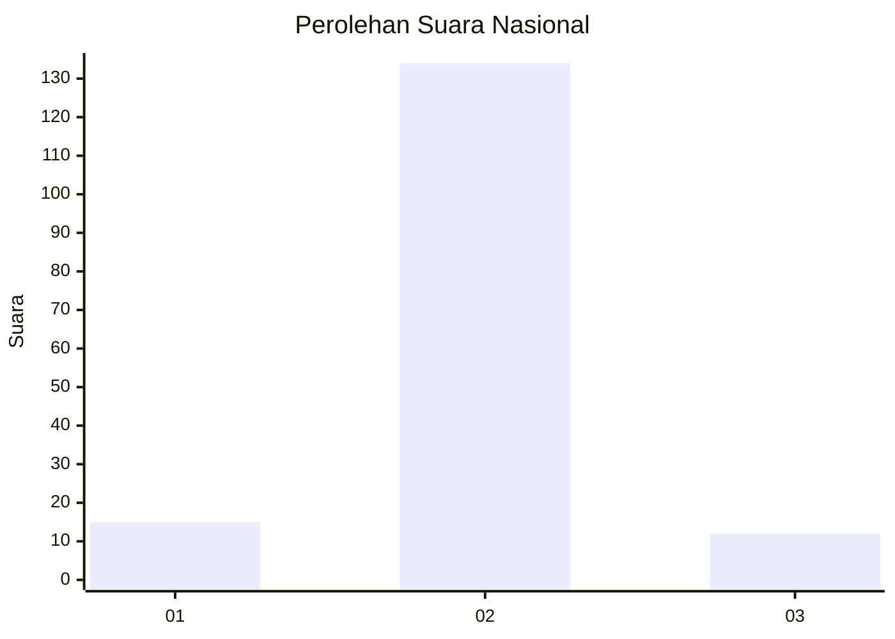
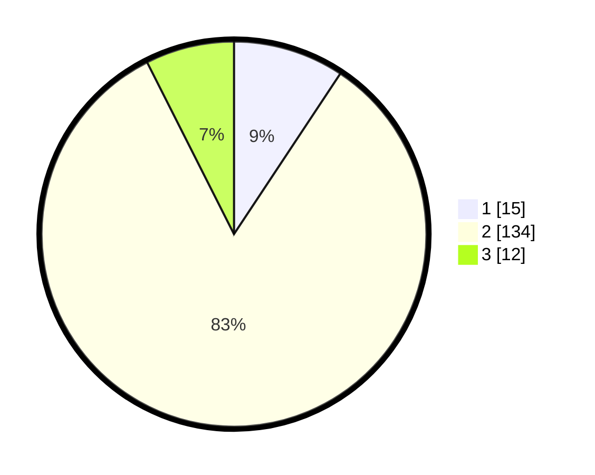

# Hasil

## Grafik

## Tabel

| No. | Nama Paslon    | Suara | Suara (raw) | Persentase |
|:--- |:-------------- | -----:| -----------:| ----------:|
| 1   | ANIES MUHAIMIN | 15    | [15][p-1]   | 9,32       |
| 2   | PRABOWO GIBRAN | 134   | [134][p-2]  | 83,23      |
| 3   | GANJAR MAHFUD  | 12    | [12][p-3]   | 7,45       |

[p-1]: https://github.com/gigit-pemilu/pemilu-2024/blob/main/pilpres/hitung-suara/sub/16-sumatera-selatan/sub/11-empat-lawang/sub/05-lintang-kanan/sub/2010-rantau-alih/sub/003-tps/sub/paslon-1.txt
[p-2]: https://github.com/gigit-pemilu/pemilu-2024/blob/main/pilpres/hitung-suara/sub/16-sumatera-selatan/sub/11-empat-lawang/sub/05-lintang-kanan/sub/2010-rantau-alih/sub/003-tps/sub/paslon-2.txt
[p-3]: https://github.com/gigit-pemilu/pemilu-2024/blob/main/pilpres/hitung-suara/sub/16-sumatera-selatan/sub/11-empat-lawang/sub/05-lintang-kanan/sub/2010-rantau-alih/sub/003-tps/sub/paslon-3.txt

## Foto C Plano

https://sirekap-obj-formc.kpu.go.id/2434/pemilu/ppwp/16/11/05/20/10/1611052010003-20240220-040848--fe7aaae3-0e1f-4c71-899b-dc9b8e8429c5.jpg

https://sirekap-obj-formc.kpu.go.id/2434/pemilu/ppwp/16/11/05/20/10/1611052010003-20240220-040927--a7369dbc-b8a3-44ce-aa31-3f3727af143c.jpg

https://sirekap-obj-formc.kpu.go.id/2434/pemilu/ppwp/16/11/05/20/10/1611052010003-20240220-041005--a1b912c4-0150-4c46-a364-aa12d9dbe302.jpg

## Metadata

| Key        | Value               |
| ---------- | ------------------- |
| Time Stamp | 2024-02-25 18:00:00 |

