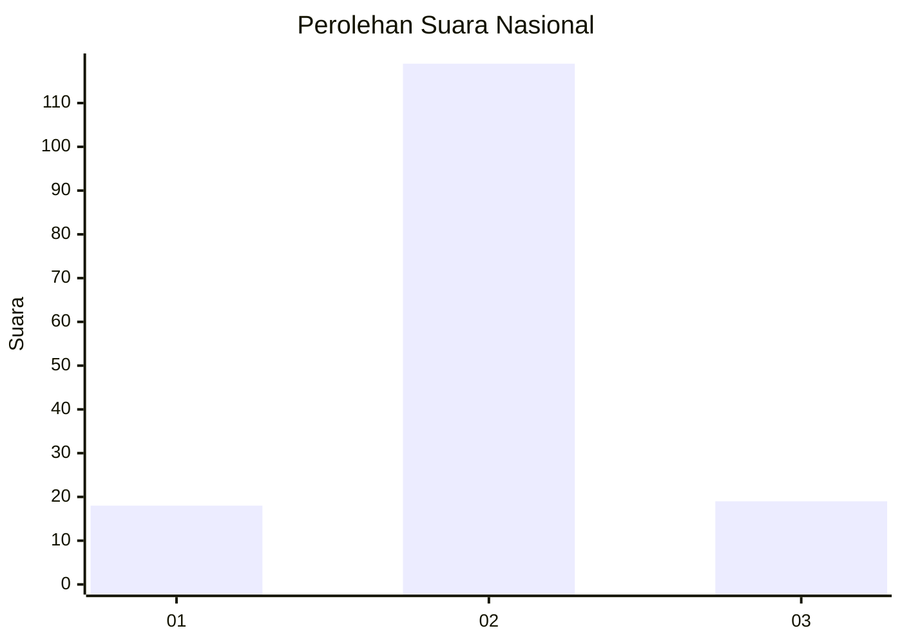
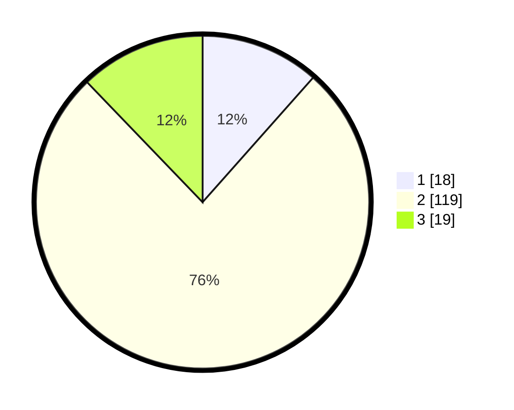

# Hasil

## Grafik

## Tabel

| No. | Nama Paslon    | Suara | Suara (raw) | Persentase |
|:--- |:-------------- | -----:| -----------:| ----------:|
| 1   | ANIES MUHAIMIN | 18    | [18][p-1]   | 11,54      |
| 2   | PRABOWO GIBRAN | 119   | [119][p-2]  | 76,28      |
| 3   | GANJAR MAHFUD  | 19    | [19][p-3]   | 12,18      |

[p-1]: https://github.com/gigit-pemilu/pemilu-2024/blob/main/pilpres/hitung-suara/sub/16-sumatera-selatan/sub/11-empat-lawang/sub/05-lintang-kanan/sub/2011-tanjung-alam/sub/003-tps/sub/paslon-1.txt
[p-2]: https://github.com/gigit-pemilu/pemilu-2024/blob/main/pilpres/hitung-suara/sub/16-sumatera-selatan/sub/11-empat-lawang/sub/05-lintang-kanan/sub/2011-tanjung-alam/sub/003-tps/sub/paslon-2.txt
[p-3]: https://github.com/gigit-pemilu/pemilu-2024/blob/main/pilpres/hitung-suara/sub/16-sumatera-selatan/sub/11-empat-lawang/sub/05-lintang-kanan/sub/2011-tanjung-alam/sub/003-tps/sub/paslon-3.txt

## Foto C Plano

https://sirekap-obj-formc.kpu.go.id/d55e/pemilu/ppwp/16/11/05/20/11/1611052011003-20240219-204349--321b43a9-e8ee-431c-b5bd-a8d23389fb2b.jpg

https://sirekap-obj-formc.kpu.go.id/d55e/pemilu/ppwp/16/11/05/20/11/1611052011003-20240219-204427--774609cf-3be7-4fce-8e67-b11d25277127.jpg

https://sirekap-obj-formc.kpu.go.id/d55e/pemilu/ppwp/16/11/05/20/11/1611052011003-20240219-204605--183832b0-e139-40c4-9db6-c66ccc60e9fc.jpg

## Metadata

| Key        | Value               |
| ---------- | ------------------- |
| Time Stamp | 2024-02-24 22:31:28 |

