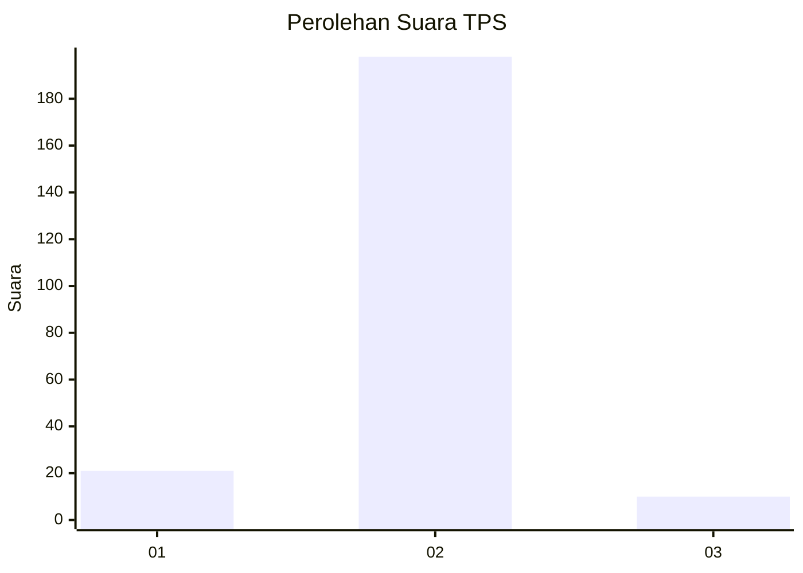
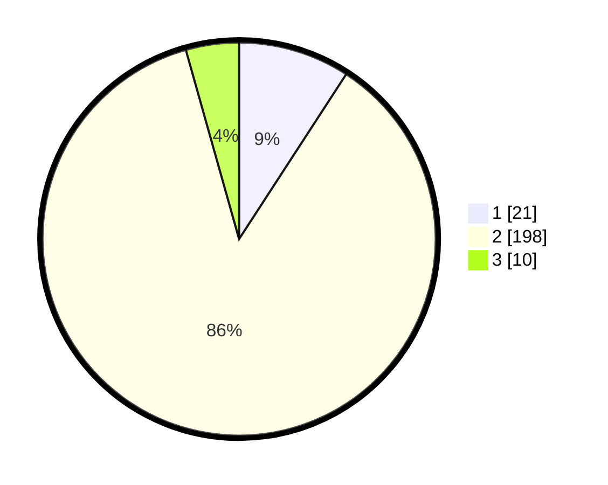

# Hasil

## Grafik

## Tabel

| No. | Nama Paslon    | Suara | Suara (raw) | Persentase |
|:--- |:-------------- | -----:| -----------:| ----------:|
| 1   | ANIES MUHAIMIN | 21    | [21][p-1]   | 9,17       |
| 2   | PRABOWO GIBRAN | 198   | [198][p-2]  | 86,46      |
| 3   | GANJAR MAHFUD  | 10    | [10][p-3]   | 4,37       |

[p-1]: https://github.com/gigit-pemilu/pemilu-2024-16-sumatera-selatan/blob/main/pilpres/hitung-suara/sub/16-sumatera-selatan/sub/11-empat-lawang/sub/05-lintang-kanan/sub/2011-tanjung-alam/sub/004-tps/sub/paslon-1.txt
[p-2]: https://github.com/gigit-pemilu/pemilu-2024-16-sumatera-selatan/blob/main/pilpres/hitung-suara/sub/16-sumatera-selatan/sub/11-empat-lawang/sub/05-lintang-kanan/sub/2011-tanjung-alam/sub/004-tps/sub/paslon-2.txt
[p-3]: https://github.com/gigit-pemilu/pemilu-2024-16-sumatera-selatan/blob/main/pilpres/hitung-suara/sub/16-sumatera-selatan/sub/11-empat-lawang/sub/05-lintang-kanan/sub/2011-tanjung-alam/sub/004-tps/sub/paslon-3.txt

## Foto C Plano

https://sirekap-obj-formc.kpu.go.id/42ae/pemilu/ppwp/16/11/05/20/11/1611052011004-20240219-212239--4faf99c5-2499-4557-b210-d06e9e3a00af.jpg

https://sirekap-obj-formc.kpu.go.id/42ae/pemilu/ppwp/16/11/05/20/11/1611052011004-20240219-212710--0b31571e-ebf1-4044-ac36-0b41649651c8.jpg

https://sirekap-obj-formc.kpu.go.id/42ae/pemilu/ppwp/16/11/05/20/11/1611052011004-20240219-212954--a904a3c6-acf6-4a7b-82c5-13d880142cc0.jpg

## Metadata

| Key        | Value               |
| ---------- | ------------------- |
| Time Stamp | 2024-02-24 22:31:28 |

