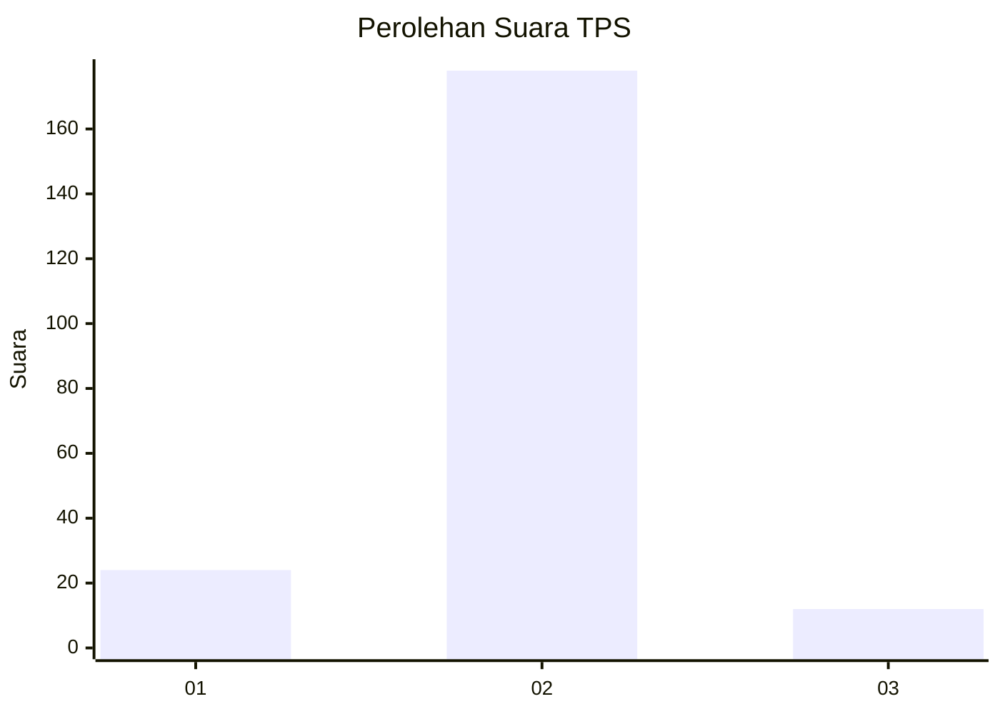
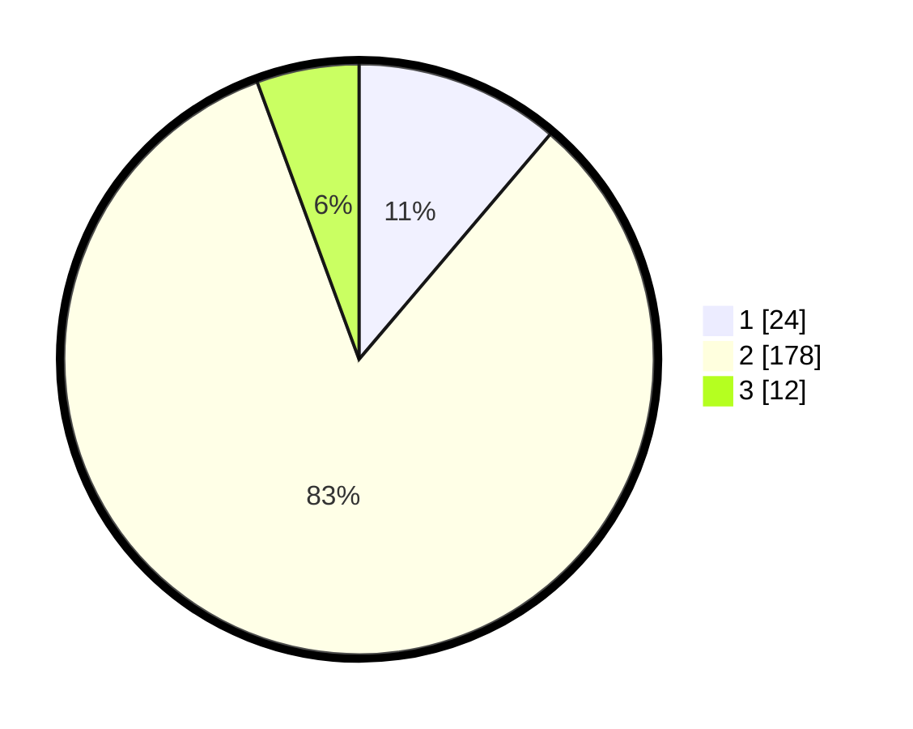

# Hasil

## Grafik

## Tabel

| No. | Nama Paslon    | Suara | Suara (raw) | Persentase |
|:--- |:-------------- | -----:| -----------:| ----------:|
| 1   | ANIES MUHAIMIN | 24    | [24][p-1]   | 11,21      |
| 2   | PRABOWO GIBRAN | 178   | [178][p-2]  | 83,18      |
| 3   | GANJAR MAHFUD  | 12    | [12][p-3]   | 5,61       |

[p-1]: https://github.com/gigit-pemilu/pemilu-2024-16-sumatera-selatan/blob/main/pilpres/hitung-suara/sub/16-sumatera-selatan/sub/11-empat-lawang/sub/05-lintang-kanan/sub/2011-tanjung-alam/sub/005-tps/sub/paslon-1.txt
[p-2]: https://github.com/gigit-pemilu/pemilu-2024-16-sumatera-selatan/blob/main/pilpres/hitung-suara/sub/16-sumatera-selatan/sub/11-empat-lawang/sub/05-lintang-kanan/sub/2011-tanjung-alam/sub/005-tps/sub/paslon-2.txt
[p-3]: https://github.com/gigit-pemilu/pemilu-2024-16-sumatera-selatan/blob/main/pilpres/hitung-suara/sub/16-sumatera-selatan/sub/11-empat-lawang/sub/05-lintang-kanan/sub/2011-tanjung-alam/sub/005-tps/sub/paslon-3.txt

## Foto C Plano

https://sirekap-obj-formc.kpu.go.id/8b8f/pemilu/ppwp/16/11/05/20/11/1611052011005-20240219-214909--109ddea4-de25-4adf-810f-bf461e359c4f.jpg

https://sirekap-obj-formc.kpu.go.id/8b8f/pemilu/ppwp/16/11/05/20/11/1611052011005-20240219-214956--281a258b-1801-464c-9fda-1620051b4cee.jpg

https://sirekap-obj-formc.kpu.go.id/8b8f/pemilu/ppwp/16/11/05/20/11/1611052011005-20240219-215056--94d7d7b3-f2fd-4138-ad34-79db8f5d78e1.jpg

## Metadata

| Key        | Value               |
| ---------- | ------------------- |
| Time Stamp | 2024-02-24 22:31:28 |

