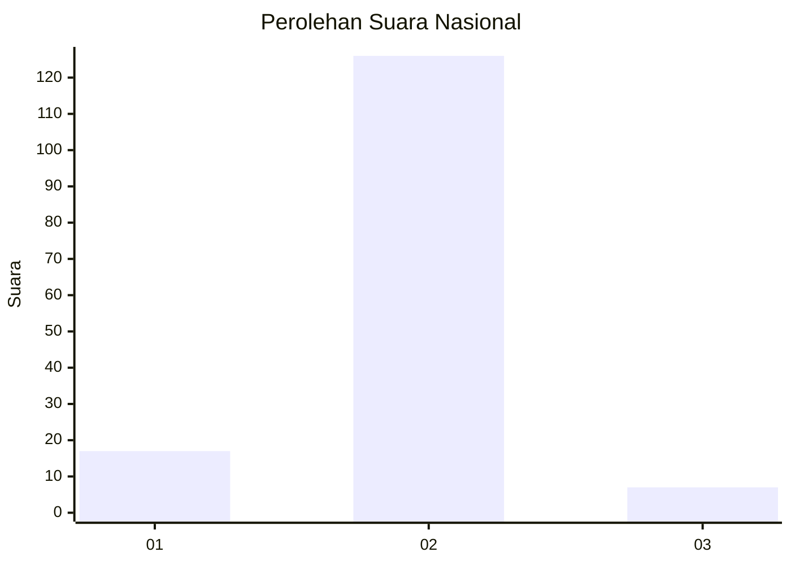
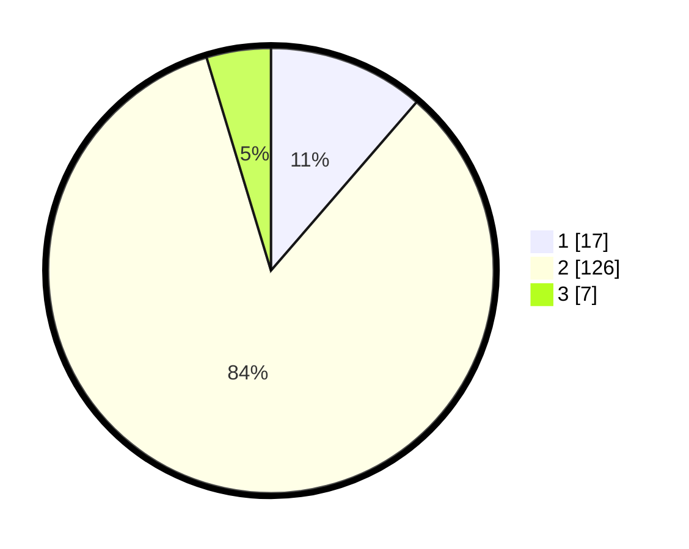

# Hasil

## Grafik

## Tabel

| No. | Nama Paslon    | Suara | Suara (raw) | Persentase |
|:--- |:-------------- | -----:| -----------:| ----------:|
| 1   | ANIES MUHAIMIN | 17    | [17][p-1]   | 11,33      |
| 2   | PRABOWO GIBRAN | 126   | [126][p-2]  | 84,00      |
| 3   | GANJAR MAHFUD  | 7     | [7][p-3]    | 4,67       |

[p-1]: https://github.com/gigit-pemilu/pemilu-2024/blob/main/pilpres/hitung-suara/sub/16-sumatera-selatan/sub/11-empat-lawang/sub/05-lintang-kanan/sub/2011-tanjung-alam/sub/006-tps/sub/paslon-1.txt
[p-2]: https://github.com/gigit-pemilu/pemilu-2024/blob/main/pilpres/hitung-suara/sub/16-sumatera-selatan/sub/11-empat-lawang/sub/05-lintang-kanan/sub/2011-tanjung-alam/sub/006-tps/sub/paslon-2.txt
[p-3]: https://github.com/gigit-pemilu/pemilu-2024/blob/main/pilpres/hitung-suara/sub/16-sumatera-selatan/sub/11-empat-lawang/sub/05-lintang-kanan/sub/2011-tanjung-alam/sub/006-tps/sub/paslon-3.txt

## Foto C Plano

https://sirekap-obj-formc.kpu.go.id/5eb5/pemilu/ppwp/16/11/05/20/11/1611052011006-20240219-220919--b0fc3fbc-32b9-4a3f-8500-0c61c45fb99a.jpg

https://sirekap-obj-formc.kpu.go.id/5eb5/pemilu/ppwp/16/11/05/20/11/1611052011006-20240219-221040--2ffba62d-21c8-419c-904e-c5a5b616038d.jpg

https://sirekap-obj-formc.kpu.go.id/5eb5/pemilu/ppwp/16/11/05/20/11/1611052011006-20240219-221206--e3fb0542-1af7-4b4b-b83e-ce47b6694347.jpg

## Metadata

| Key        | Value               |
| ---------- | ------------------- |
| Time Stamp | 2024-02-24 22:31:28 |

