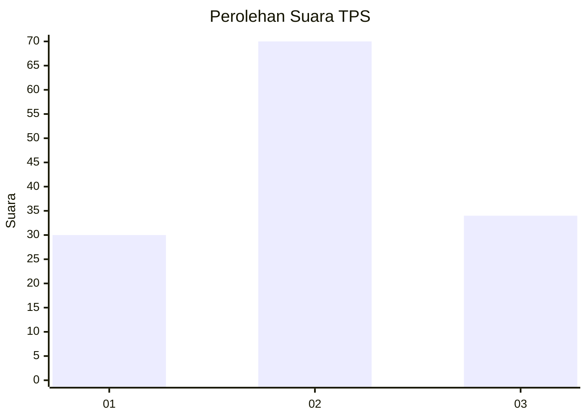
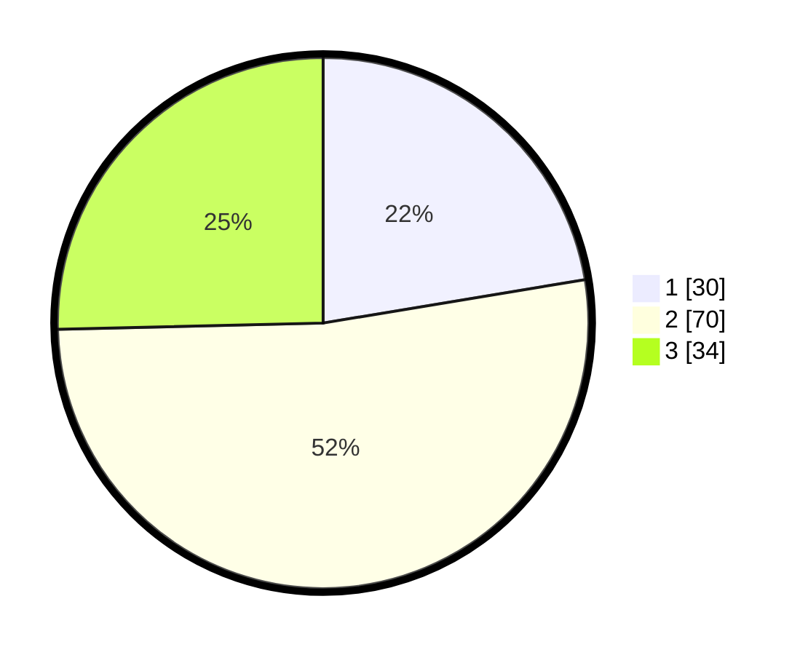

# Hasil

## Grafik

## Tabel

| No. | Nama Paslon    | Suara | Suara (raw) | Persentase |
|:--- |:-------------- | -----:| -----------:| ----------:|
| 1   | ANIES MUHAIMIN | 30    | [30][p-1]   | 22,39      |
| 2   | PRABOWO GIBRAN | 70    | [70][p-2]   | 52,24      |
| 3   | GANJAR MAHFUD  | 34    | [34][p-3]   | 25,37      |

[p-1]: https://github.com/gigit-pemilu/pemilu-2024-16-sumatera-selatan/blob/main/pilpres/hitung-suara/sub/16-sumatera-selatan/sub/11-empat-lawang/sub/05-lintang-kanan/sub/2012-lesung-batu/sub/001-tps/sub/paslon-1.txt
[p-2]: https://github.com/gigit-pemilu/pemilu-2024-16-sumatera-selatan/blob/main/pilpres/hitung-suara/sub/16-sumatera-selatan/sub/11-empat-lawang/sub/05-lintang-kanan/sub/2012-lesung-batu/sub/001-tps/sub/paslon-2.txt
[p-3]: https://github.com/gigit-pemilu/pemilu-2024-16-sumatera-selatan/blob/main/pilpres/hitung-suara/sub/16-sumatera-selatan/sub/11-empat-lawang/sub/05-lintang-kanan/sub/2012-lesung-batu/sub/001-tps/sub/paslon-3.txt

## Foto C Plano

https://sirekap-obj-formc.kpu.go.id/e2f1/pemilu/ppwp/16/11/05/20/12/1611052012001-20240222-230357--1ddb6586-d045-48a4-b1c3-40a28917aea9.jpg

https://sirekap-obj-formc.kpu.go.id/e2f1/pemilu/ppwp/16/11/05/20/12/1611052012001-20240222-230844--8e37c907-e29f-4bec-8ae1-e5538220c111.jpg

https://sirekap-obj-formc.kpu.go.id/e2f1/pemilu/ppwp/16/11/05/20/12/1611052012001-20240222-230933--ffda6cbc-41f4-40aa-a808-6cf57ee6ea7a.jpg

## Metadata

| Key        | Value               |
| ---------- | ------------------- |
| Time Stamp | 2024-02-25 12:00:00 |

